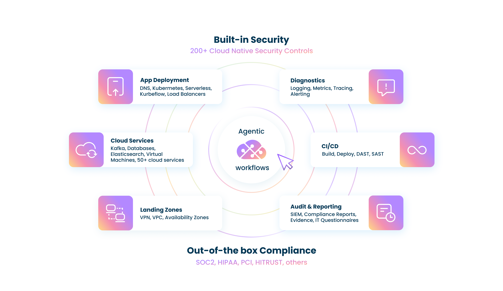

# Overview

DuploCloud is an agentic DevSecOps Automation platform that leverages AI for a wide range of Cloud Infrastructure automation needs. It encompasses DevOps, Security, Compliance, Observability and CICD. The software can:

* Configure and update resources safely and securely
* Write IAC (Cursor like experience in an IDE)
* Troubleshoot incidents
* Perform several other functions like collect evidence for compliance audits, reporting, discover cloud resources to generate documentation and so on.&#x20;


Duplocloud platform is entirely self hosted in customer's cloud account. With an open architecture you can choose your own model, build your own agents and bring your own automation tools.


The platform is composed of two main components:

*   **Agentic Orchestration (AI Suite)**

    This module coordinates a collection of AI agents specialized in DevOps operations. Together, these agents function as an **AI DevOps engineer**, capable of handling complex, high-level tasks delegated by users.

    The primary user experience mirrors an IT Help Desk. Users can create tickets and assign them to AI agents, which execute tasks in real time. The help desk interface is accessible through a web browser, Slack or Teams chat thread, or directly within an IDE extension (offering a “Cursor-like” experience).
*   **Automation Platform**

    To effectively manage cloud infrastructure, AI agents rely on a suite of automation tools. For example, enabling AI-driven observability requires an underlying observability framework such as Datadog or OpenTelemetry. DuploCloud’s automation platform delivers a comprehensive set of such capabilities, including:

    * **Provisioning Toolkit:** Automates the creation and management of hundreds of cloud services such as EKS, AKS, GKE, S3, SQS, RDS, Azure SQL, and Google Cloud SQL. The toolkit is accessible to AI agents through MCP, Terraform provider, CLI, and APIs.
    * **Observability:** Built on the OpenTelemetry stack, offering full-spectrum monitoring — including tracing, logging, alerting, profiling, infrastructure metrics, RUM, and SLO/SLA tracking.
    * **Security Tooling:** Provides integrated SIEM, vulnerability assessment, antivirus, just-in-time access control, and other security mechanisms.
    * **CI/CD:** Supports ArgoCD, workflows, and seamless integration with any other CI/CD systems.

    Teams can also bring their own automation tools whether built in-house or from a third party. &#x20;


Users can interface directly with the automation tools without going through the AI functionality using the APIs, Terraform provider, CLI and Browser workflows.


<figure><figcaption></figcaption></figure>

## AI Orchestration Demo

Check out a quick video of the AI functionality



## Automation Platform Demo

Check out a 6-minute video overview of the comprehensive Automation Platform.


