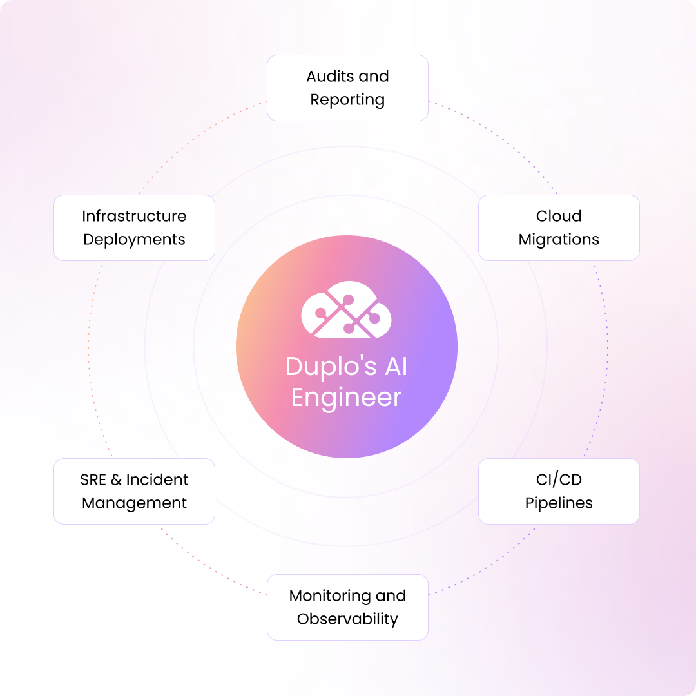
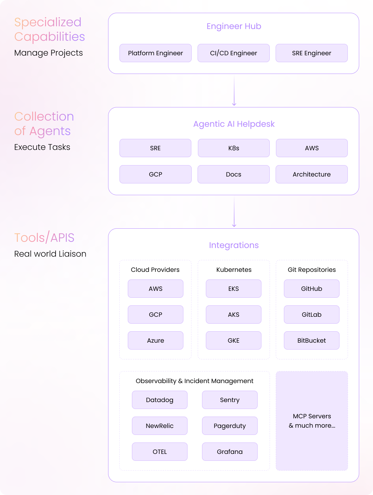

# Overview

DuploCloud is an agentic DevOps automation platform that leverages AI to accomplish a wide range of DevOps tasks. At the core of this platform is DuploCloud's AI DevOps Engineer that organizations can leverage for complex DevOps projects. Unlike traditional AI coding assistants that merely enhance human capabilities, the AI DevOps Engineer is an autonomous worker, with human-in-the loop governance, that can be onboarded, trained, assigned tasks, and managed just like a human team member.

## What Can an AI DevOps Engineer Do for You?&#x20;

* Manage projects related to deployments, migrations, observability, security, and compliance.
* Troubleshoot incidents end-to-end from setting up monitoring or alerting to responding in real time to outages and service degradations.
* Help with everyday tasks like infrastructure health reviews, code deployment, IaC maintenance, rollbacks, and backups.&#x20;
* Perform other functions like collecting evidence for compliance audits, reporting, discovering cloud resources to generate documentation, and more. 

<figure><picture><source srcset=".gitbook/assets/duplocloud-diagram-1-dark.png" media="(prefers-color-scheme: dark)"></picture><figcaption></figcaption></figure>

DuploCloud’s AI DevOps Engineer is highly customizable. You can start with DuploCloud’s out-of-the-box engineers, extend them with specific capabilities tailored to your organization, or build entirely new engineers with specialized skills. Think of this as a self-hosted Claude Code, purpose-built for DevOps, with significantly more autonomy and control. The possibilities are endless!

## Main Platform Components&#x20;

### Engineer Hub

The Engineer Hub is the home of all your specialized AI engineers, each capable of autonomously handling complex projects with a human-in-the-loop. In the hub, you can create Platform Engineers, CI/CD Engineers, SRE Engineers, and more, and manage your AI engineers' permissions, projects, and performance. Simply define your high-level project requirements and your AI engineer will convert them to a detailed plan coordinating a team of AI agents to complete the tasks to achieve your goals.

### Agentic AI Helpdesk

The Agentic AI Helpdesk is where you go to achieve task-level objectives with the help of specialized agents. These agents are designed to execute specific tasks and include SRE, K8s, AWS, GCP, Docs, and Architecture agents. Modeled on a traditional IT help desk and accessible through a web browser, Slack, or Teams chat, or directly within an IDE extension (offering a "Cursor-like" experience), it lets you create tickets and assign them to AI agents, which then execute tasks in real time.

### Integrations

The AI DevOps Engineer comes with a suite of integrations that help you accomplish tasks across cloud infrastructure provisioning, observability, security, compliance, cost, CI/CD, etc. These integrations provide real-world connectivity through tools and APIs, including:

* **Cloud Providers**: AWS, GCP, Azure
* **Kubernetes**: EKS, AKS, GKE
* **Git Repositories**: GitHub, GitLab, Bitbucket
* **Observability & Incident Management**: Datadog, Sentry, New Relic, PagerDuty, OpenTelemetry, Grafana
* **MCP Servers** and much more

<figure><picture><source srcset=".gitbook/assets/duplocloud-diagram-3-dark.png" media="(prefers-color-scheme: dark)"></picture><figcaption></figcaption></figure>
