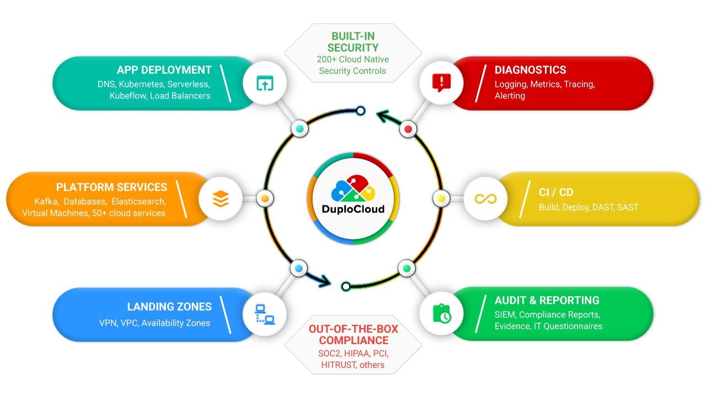

# Introduction

DuploCloud is a DevOps-as-a-Service platform for engineers and operators in organizations hosting infrastructure on the public cloud. Security and compliance are fundamentals enabled by this platform. Users provide high level application specifications that include cloud services, application containers, packages and configurations, inter-connectivity, requirements for multiple environments, and compliance standards that are in scope. With this provided information, the platform auto-generates the required lower level configurations, provisions them in a secure and compliant way, and maintains their ongoing operations. The platform also enables logging, monitoring, alerting, and reporting of the provisioned system. The following figure shows the various functions provided by the platform.

DuploCloud is a single tenant software platform that installs in the customer's cloud account. The customer interfaces with DuploCloud via the browser UI, the DuploCloud Terraform provider and/or API calls, and all data and configuration stays within the customer's cloud account. All configurations that have been created and applied by DuploCloud are transparently available to be reviewed and edited in the customer's cloud account.

## Quick demo

**Got 2 minutes?** Check out a video overview of a DuploCloud deployment:


