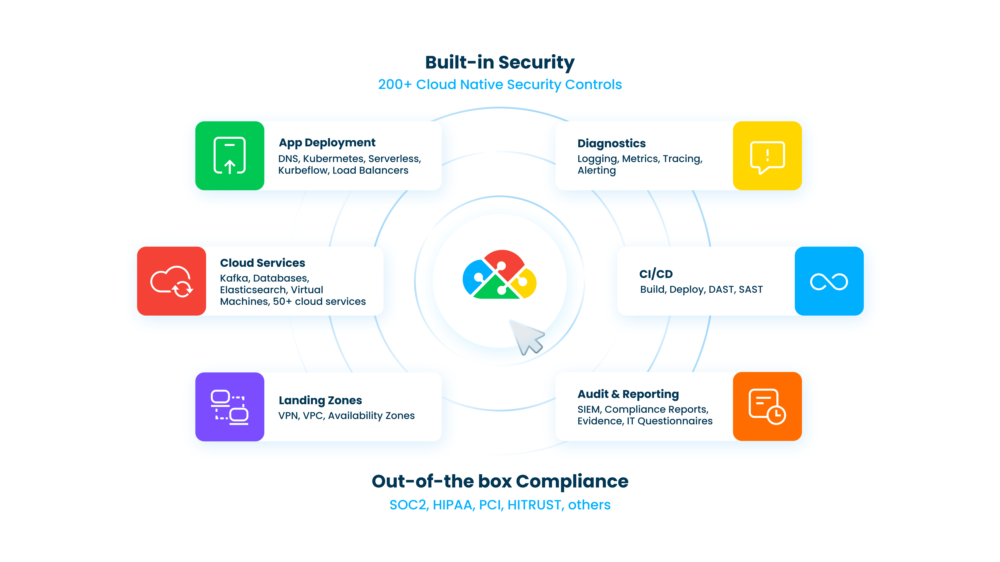

# Overview

DuploCloud is an AI enabled cloud infrastructure automation platform that enables developer self-service with built-in security and compliance for organizations hosting public cloud infrastructure.

You provide high-level application specifications, including cloud services, application containers, packages and configurations, interconnectivity, requirements for multiple environments, and scoped compliance standards. DuploCloud uses these specifications to auto-generate required lower-level configurations, provisioning them securely and compliantly while maintaining ongoing operations.

Further protection is supplied by the DuploCloud [Tenant](welcome-to-duplocloud/application-focused-interface-duplocloud-architecture/duplocloud-common-components/tenant.md), an isolated workspace that acts as an additional isolation layer, ideal for segregating production workloads or creating extensible developer sandboxes. A Tenant’s architecture is abstracted from its underlying [Infrastructure](welcome-to-duplocloud/application-focused-interface-duplocloud-architecture/duplocloud-common-components/infrastructure.md), and you can create as many Tenants as you need with no degradation in performance.

DuploCloud also offers AI agents that automate tedious DevOps and SRE tasks for infrastructure provisioning, and troubleshooting scenarios.

In addition, DuploCloud facilitates logging, monitoring, alerting, and reporting. The following figure  shows the platform's various functions.

The customer interfaces with DuploCloud via the browser UI, the DuploCloud Terraform provider, and API calls while the data and configuration stay within the customer's cloud account. All configurations created and applied by DuploCloud can be reviewed and edited in the customer's cloud account.

## Demo

Check out a 5-minute video overview of a DuploCloud deployment.


