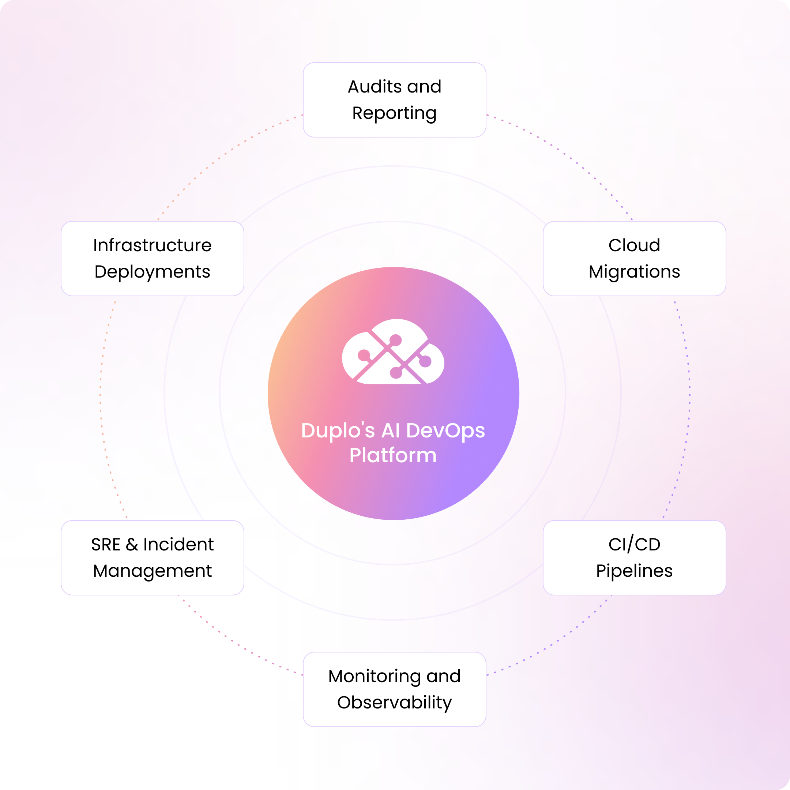

# Overview

DuploCloud is an agentic DevOps automation platform that uses AI to handle a broad range of DevOps tasks. AI becomes your most capable DevOps resource, with expertise spanning infrastructure as code, Kubernetes, observability, CI/CD, incident management, cost management, compliance, security, and more. DuploCloud is a collaborative platform where humans and AI work side by side as a unified team.

AI handles the heavy lifting while humans maintain oversight. AI tools are already widely used today — from ChatGPT to desktop copilots like Claude Code — and have significantly boosted individual productivity. DuploCloud brings that same level of efficiency to the organizational level.

With a centralized system, you get:

1. A highly collaborative environment where all AI sessions are stored, serving as your central system of intelligence.
2. Shared context that reduces LLM cost per task by 50% compared to users running the same tasks individually through desktop copilots without session sharing.
3. An always-on AI that functions like a 24/7 SRE, handling routine tickets and incidents automatically.
4. Cloud-scale execution that removes the constraints of individual desktop environments.

DuploCloud is fully self-hosted and deploys directly within your cloud account.

You can interact with the platform through a web UI chat interface, Slack, your IDE via the Claude Code plugin, and more.

### **What can DuploCloud's AI DevOps Platform do for you?**

* Manage projects related to deployments, migrations, observability, security, and compliance.
* Troubleshoot incidents end-to-end, from configuring monitoring and alerting to responding in real time to outages and service degradations.
* Assist with everyday tasks such as infrastructure health reviews, code deployments, IaC maintenance, rollbacks, and backups.
* Perform additional functions including collecting evidence for compliance audits, generating reports, discovering cloud resources, and producing documentation.

<figure><picture><source srcset=".gitbook/assets/Overview-Dark-1.png" media="(prefers-color-scheme: dark)"></picture><figcaption></figcaption></figure>

## Get acquainted with Duplo's AI DevOps Platform

See how AI can help you ship faster, stay secure, and scale, without adding headcount.



