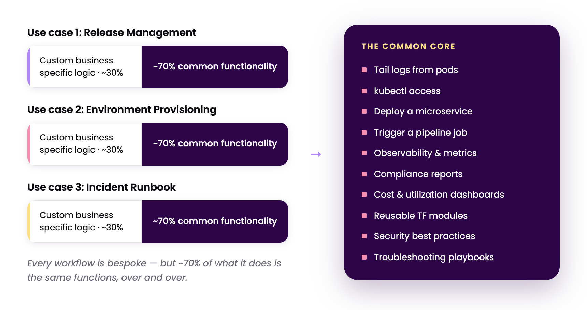
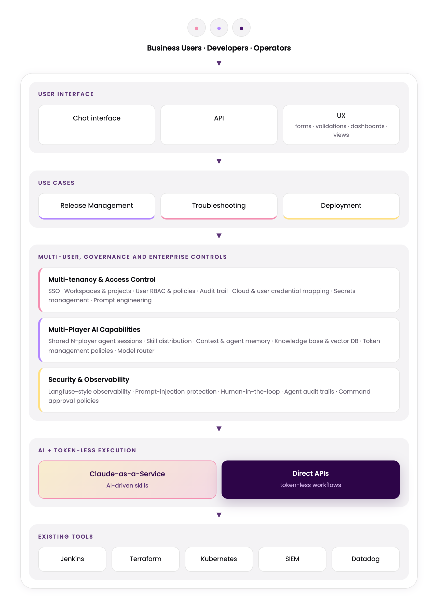
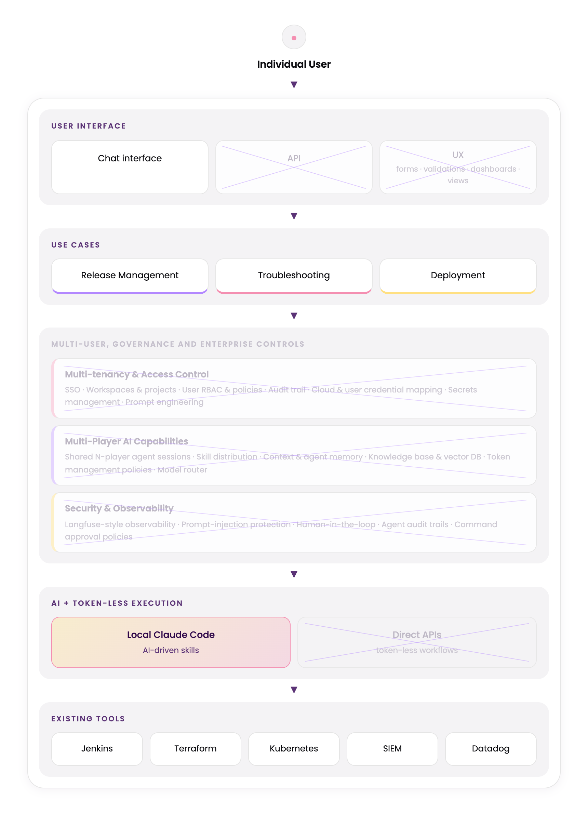
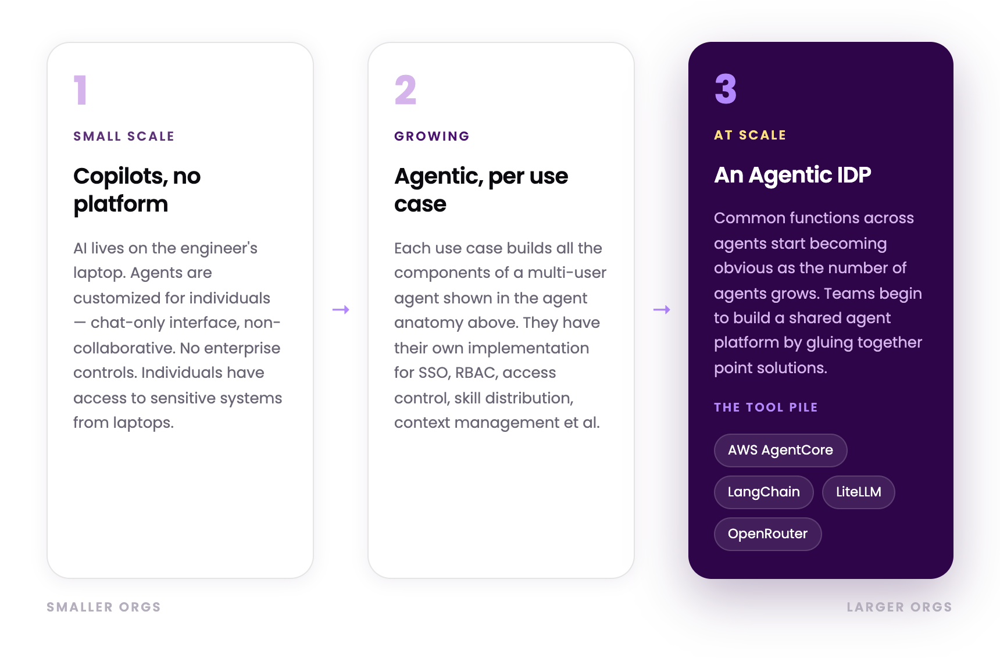
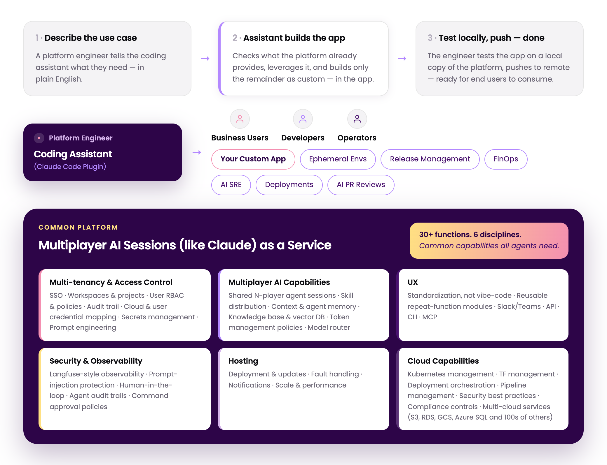

---
cover:
  light: .gitbook/assets/Banner_Image_Light.png
  dark: .gitbook/assets/Banner_Image_Dark.png
coverY: 0
---

# Overview

## From DevOps to Platform Engineering — and What Changed

Platform engineering exists to help DevOps scale: once every product team owns its own infrastructure, the combined weight of Kubernetes, Terraform, and compliance requirements is better handled with shared platform support than team-by-team. The industry's answer was centralization — stand up a platform team, build an Internal Developer Platform (IDP), encode best practices into "golden paths," and let developers self-serve instead of filing tickets.

In practice, that's proven harder to deliver than the pitch suggests. A real IDP — one with shared state, RBAC, audit trails, deterministic execution, and multi-engineer coordination — is a multi-year software build, and delivering one at that depth takes more time and engineering investment than most platform teams have had available. Many organizations stood up a platform team well before the platform itself existed. Golden paths often stayed aspirational, and ticket volume held steady.

AI's impact here has been concentrated in one area so far. It's shown up meaningfully in troubleshooting, largely through SRE-focused tooling, with more room to grow in deployments, release management, and compliance. The AI tool that got adopted at scale is the individual coding assistant — a huge productivity boost for one engineer at a time, and the next step is bringing that same boost to a whole team.

The shift that changes this: AI has made the economics of building a real IDP different. That's the idea behind an **Agentic IDP** — an Internal Developer Platform where every workflow is delivered as an agent, rather than as a static golden-path portal.

## The Platform Engineering Problem, and What an Agent Needs

Look past the surface differences between one team's release process, another's environment setup, and a third's incident protocol, and most of that logic is the same everywhere — roughly 70% common functionality, 30% organization-specific.

<figure><figcaption></figcaption></figure>

An agent capable of covering this needs three things: a conversational interface, rich use-case-specific UX (forms, validations, dashboards, views — not everything should be a chat prompt), and the judgment to mix AI reasoning with plain, token-less API calls wherever a workflow doesn't actually need a model in the loop.

<figure><figcaption></figcaption></figure>

### What Claude Code already solves — and what a platform adds

Engineers can already build a personalized agent with Claude Code that combines skills across Terraform, Jenkins, Kubernetes, and observability tooling. What a platform adds on top: a dedicated UI, APIs, token-less execution, and the multi-user, governance, and enterprise controls a platform team needs — since a personalized agent is architected as a single-user, single-session tool. That's the choice in front of most organizations: let individual engineers keep building their own agents against sensitive systems, or move toward a centralized platform with shared controls.

<figure><figcaption></figcaption></figure>

### The enterprise maturity spectrum

Most organizations sit at one of three stages:

1. **Small-scale copilots** — AI lives on individual laptops. Chat-only and single-player — great for one engineer, but without shared collaboration or enterprise controls yet.
2. **Growing agentic** — Each use case builds its own multi-user plumbing independently: SSO, RBAC, access control, skill distribution, context management. Real capability, just not yet shared across use cases.
3. **At-scale, centralized Agentic IDP** — A platform team consolidates the overlapping point solutions into one system. Very few organizations have reached this stage yet — it's where the rest are headed.

<figure><figcaption></figcaption></figure>

### Building an Agentic IDP

The shape that solves this: a **common platform** that every use case builds on top of as its own custom application — plug-and-play, sandboxed from every other application, but inheriting the platform's capabilities automatically — paired with **a coding assistant specialized for building on that platform** (concretely, a Claude plugin) that enforces a standard implementation so applications stay interoperable instead of drifting into their own silos.

That gives two distinct personas: the **end user**, who uses an agent to get their actual work done, and the **agent builder**, who uses the specialized coding assistant to turn a new use case into a governed application on the shared platform.

<figure><figcaption></figcaption></figure>


Adapted from [How Is Platform Engineering Evolving with AI — and What Is an Agentic IDP?](https://duplocloud.com/blog/agentic-internal-developer-platform) — read the full essay for the complete argument.


## Detailed Implementation: The DuploCloud AI DevOps Platform

This is exactly what the DuploCloud Platform implements, organized into three layers for building and running AI-native DevOps applications at scale.

At the foundation is **ARMOR (Agent Runtime for Multiplayer Operations)** — Layer 1. ARMOR is a Multiplayer Claude-as-a-Service runtime that brings together ticketing, connections, intelligence, workspaces, RBAC, projects, analytics, and cost management into a unified core. Business users — whether accessing through a web browser, REST API, Claude Code plugin, or Slack/Teams — interact with a shared Workspace that enforces role-based access control and scoped project context, while an underlying CaaS agent (built on the Agent SDK) handles ingestion, moderation, and communication with the LLM layer beneath it. This is what makes the platform **multiplayer** by design — the first of the three requirements above.

<figure><figcaption></figcaption></figure>

Building on that foundation, the **Extension Framework** (Layer 2) lets teams define policy models, build skills, and compose full Ops applications with forms, APIs, and lifecycle management — turning the runtime's capabilities into governed, repeatable workflows. This is the platform's answer to the second requirement, **custom workflows with rich UX**, and to the third — blending AI-driven steps with plain, **token-less** API execution wherever a model isn't needed.

On top of that sits the **Developer Experience & Hosting** layer (Layer 3), which allows teams to build and ship Ops applications in days using either a web interface or Claude Code, with flexible hosting options (managed or self-hosted). This is the **agent builder's** persona in practice — the specialized coding assistant for turning a new use case into a governed application on the shared platform, without building infrastructure from scratch.

Continue reading for a detailed walkthrough of each of the three layers — what they do, how they fit together, and what they unlock.
