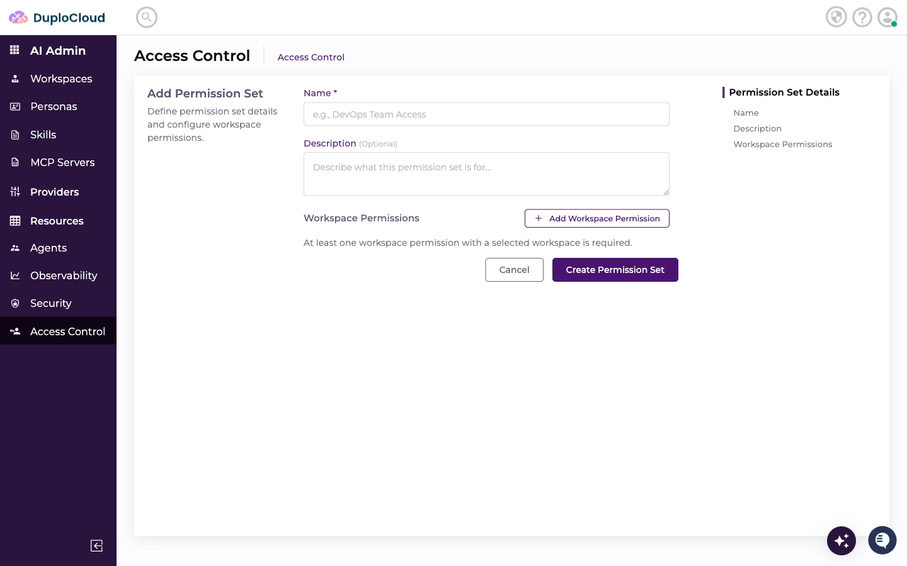
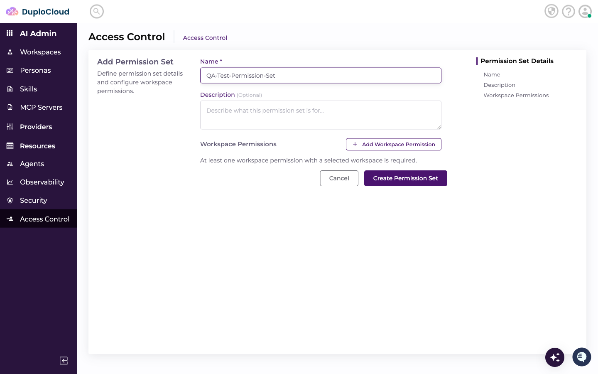
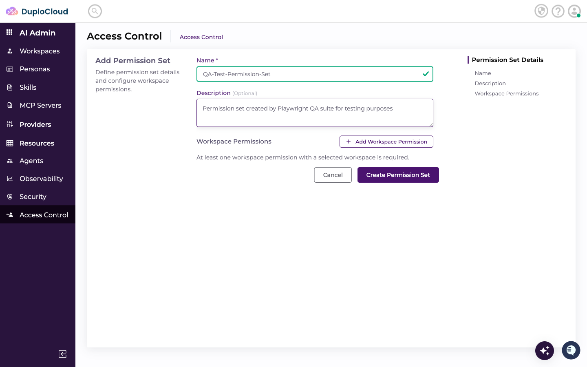
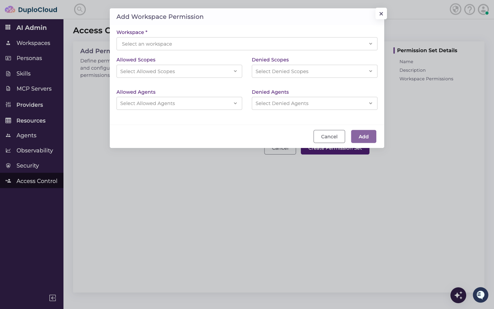
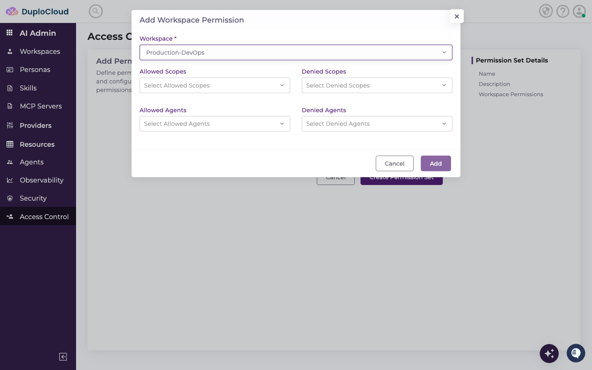
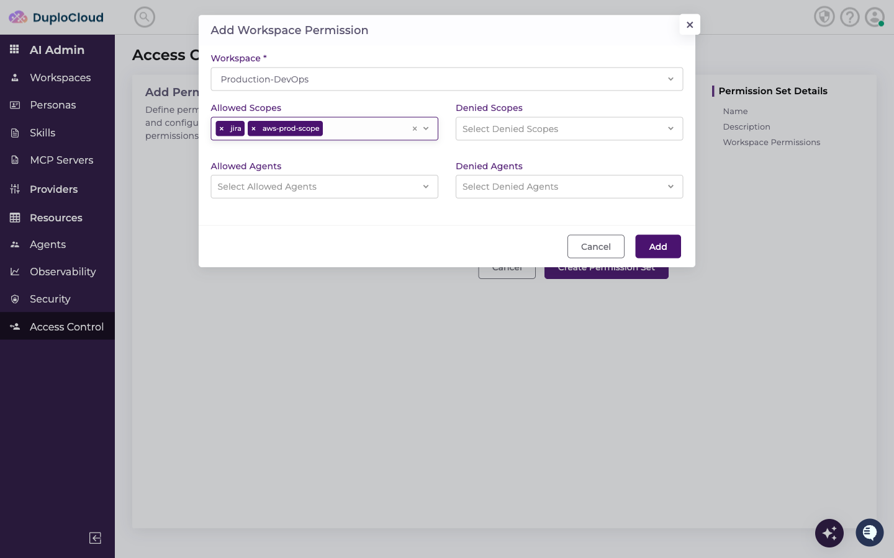
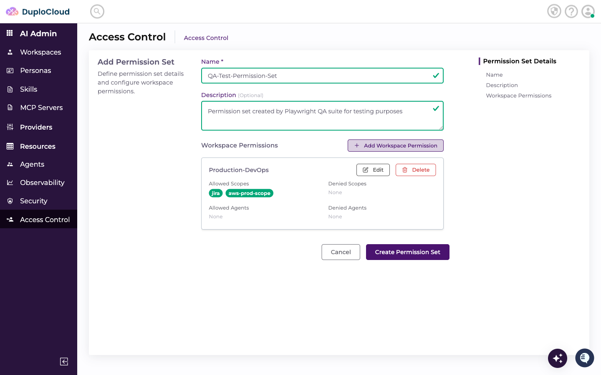
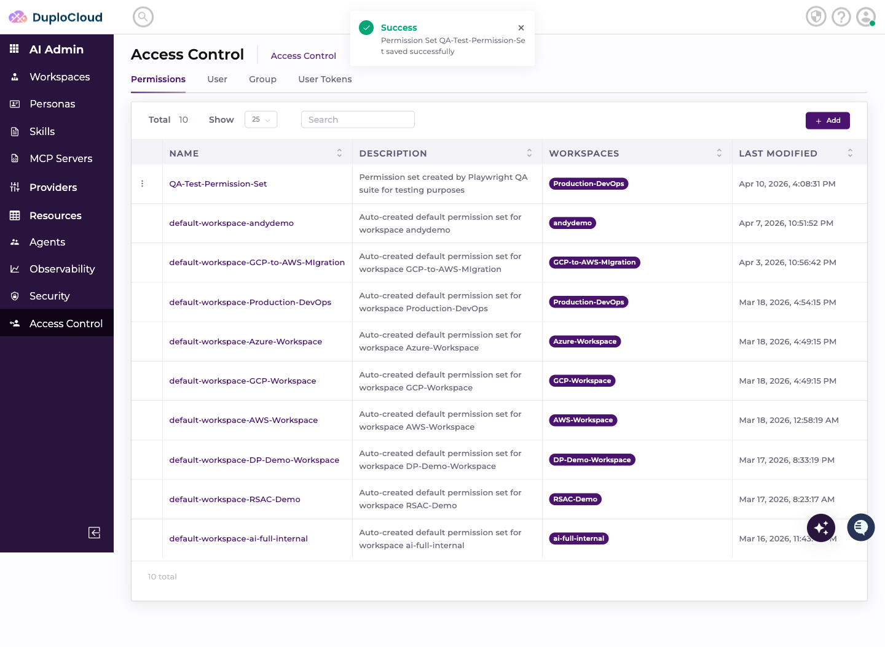

# Create Permission Set Tutorial

This document explains how to create a new Permission Set in the DuploCloud AI Suite Access Control panel.

---

## Prerequisites

- Access to the DuploCloud AI Suite admin panel
- Admin permissions on the Access Control section

---

## Step 1 — Navigate to Access Control

Go to **AI Admin → Access Control** in the left-hand navigation. The page opens on the **Permissions** tab by default, which lists all existing permission sets.

---

## Step 2 — Click "Add"

In the top-right corner, click the **+ Add** button. The Add Permission Set form slides in.

---

## Step 3 — Enter a Name

Click the **Name** field and type a name for the permission set.

In this example: `QA-Test-Permission-Set`

---

## Step 4 — Enter a Description

Click the **Description** textarea and describe the purpose of this permission set.

---

## Step 5 — Open the Workspace Permission Modal

Click **+ Add Workspace Permission**. A modal dialog opens with fields for:

| Field | Purpose |
|---|---|
| Workspace | The workspace this permission applies to |
| Allowed Scopes | Resources the user can access |
| Denied Scopes | Resources explicitly blocked |
| Allowed Agents | AI agents the user can use (empty = all allowed) |
| Denied Agents | AI agents explicitly blocked |

---

## Step 6 — Select the Workspace

Click the **Workspace** dropdown and select the target workspace.

In this example: `Production-DevOps`

---

## Step 7 — Select Allowed Scopes

Click the **Allowed Scopes** dropdown and select the scopes to grant access to. You can select multiple.

In this example: `jira` and `aws-prod-scope`

---

## Step 8 — Allow All Agents

Leave the **Allowed Agents** field empty to allow access to all agents. No selection is required.

---

## Step 9 — Confirm the Workspace Permission

Click the **Add** button inside the modal to save the workspace permission entry.

---

## Step 10 — Submit the Form

Review the completed permission set form, then click **Create Permission Set**.

A green **Success** toast confirms the permission set was saved.

---

## Step 11 — Verify in the List

The new permission set appears at the top of the Permissions table with the associated workspace.

