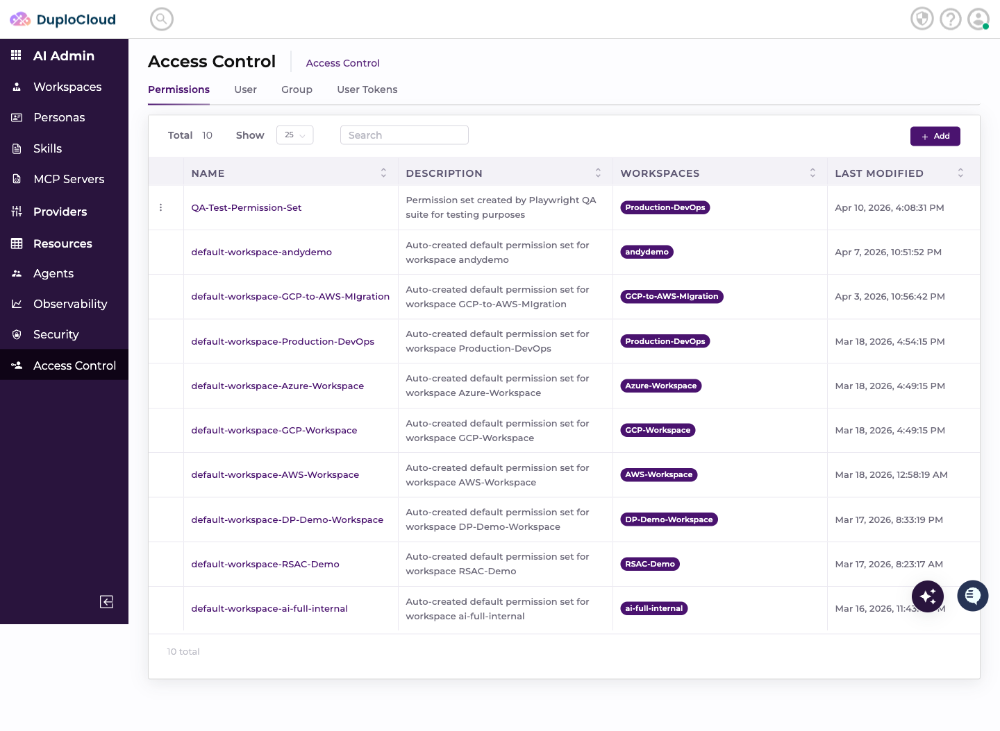
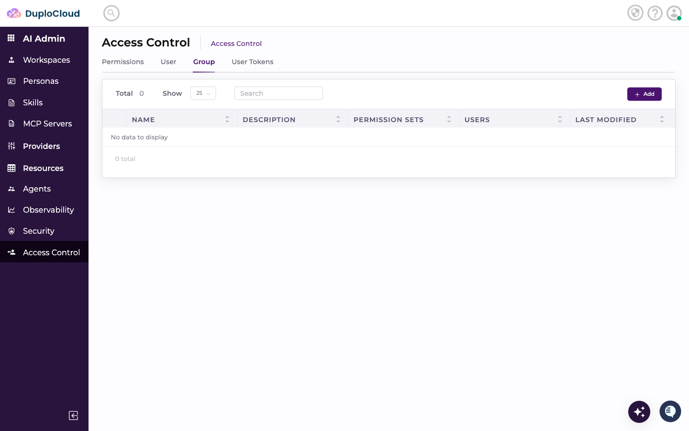
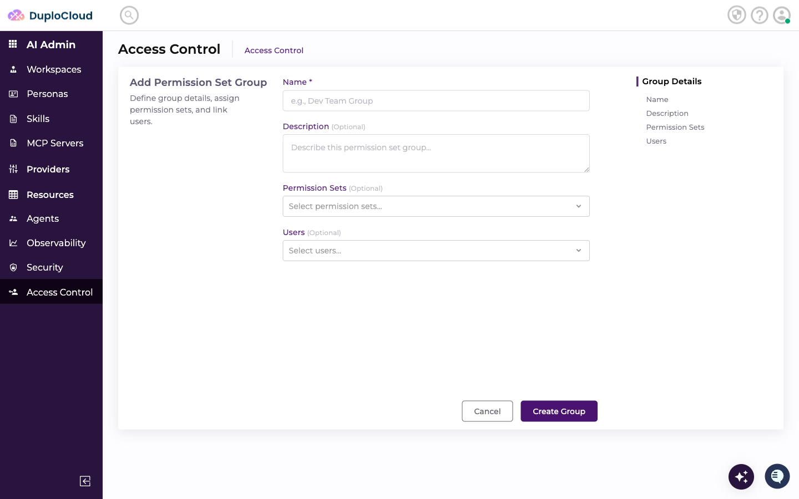
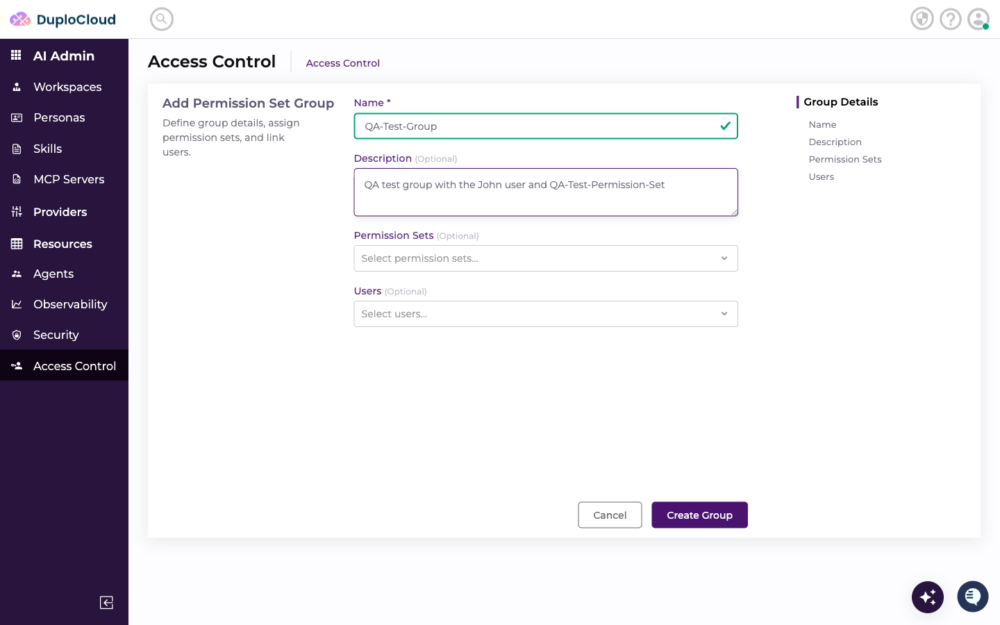
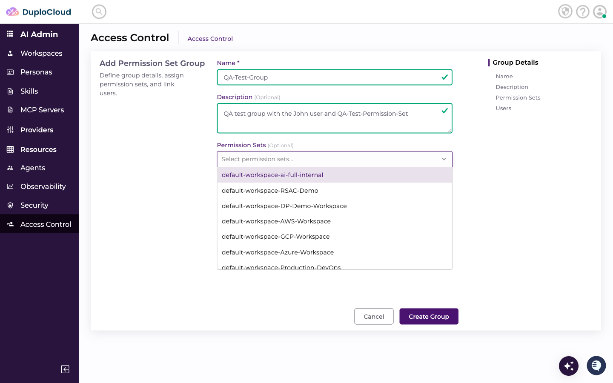
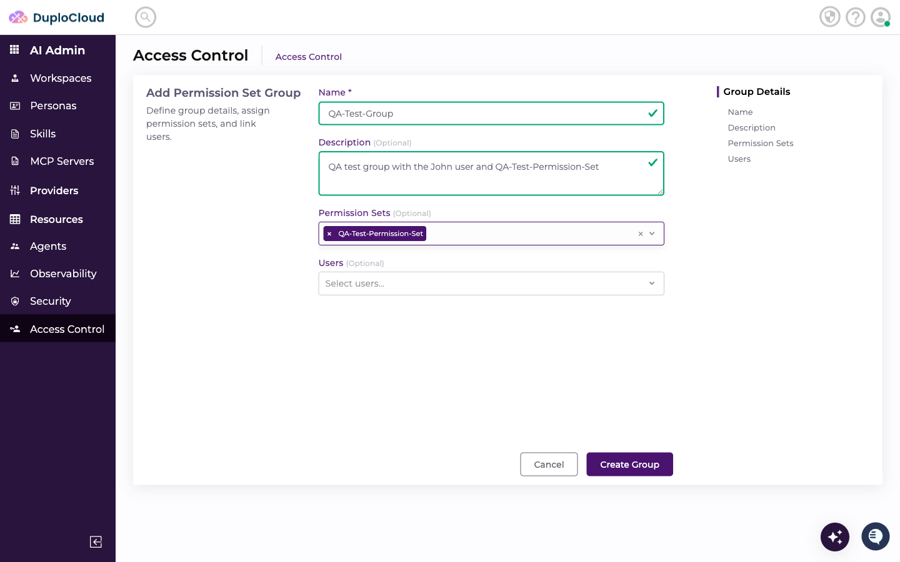
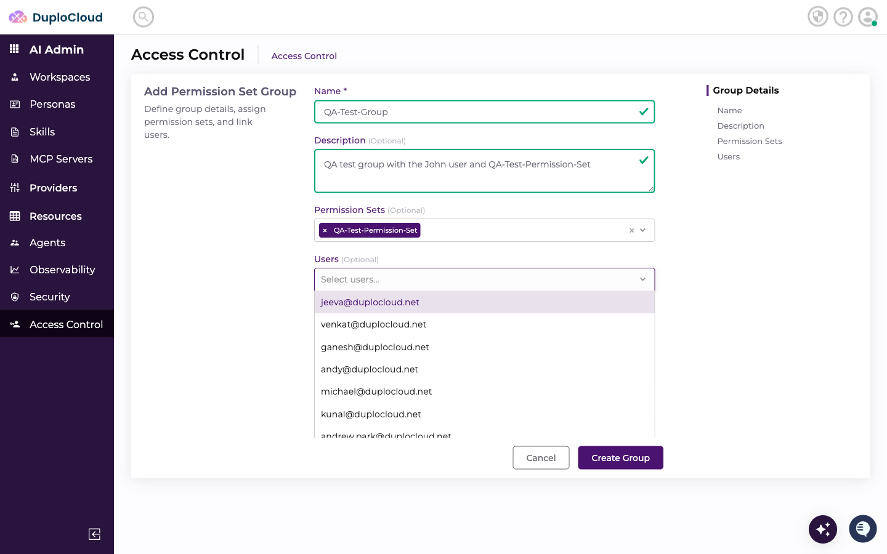
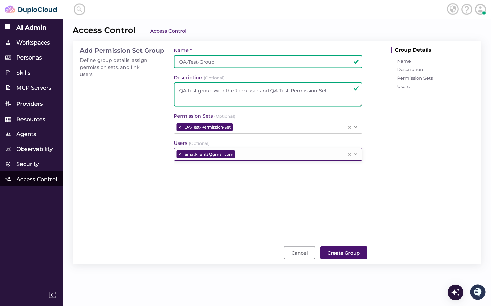
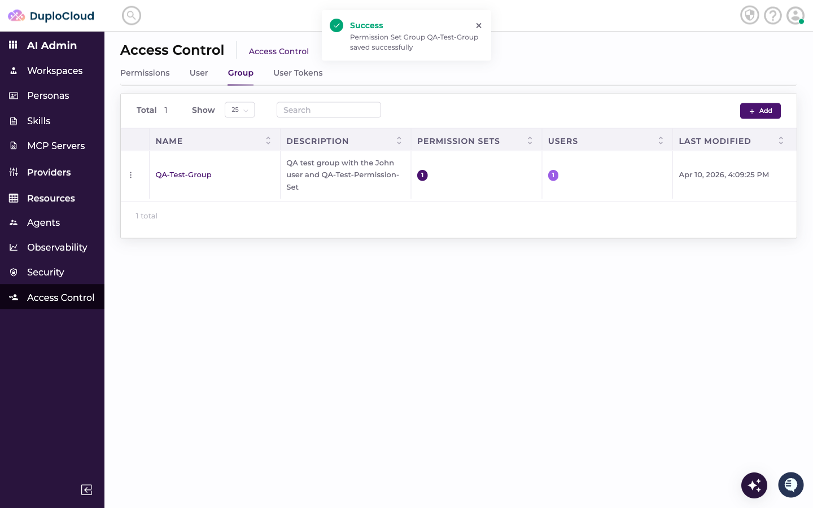

# Create Group Tutorial

This document explains how to create a new Permission Set Group in the DuploCloud AI Suite Access Control panel, linking a user and a permission set together.

---

## Prerequisites

- A user already created (e.g. `John` — see **create user tutorial**)
- A permission set already created (e.g. `QA-Test-Permission-Set` — see **create permission set tutorial**)
- Admin permissions on the Access Control section

---

## Step 1 — Navigate to Access Control

Go to **AI Admin → Access Control** in the left-hand navigation.

---

## Step 2 — Click the "Group" Tab

At the top of the Access Control page, click the **Group** tab. This lists all existing groups.

---

## Step 3 — Click "Add"

In the top-right corner, click the **+ Add** button. The Add Permission Set Group form slides in.

---

## Step 4 — Enter a Group Name

Click the **Name** field and type a name for the group.

In this example: `QA-Test-Group`

---

## Step 5 — Enter a Description

Click the **Description** textarea and describe the group's purpose.

---

## Step 6 — Select the Permission Set

Click the **Permission Sets** dropdown. Type to filter, then select the permission set to assign to this group.

In this example: `QA-Test-Permission-Set`

---

## Step 7 — Select the User

Click the **Users** dropdown. Type to filter by email or display name, then select the user to add to this group.

In this example: `amal.kiran13@gmail.com` (John)

---

## Step 8 — Review and Submit

Review the completed group form — confirm the name, permission set, and user are all set correctly. Click **Create Group**.

A green **Success** toast confirms the group was saved.

---

## Step 9 — Verify the Group in the List

The new group appears in the Groups table, showing the linked permission set count and user count.

