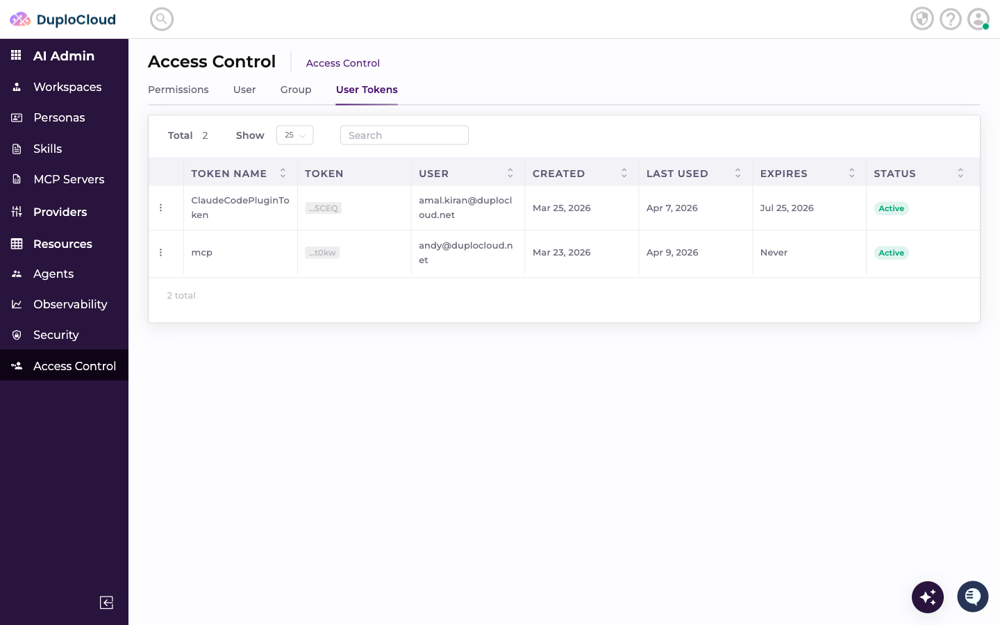
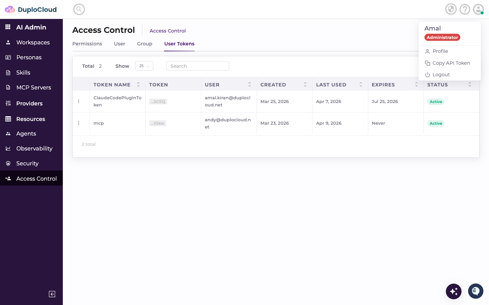
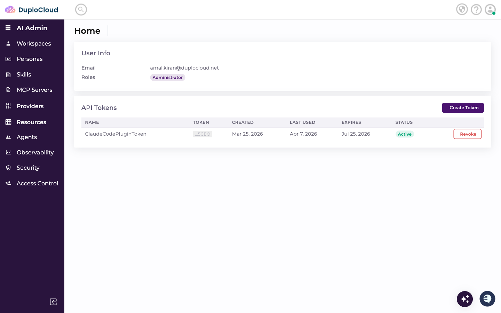
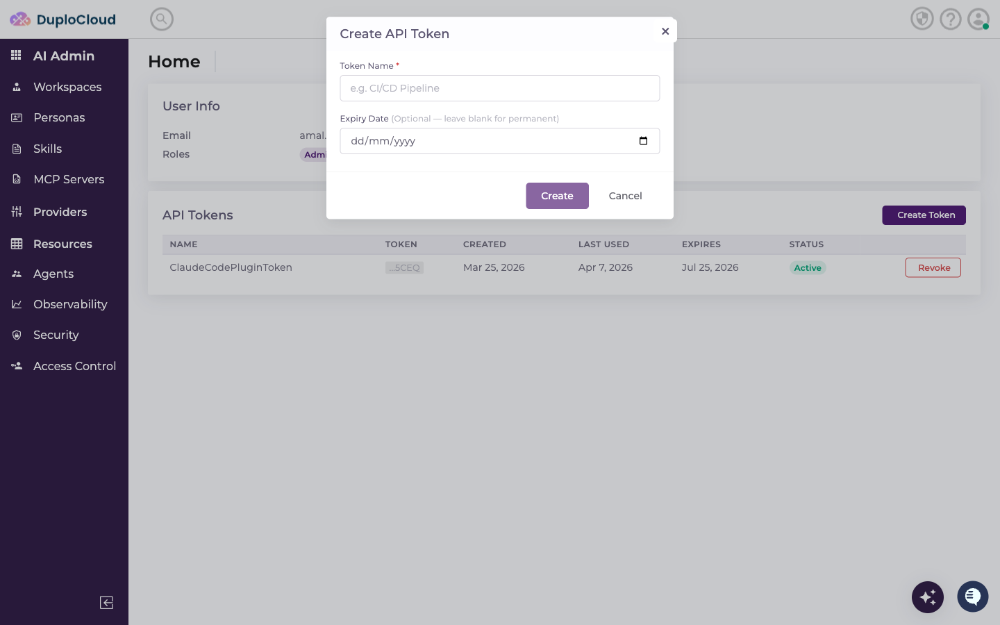
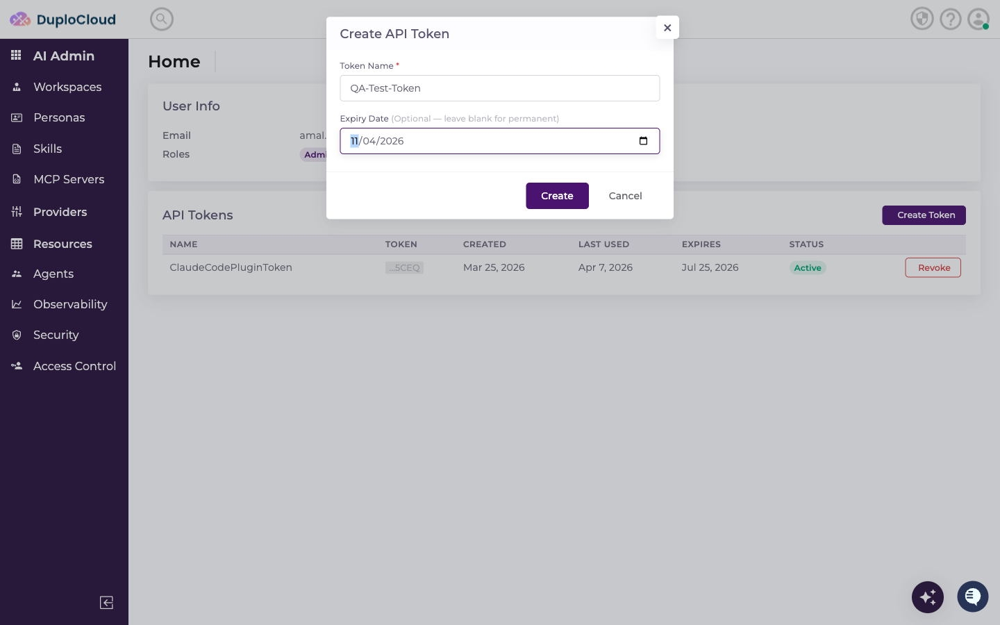
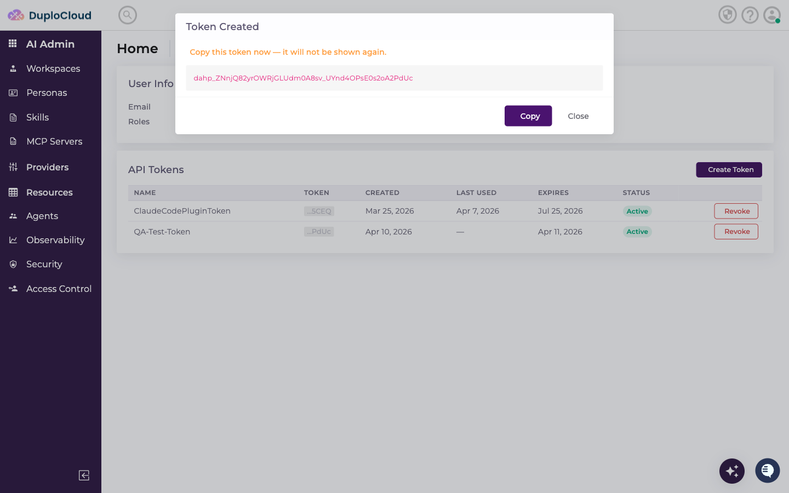

# User Tokens

This document explains how to create a new API Token in the DuploCloud AI Suite, using the User Tokens tab and the Profile page.

***

## Prerequisites

* Access to the DuploCloud AI Suite admin panel
* An authenticated user account

***

## Step 1 — Navigate to Access Control → User Tokens

Go to **AI Admin → Access Control** in the left-hand navigation. Click the **User Tokens** tab at the top. This lists all existing API tokens with their name, token value, user, created date, last used, expiry, and status.

***

## Step 2 — Click the Profile Icon (Top Right)

In the top-right corner of the page, click the **profile avatar** icon. A dropdown menu appears showing your name and role.

***

## Step 3 — Click "Profile"

In the dropdown, click **Profile**. This navigates to your Profile page which shows your User Info and the API Tokens table.

***

## Step 4 — Click "Create Token"

On the Profile page, locate the **API Tokens** section. Click the **Create Token** button on the right side (shown in purple).

A **Create API Token** modal dialog opens with two fields: Token Name and Expiry Date.

***

## Step 5 — Enter a Token Name

Click the **Token Name** field and type a descriptive name for the token.

In this example: `QA-Test-Token`

***

## Step 6 — Set the Expiry Date

Click the **Expiry Date** field and enter a future date in `YYYY-MM-DD` format.

> **Important:** The expiry date must be greater than today's date or the form will reject it.

In this example: `2026-04-11` (April 11, 2026)

***

## Step 7 — Click "Create"

Review the token name and expiry date, then click the **Create** button.

***

## Step 8 — Copy the Token

A **Token Created** confirmation dialog appears showing the full token value. **Copy the token now** — it will not be shown again.

Click **Copy** to copy it to your clipboard, then click **Close**.

The new token appears in the API Tokens table with **Active** status and the expiry date you set.
