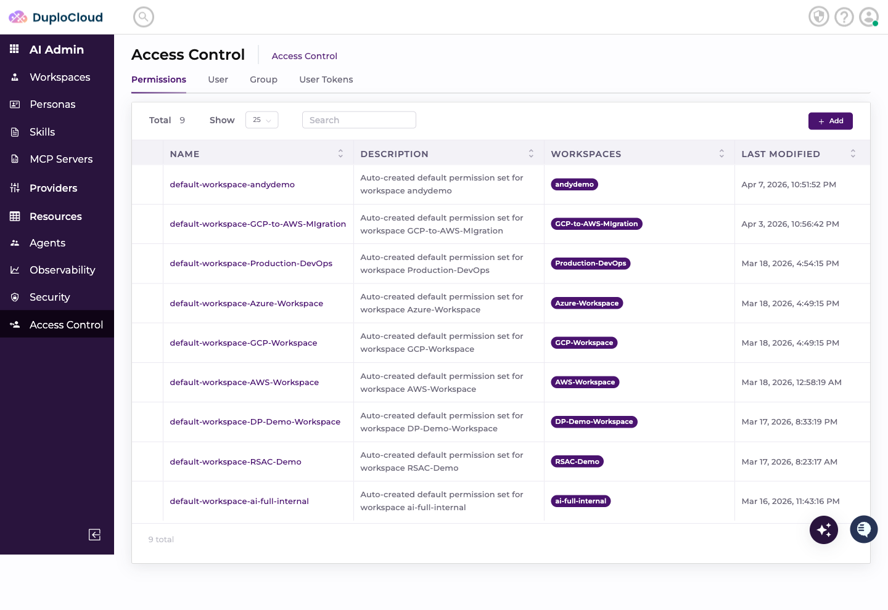
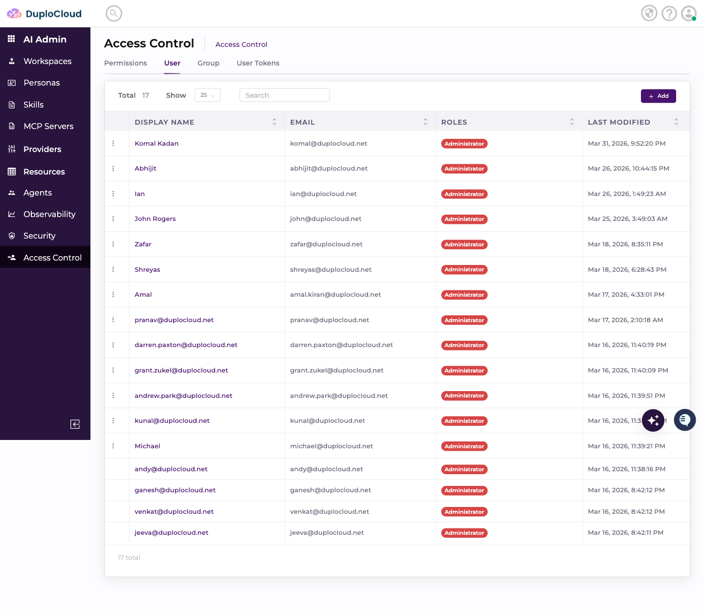
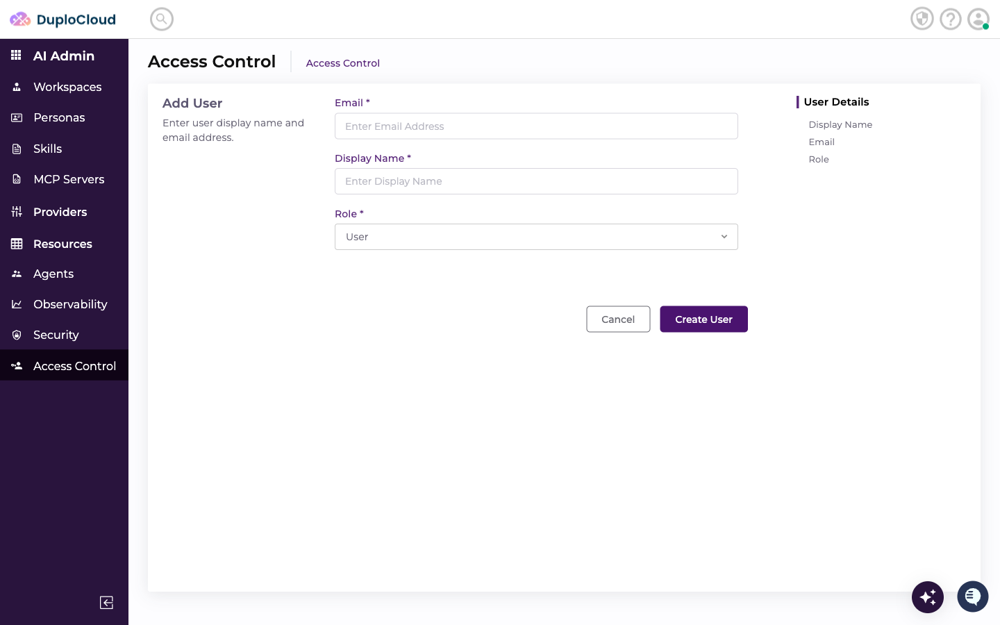
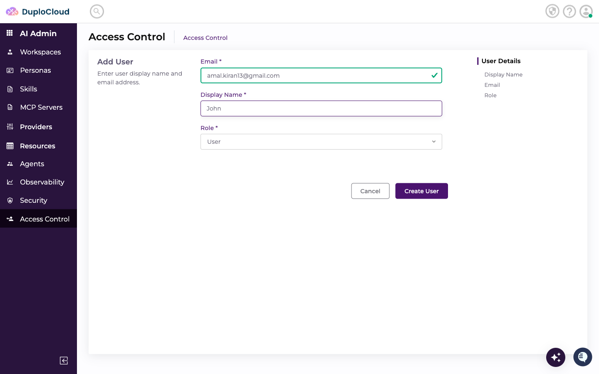
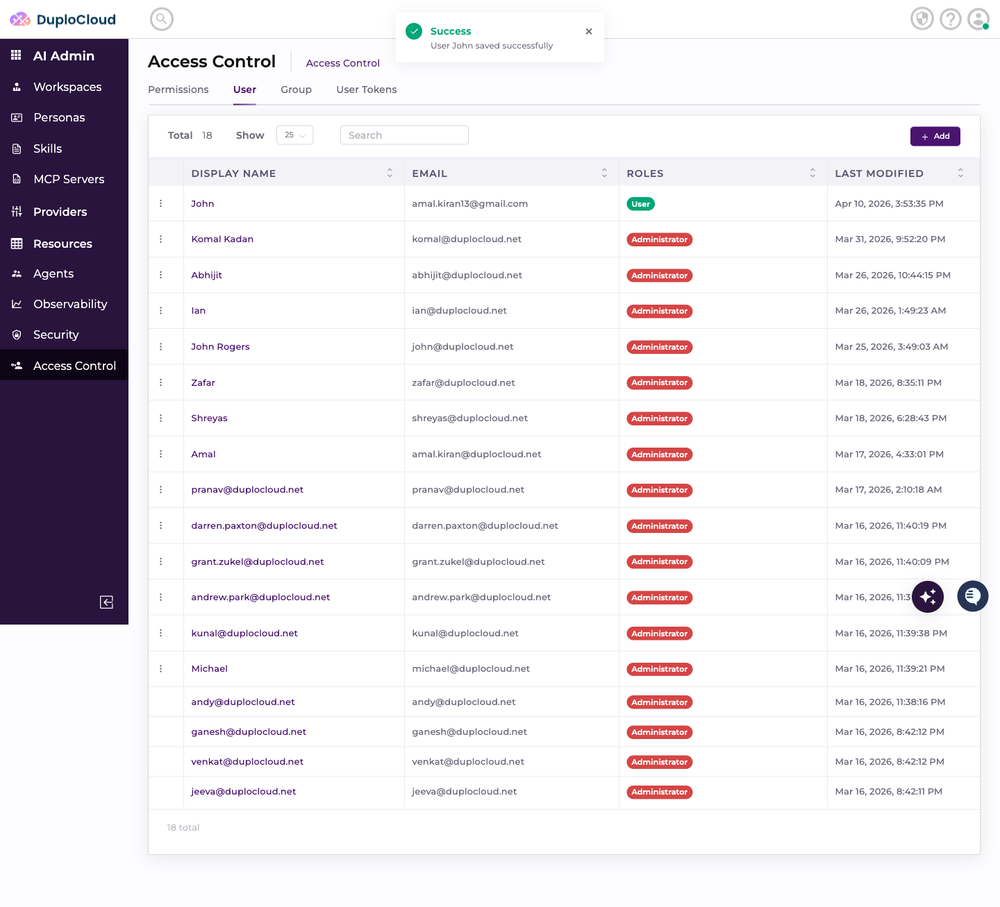

# Users

This document explains how to create a new user in the DuploCloud AI Suite Access Control panel.

***

## Prerequisites

* Access to the DuploCloud AI Suite admin panel
* Admin permissions on the Access Control section

***

## Step 1 — Navigate to Access Control

Go to **AI Admin → Access Control** in the left-hand navigation. The page opens on the **Permissions** tab by default.

***

## Step 2 — Click the "User" Tab

At the top of the Access Control page, click the **User** tab. This shows a table of all existing users with their display name, email, role, and last modified date.

***

## Step 3 — Click "Add"

In the top-right corner of the User tab, click the **+ Add** button. The Add User form slides in.

***

## Step 4 — Enter the Email Address

Click the **Email** field and type the user's email address. Select the email from the dropdown if it appears.

In this example: `amal.kiran13@gmail.com`

***

## Step 5 — Enter the Display Name

Click the **Display Name** field and type the user's name.

In this example: `John`

***

## Step 6 — Set the Role

The **Role** dropdown defaults to **User**. If a different role is pre-selected, click the dropdown and choose **User**.

Available roles: `User`, `Administrator`

***

## Step 7 — Review and Submit

Confirm all fields are filled correctly, then click **Create User**.

A green **Success** toast appears confirming the user was saved.

***

## Step 8 — Verify the User in the List

The new user appears at the top of the users table with the **User** role badge.

