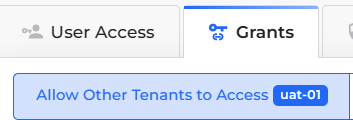
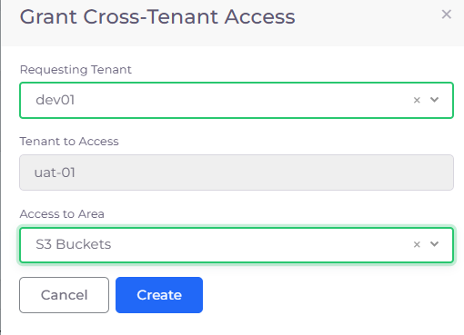
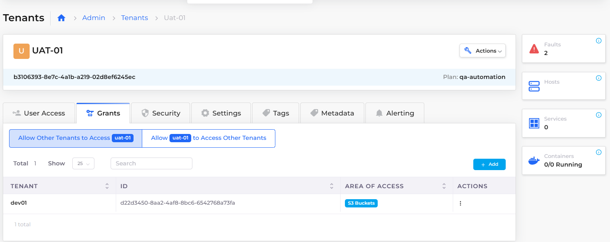

# Cross-Tenant Access


These features are currently only available for AWS.


## Allowing Cross-Tenant access based on Security Groups

To allow access between two Tenants, based on Security Groups in the underlying Cloud Platform, perform this procedure using the Tenant **Security** tab. For services that are restricted by IAM policies, see [Cross-Tenant access to restricted policy-based resources](allow-cross-tenant-access.md#cross-tenant-access-to-restricted-policy-based-resources).

1. In the DuploCloud Portal, navigate to **Administrator** -> **Tenants**.
2. Select the Tenant whose resources you want to share from the **Name** column.
3. Click the **Security** tab.
4. Click **Add**. The **Add Tenant Security** pane displays.
5. From the **Source Type** list box, select **Tenant**.
6. From the **Tenants** list box, select another Tenant with which you want to share resources.
7. From the **Protocol** list box, select the protocol that you want to use for sharing.
8. In the **Port Range** field, specify the range of ports to which you want to grant access.
9. Add a user-friendly **Description** of this sharing rule.
10. Click **Add**.

<figure><figcaption>
<strong>Add Tenant Security</strong> pane
</figcaption></figure>

## Cross-Tenant access to restricted policy-based resources

To allow access, or create a share, between two Tenants for services that are restricted by IAM policies, perform this procedure using the Tenant **Grants** tab. To establish general non-IAM restricted Cross-Tenant access, see [Allowing Cross-Tenant access to non-restricted services](allow-cross-tenant-access.md#allowing-cross-tenant-access-to-non-restricted-services).

1. In the DuploCloud portal, navigate to **Administrator** -> **Tenants**. The **Tenants** page displays.
2. From the **Name** column, select the Tenant with access to the restricted resource that you want to share.
3.  Click the **Grants** tab. Select **Allow Other Tenants to access **_**TENANT\_NAME**_, where _**TENANT\_NAME**_ is the Tenant you selected.

    <figure><figcaption>
<strong>Grants</strong> tab with <strong>Allow Other Tenants to access </strong><em><strong>TENANT_NAME</strong></em> option 
</figcaption></figure>
4.  Click **Add**. The **Grant Cross-Tenant Access** pane displays.

    <figure><figcaption>
<strong>Grant Cross-Tenant Access</strong> pane
</figcaption></figure>
5. From the **Requesting Tenant** list box, select the Tenant with which you want to share access.
6. From the **Access to Area** list box, select the restricted policy-based resource that you want to share.
7. Click **Create**. Your Cross-Tenant Access share is created.

### Viewing Cross-Tenant grants to restricted policy-based resources

1. In the DuploCloud portal, navigate to **Administrator** -> **Tenants**. The **Tenants** page displays.
2. From the **Name** column, select the Tenant whose Cross-Tenant grants you want to view.
3. Click the **Grants** tab. Select **Allow Other Tenants to access **_**TENANT\_NAME**_, where _**TENANT\_NAME**_ is the Tenant you selected.
4. The resources that _**TENANT\_NAME**_ has access to are displayed.

<figure><figcaption>
<strong>UAT-01</strong> Tenant page displaying resource <strong>S3 Buckets</strong> shared with <strong>Tenant DEV01</strong>
</figcaption></figure>
