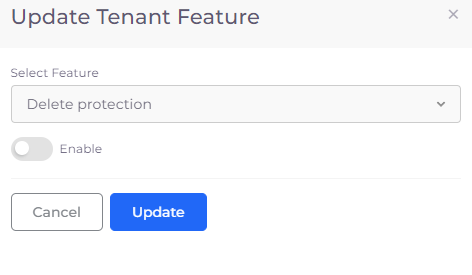

# Deleting a Tenant

When DuploCloud is installed, a **Delete protection** setting is created that prevents you from deleting a Tenant, even if you have Administrator privileges.

In order to override this protection:

1. In the DuploCloud Portal, navigate to **Administrator** -> **Tenants**.
2. Select the Tenant that you want to delete from the **Name** column.
3. Click the **Settings** tab. Note that the value for the **Delete protection** setting is **True**, indicating that **Delete protection** is enabled.
4. In the **Delete protection** row, click the open pane ( (1) (4).png>)) icon. The **Update Tenant Feature** pane displays.
5.  Select the **Enable** switch to disable **Delete protection** for the Tenant.

    <figure><figcaption>
<strong>Update Tenant Feature</strong> pane with <strong>Delete protection</strong> not enabled
</figcaption></figure>
6. Click **Update**. Note that the value of the **Delete protection** setting is now **False**.
7. Navigate back to **Administrator** -> **Tenants** and select the Tenant that you want to delete.
8. From the **Actions** menu, select **Delete**. The Tenant is deleted.
