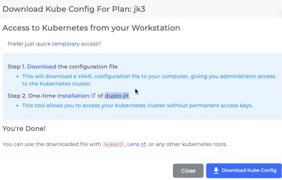

# Kubectl setup

You can access `kubectl`on a local computer to a Kubernetes cluster with `cluster-admin` privileges to download and run `kubeconfig`.


You can obtain Just-In-Time (JIT) access to Kubernetes by using `duplo-jit`. See the [JIT Access](../../aws/use-cases/jit-access.md) documentation for detailed information about:

• Obtaining JIT access, using the UI and CLI.

• Installing `duplo-jit`, using various tools.&#x20;

• Getting credentials for AWS access interactively, or with an API token.&#x20;

• Accessing the AWS Console.&#x20;


## Downloading `kubeconfig`&#x20;

1. In the DuploCloud Portal, navigate to **Administrators** -> **Infrastructure.**
2. In the Name column, select the Infrastructure in which you want to set up `kubectl`.&#x20;
3. Click the **EKS** (for AWS) tab, **GKE** (for GCP) tab, or the **AKS** (for Azure) tab.
4. Click **Download Kube Config** to download the `kubeconfig` file.



If you don't have Administrator access, you can use `duplo-jit` to access Kubernetes. When you click **Download Kube Config**, the **Access to Kubernetes from your Workstation** window displays, which provides you the alternative of installing [`duplo-jit`](../../aws/use-cases/jit-access.md) to access your Kubernetes cluster without obtaining permanent access keys.


<figure><figcaption><p><strong>Access to Kubernetes from your Workstation</strong> window with instructions and links for temporary access with duplo-jit</p></figcaption></figure>

## Installing kubectl on your local computer

1. Use these [tools ](https://kubernetes.io/docs/tasks/tools/)to install `kubectl` locally.
2. Run these commands to enable `kubectl` to use the downloaded `kubeconfig`.

* For Linux or macOS:

```shell
export KUBECONFIG=/home/duplo/duploinfra-INFRASTRUCTURE_NAME.yaml # INFRASTRUCTURE_NAME is your DuploCloud Infrastructure name.
```

* For Windows:

```powershell
setx KUBECONFIG "%USERPROFILE%\Downloads\duploinfra-INFRASTRUCTURE_NAME.yaml" # INFRASTRUCTURE_NAME is your DuploCloud Infrastructure name.
```

