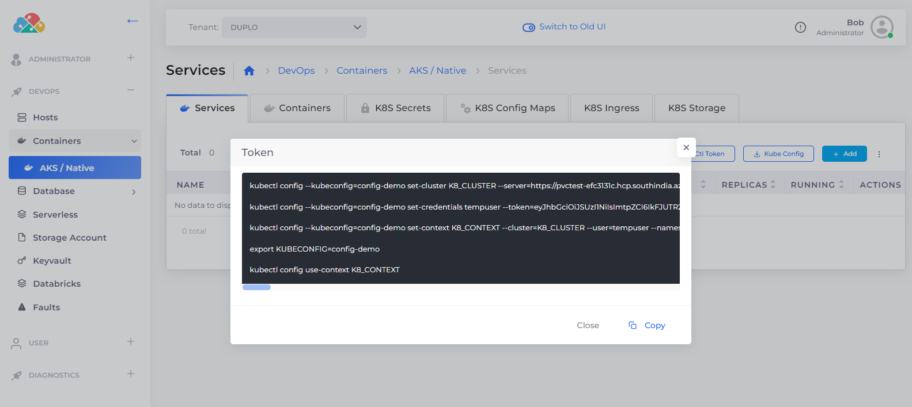

# Kubectl setup for non-administrators (AWS only)


This procedure is valid for AWS only. Variations for Azure and GCP are coming soon.


If you don't have administrator privileges, follow this procedure to access `kubeconfig`  using the `kubectl` token. `kubeconfig` is a YAML file that stores cluster authentication information for `kubectl`. It contains a list of contexts to which `kubectl` refers when running commands. By default, `kubeconfig` is saved in`$HOME/`in Linux operating systems.


Before beginning, refer to this [Kubernetes article](https://docs.aws.amazon.com/cli/latest/reference/eks/update-kubeconfig.html) for instructions about how to update `kubeconfig`.&#x20;


## Updating your AWS profile

Add the following code to your AWS profile:

```
[profile NAME] # Supply your AWS profile name
region=us-east-1
credential_process=duplo-aws-credential-process --admin --host  --interactive
```

## Downloading the kubectl token


The token that you download is for the selected Tenant only. It is intended for use with a non-human DuploCloud service account.


1. In the DuploCloud Portal, navigate to **DevOps** -> **Containers** -> **EKS/Native** -> **Services**.
2.  Click **KubeCtl Token**. The **Token** window displays.

    <figure><figcaption><p><strong>Token</strong> window</p></figcaption></figure>
3. Click **Copy** to copy the `kubectl` commands in the **Token** window to your clipboard.
4. On the **Services** tab, click **KubeCtl Shell** to launch the shell instance. Paste the copied commands into the shell and run them.

&#x20;
