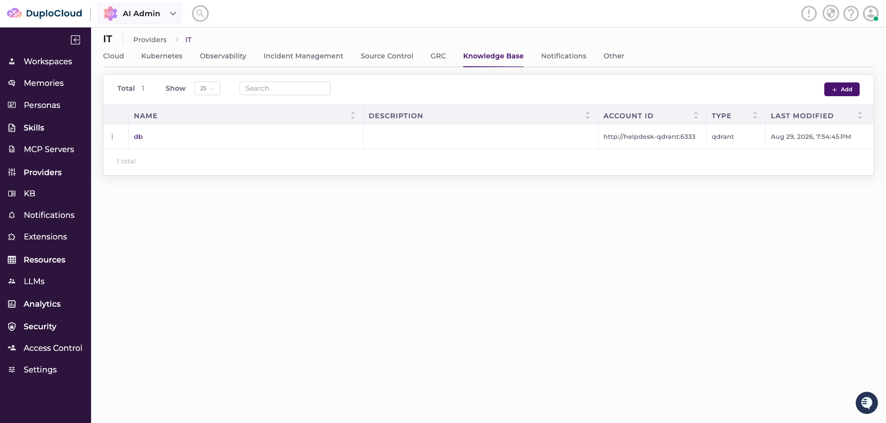
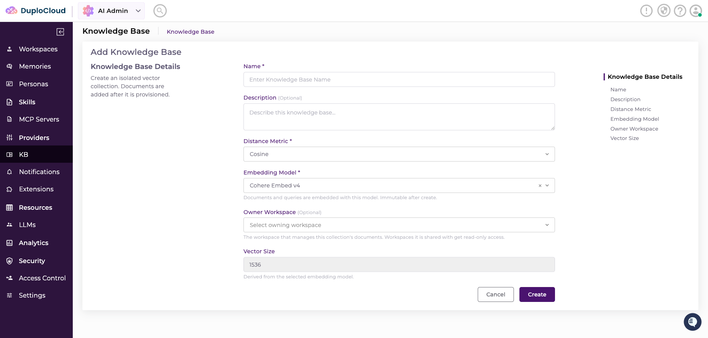
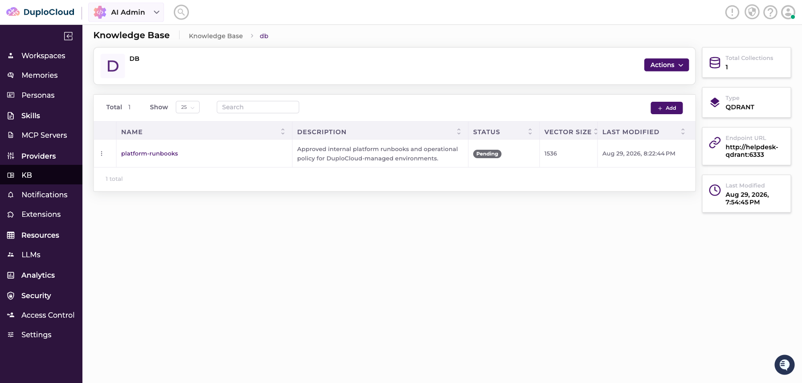
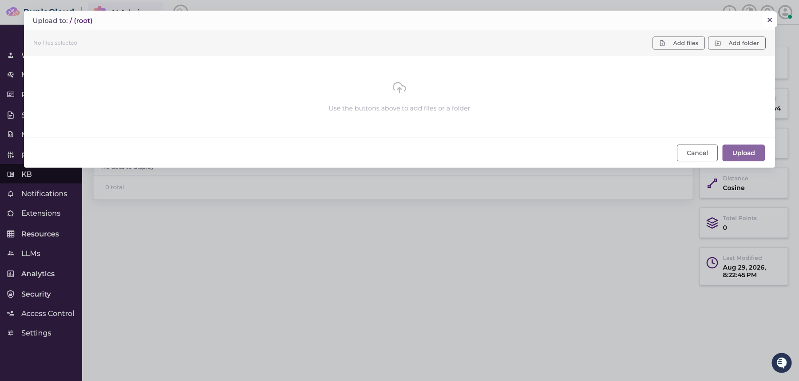
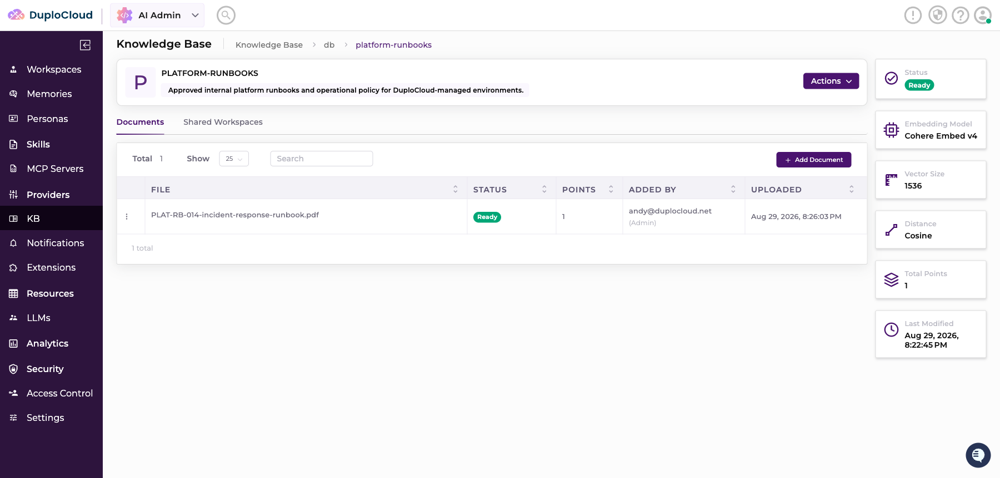
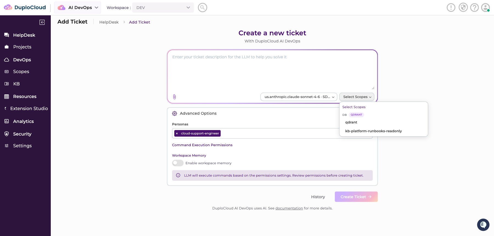
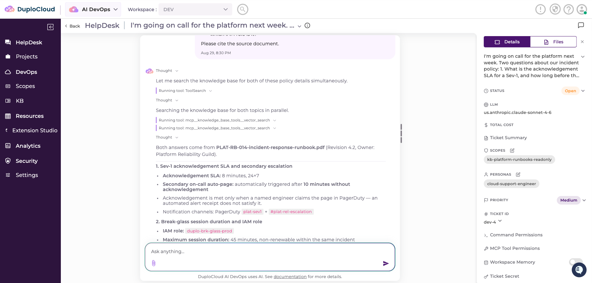

# Knowledge Base

The Knowledge Base gives an AI Agent access to your own documents. You upload files to a **Collection**, the platform embeds them into a Qdrant vector database, and the Agent searches that Collection — read-only — while answering a Ticket.

This lets Agents answer from your runbooks, policies, and internal procedures instead of from general knowledge alone.

## How it fits together

| Component | Description |
| --------- | ----------- |
| **Qdrant** | The vector database. Deployed in-cluster by the AI Helpdesk Helm chart. |
| **Provider** | The registered connection to Qdrant — its endpoint URL and master API key. |
| **Collection** | An isolated set of documents sharing one embedding model. Backed by a Qdrant collection. |
| **Scope** | What you attach to a Ticket. Each Collection gets a read-only Scope granting search access. |

The Agent never receives the master API key. When a Collection is provisioned, the platform mints a **read-only, per-Collection token** and stores it on that Collection's Scope. Only that token reaches the Agent, and only for Collections attached to the Ticket.

## Prerequisites

Qdrant must be running and reachable from the AI Helpdesk backend and Agent. The Helm chart ships it as an opt-in component:

```yaml
qdrant:
  enabled: true
  persistence:
    # Must be block storage (EBS / Persistent Disk / Azure Disk).
    storageClass: <your-block-storage-class>
    size: 10Gi
```

The chart generates the API key and preserves it across upgrades. Retrieve it when registering the Provider:

```bash
kubectl get secret <release>-helpdesk-qdrant -n <namespace> \
  -o jsonpath='{.data.api-key}' | base64 -d
```

In-cluster, Qdrant is reachable at `http://<release>-helpdesk-qdrant:6333`.


Use block storage for the Qdrant volume, never NFS-family storage such as EFS, Filestore, or Azure Files. Qdrant relies on memory-mapped files and POSIX file locking, which those filesystems do not provide safely. The resulting index corruption appears only after a node disruption, at which point the index is unrecoverable.



Qdrant runs with JWT RBAC enabled. This is required — it is what allows the platform to mint scoped, read-only tokens instead of distributing the master API key.


## Registering the vector database

To register Qdrant as a Knowledge Base Provider, complete the following steps:

1. Navigate to **AI Admin**, and select **Providers** > **IT**.
2. Select the **Knowledge Base** tab.
3. Click **Add**.
4. In the **Account ID** field, enter the Qdrant endpoint URL including the port, for example `http://helpdesk-qdrant:6333`.
5. In the **Credential** field, enter the master API key retrieved above.
6. Click **Add** to register the Provider.

<figure><figcaption><p>A registered Qdrant Provider in the Knowledge Base tab</p></figcaption></figure>


Always include the port in the endpoint URL. The Agent's Qdrant client reads the port directly from this value.


## Creating a Collection

A Collection is an isolated group of documents that share a single embedding model.

To create a Collection, complete the following steps:

1. Navigate to **AI Admin**, and select **KB**.
2. Select your Provider, and click **Add**.
3. Complete the Knowledge Base fields described below.
4. Click **Create**.

<figure><figcaption><p>Creating a Knowledge Base Collection</p></figcaption></figure>

| Field | Description |
| ----- | ----------- |
| **Name** | Becomes the Qdrant collection name. |
| **Description** | Optional summary of what the Collection holds. |
| **Distance Metric** | Vector similarity metric. Defaults to **Cosine**. |
| **Embedding Model** | The model used to embed documents and queries. **Immutable after creation.** |
| **Owner Workspace** | The Workspace that manages this Collection's documents. Workspaces it is shared with receive read-only access. |
| **Vector Size** | Derived from the selected embedding model. Not editable. |

The Collection is created in a **Pending** state while a background worker provisions it in Qdrant and mints its read-only Scope. It becomes **Ready** shortly afterward.

<figure><figcaption><p>A Collection provisioning in the Pending state</p></figcaption></figure>


The embedding model cannot be changed after creation, because queries must be embedded with the same model as the documents. To move to a different model, create a new Collection.


## Uploading documents

To add documents to a Collection, complete the following steps:

1. Open the Collection, and click **Add Document**.
2. Click **Add files**, and select one or more files. PDF, Markdown, and plain text are supported.
3. Click **Upload**.

<figure><figcaption><p>Uploading documents to a Collection</p></figcaption></figure>

Each document is chunked, embedded with the Collection's model, and written into Qdrant. Documents display a **Ready** status and a point count once ingestion completes.

<figure><figcaption><p>An ingested document showing Ready status</p></figcaption></figure>

## Attaching a Collection to a Ticket

Once a Collection is Ready, its read-only Scope becomes available as `kb-<collection>-readonly`.

To give an Agent access to a Collection, complete the following steps:

1. Create a Ticket.
2. Click **Select Scopes**.
3. Select the `kb-<collection>-readonly` Scope for the Collection you want the Agent to search.

<figure><figcaption><p>Attaching a Knowledge Base Scope to a Ticket</p></figcaption></figure>

## Verifying retrieval

Ask the Agent something that can only be answered from an uploaded document. The Agent searches the Collection and answers from the retrieved passages.

<figure><figcaption><p>An Agent answering from the Knowledge Base and citing its source document</p></figcaption></figure>

The search appears in the Ticket timeline as a `vector_search` tool call, so you can always confirm whether an answer came from the Knowledge Base or from the model's general knowledge.

## How access is scoped

* `vector_search` is **read-only**. An Agent cannot write to, modify, or delete a Collection.
* The tool is available only when a Knowledge Base Scope is attached to the request. Tickets without one have no such tool.
* The per-Collection token is held only within the tool and never enters the prompt, the system prompt, or logs.
* Tokens carry an expiry and are automatically re-minted before they lapse.

## Improving answer quality

Retrieval quality depends on what you upload.

* **Prefer structured documents.** Headings, tables, and short sections retrieve far better than long unbroken prose.
* **Keep one topic per Collection.** A focused Collection retrieves more precisely than one holding everything.
* **Instruct the Agent in its Persona.** A Persona told to search the Knowledge Base first, cite its source, and say plainly when something is not covered produces noticeably more grounded answers.

## Troubleshooting

| Symptom | Likely cause |
| ------- | ------------ |
| Collection stays in **Pending** | The platform cannot reach Qdrant. Verify the Provider endpoint URL and port, and that the Qdrant pod is Ready. |
| Collection reaches **Failed** | Usually an incorrect API key, or JWT RBAC not enabled on Qdrant. |
| Scope missing from the Ticket picker | The Collection is not yet Ready, or the Ticket's Workspace neither owns the Collection nor has been shared it. |
| Agent answers without searching | No Knowledge Base Scope was attached to the Ticket. |
| `storage folder is already locked` in Qdrant logs | Qdrant is running on NFS-family storage. Move it to block storage. |
