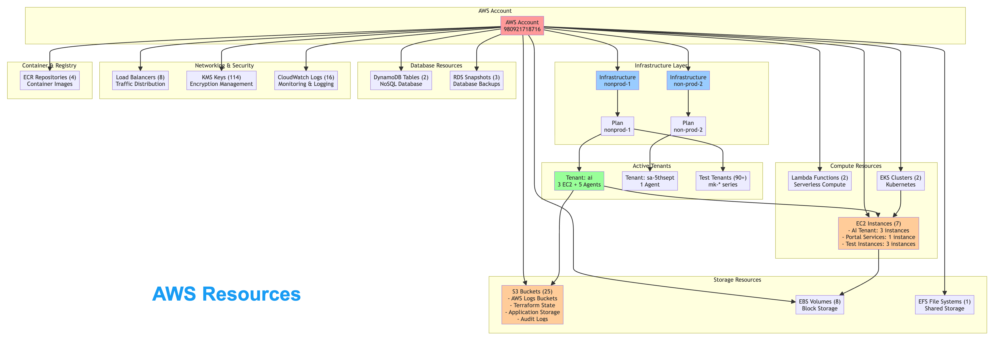
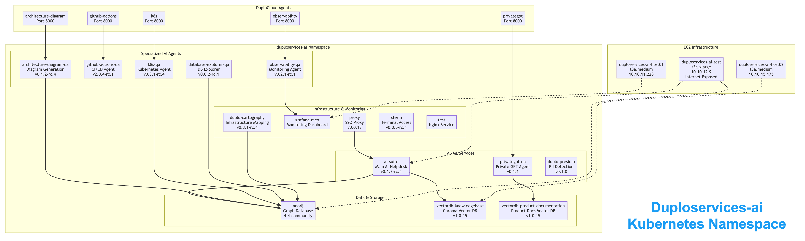
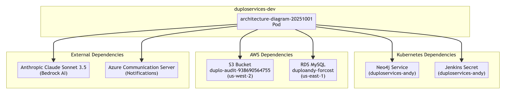

# Agents

DuploCloud AI Suite includes several Prebuilt, production-ready Agents that handle common DevOps and infrastructure management tasks. These Agents integrate seamlessly with your existing DuploCloud infrastructure and can be deployed immediately to automate routine operations and troubleshooting workflows.

Agents work within DuploCloud's secure Tenant architecture, inheriting user permissions and maintaining compliance with your organization's security policies. Agents can be accessed through the HelpDesk interface, where you can create Tickets and collaborate with AI Agents to resolve issues or perform tasks.

## Out-of-the-Box Agents

### Site Reliability Engineer (SRE) Agent

The Site Reliability Engineer (SRE) Agent is a central AI agent that orchestrates multiple specialized sub-agents to provide comprehensive support. When you interact with the SRE Agent, it automatically selects the appropriate sub-agent(s) to handle your queries, serving as a single point of interaction for all your operational questions.

**Current integrations** include the following sub-agents:

* **PrivateGPT Agent:** secure access to DuploCloud documentation and tenant-specific knowledge
* **Kubernetes Agent:** real-time cluster monitoring, resource management, troubleshooting, and log analysis

**Future Integrations** will include AWS, Observability, CI/CD, and additional sub-agents to provide end-to-end coverage for troubleshooting, diagnostics, monitoring, and observability.

View SRE (Master) Agent details

#### Core Capabilities

* **Automatic Sub-Agent Routing:** Dynamically determines which sub-agent(s) to engage for each query.
* **Comprehensive Operational Support:** Covers troubleshooting, diagnostics, monitoring, and observability.
* **Context-Aware Assistance:** Maintains awareness of tenant, cluster, and infrastructure context for precise answers.
* **Security and Compliance:** Inherits sub-agent security and permission models (e.g., PrivateGPT Agent's in-tenant processing, Kubernetes Agent’s permission inheritance).

#### Key Features

* **Single Point of Interaction:** Users can ask questions without needing to know which sub-agent to consult.
* **Real-Time Insights:** Retrieves live cluster data, documentation, or logs as required by the query.
* **Dynamic Orchestration:** Combines outputs from multiple sub-agents for complex queries spanning documentation and operational state.
* **Audit Logging:** All agent interactions are logged for traceability and compliance.

#### Integration Workflow

1. **User Query:** User submits a question or task via the HelpDesk interface.
2. **Agent Routing:** The SRE Master Agent automatically routes queries to the appropriate sub-agent(s), currently including **PrivateGPT** and **Kubernetes** agents.
3. **Sub-Agent Execution:** Selected sub-agent(s) process the request (e.g., PrivateGPT Agent answers documentation questions, Kubernetes Agent retrieves cluster metrics).
4. **Aggregated Response:** SRE Master Agent consolidates results and presents a unified answer.
5. **Logging & Auditing:** All interactions are captured for traceability.

#### Future Integrations

The SRE Agent will extend its operational coverage over time by incorporating additional sub-agents, such as:

* **AWS Agent:** Infrastructure management and cloud resource queries.
* **Observability Agent:** Logs, metrics, and alerting for full observability coverage.
* **CI/CD Agent:** Pipeline monitoring, failure detection, and automated troubleshooting.
* **Additional agents:** To provide end-to-end operational support across all DuploCloud-managed resources.

### AWS Agent

The AWS Agent is an AWS infrastructure expert that helps you diagnose, troubleshoot, and manage cloud resources across one or more AWS accounts. It suggests and executes AWS CLI commands with user approval, helping teams inspect, analyze, and take action on AWS infrastructure without requiring deep CLI expertise.

View AWS Agent details

#### Core Capabilities

* **Resource Discovery**: List and inspect AWS resources across EC2, S3, RDS, Lambda, ECS, and more
* **Multi-Account Support**: Work across multiple AWS accounts in a single conversation using Scopes
* **Command Suggestions**: Recommends precise AWS CLI commands based on your query
* **Command Execution**: Executes approved commands and returns results in real time
* **Credential Handling**: Securely processes AWS credentials from your defined Providers — each Provider maps to a separate AWS account and region
* **Context Awareness**: Maintains conversation history for more accurate, relevant responses

#### Key Features

* **Approval Workflow**: All suggested commands are presented for user review before execution
* **Scoped Execution**: When multiple Providers are configured, the agent identifies which account to target and routes commands to the correct credentials automatically
* **AWS Bedrock Backend**: Powered by Anthropic Claude via AWS Bedrock — processing stays within your AWS environment
* **Isolated Execution**: Commands run in an isolated process per session
* **Audit Logging**: All agent interactions and command executions are logged for traceability

#### Use Cases

* Investigating resource configuration and availability issues across one or more AWS accounts
* Discovering and inventorying resources within an Environment
* Troubleshooting IAM permissions, security groups, and networking
* Analyzing CloudWatch logs and metrics for performance issues
* Auditing cost and usage patterns across AWS services and accounts
* Root cause analysis for infrastructure incidents

#### Security Model

* **Permission Scope**: You define the permission boundary of the agent based on the Provider Scope you define
* **Sandboxed Execution**: Commands run in an isolated process per session
* **Audit Logging**: All agent interactions and command executions are logged for traceability and compliance

### GCP Agent

The GCP Agent is a Google Cloud Platform infrastructure expert that helps you diagnose, troubleshoot, and manage GCP resources. It suggests and executes `gcloud` and `kubectl` commands with user approval, helping teams inspect, analyze, and take action on GCP infrastructure — including GKE clusters — without requiring deep CLI expertise.

View GCP Agent details

#### Core Capabilities

* **Resource Discovery**: List and inspect GCP resources across Compute Engine, GKE, Cloud Storage, IAM, Networking, and more
* **Command Suggestions**: Recommends precise `gcloud` and `kubectl` commands based on your query
* **Command Execution**: Executes approved commands and returns results in real time
* **GKE Integration**: Full Kubernetes support for GKE clusters, including pod management, deployments, and log retrieval
* **Credential Handling**: Securely processes GCP credentials from your defined Providers
* **Context Awareness**: Maintains conversation history for more accurate, relevant responses

#### Key Features

* **Approval Workflow**: All suggested commands are presented for user review before execution
* **Dual CLI Support**: Works across both `gcloud` for GCP resource management and `kubectl` for GKE workloads
* **Isolated Execution**: Commands run in an isolated process per session
* **Audit Logging**: All agent interactions and command executions are logged for traceability

#### Use Cases

* Investigating Compute Engine instance configuration and availability
* Diagnosing GKE pod failures, crashes, and networking issues
* Managing Cloud Storage buckets and IAM policies
* Analyzing Cloud Logging and Cloud Monitoring data for performance issues
* Troubleshooting VPC networking, firewall rules, and load balancers
* Root cause analysis for GCP infrastructure incidents

#### Security Model

* **Permission Scope**: You define the permission boundary of the agent based on the Provider Scope you define
* **Sandboxed Execution**: Commands run in an isolated process per session
* **Audit Logging**: All agent interactions and command executions are logged for traceability and compliance

### Kubernetes Agent

The Kubernetes Agent is an expert DevOps engineer specialized in Kubernetes cluster management, maintenance, and troubleshooting. This Agent serves as your dedicated Kubernetes specialist, capable of handling everything from routine cluster health checks to complex resource deployments.

View Kubernetes Agent details

#### Core Capabilities

* **Cluster Health Monitoring**: Assess overall cluster health and identify potential issues
* **Resource Management**: Create, update, and manage Kubernetes resources (pods, services, deployments, etc.)
* **Troubleshooting**: Diagnose and resolve pod failures, networking issues, and resource constraints
* **Log Analysis**: Retrieve and analyze logs from specific pods or services
* **Resource Inspection**: Detailed examination of Kubernetes objects and their configurations

#### Key Features

* **Permission Inheritance**: Operates with the requesting user's Kubernetes permissions - no additional access required
* **kubectl Integration**: Executes kubectl commands securely within your cluster environment
* **Multi-Level Support**: Handles both specific detailed requests (like "get logs for pod xyz") and high-level queries (like "assess cluster health")
* **Real-time Troubleshooting**: Interactive problem-solving with immediate command execution

#### Use Cases

* Investigating pod startup failures or crashes
* Analyzing resource utilization and capacity planning
* Deploying new applications or updating existing ones
* Troubleshooting networking and service connectivity issues
* Performing routine maintenance tasks and health checks

#### Security Model

* No standalone permissions - inherits user's existing kubectl access
* All actions are performed within DuploCloud's Tenant isolation
* Command execution is logged and auditable

Here’s a quick look at the Kubernetes AI Agent in action.



### IaC Agent

The IaC Agent autonomously implements infrastructure changes in your Terraform repositories and opens pull requests for review. Give it a task — such as "add an S3 bucket with KMS encryption" — and it clones your repo, maps its structure, plans the changes, implements them, verifies the result, and creates a PR. Cloud-agnostic by design, it supports AWS, GCP, and Azure Terraform configurations.

View IaC Agent details

#### Core Capabilities

* **Autonomous Terraform Implementation**: Clones your repo, plans changes, writes Terraform code, and opens a PR — end to end
* **Multi-Cloud Support**: Works with AWS, GCP, and Azure Terraform repositories
* **Repo Structure Discovery**: Automatically maps Terraform roots, modules, and CI patterns before making changes
* **Clarification Q&A**: Pauses to ask questions when a task is ambiguous before proceeding
* **Change Verification**: Runs `terraform fmt`, `init`, `validate`, and `plan` to verify changes before the PR is created
* **Human Review Checkpoints**: Optionally pause at the planning or implementation stage for review and feedback before continuing

#### Key Features

* **Fully Autonomous Mode**: Submit a task and walk away — the agent handles the full pipeline without intervention
* **Checkpoint Feedback Loop**: At any checkpoint, approve the plan, provide feedback for revision, or directly edit the artifact before continuing
* **PR Creation**: Automatically branches, commits, and opens a GitHub pull request with a full summary of changes
* **Audit Trail**: Every step of the pipeline produces artifacts — plan, diff summary, verification results — retained per run

#### Benefits

* **Faster Implementation**: Infrastructure changes that would take hours to research, write, and validate manually can be completed in minutes
* **Consistent Code Quality**: The agent follows your existing repo structure, naming conventions, and Terraform patterns — changes fit naturally into your codebase
* **Reduced Errors**: Automated `terraform fmt`, `validate`, and `plan` checks catch mistakes before they ever reach a PR
* **Human Oversight Without Manual Work**: Checkpoints give your team full control over what gets merged, without requiring them to write the code themselves
* **Democratizes IaC**: Team members without deep Terraform expertise can contribute infrastructure changes safely

#### Use Cases

* Adding new cloud resources (compute, storage, databases, networking) via Terraform
* Modifying existing infrastructure configurations across environments
* Automating repetitive IaC tasks that follow consistent patterns
* Reviewing and approving AI-generated infrastructure changes before they reach your repo

#### Security Model

* **Credentials Never Persisted**: API keys, GitHub tokens, and cloud credentials are passed per request and never written to disk
* **Isolated Execution**: Each run operates in its own isolated directory
* **Human in the Loop**: Optional checkpoints ensure no changes land in your repo without review

### Observability Agent

The Observability Agent provides intelligent monitoring and troubleshooting capabilities through integration with your observability stack. It is currently optimized for OpenTelemetry-based environments using Grafana and helps teams quickly identify and resolve application performance issues.

View Observability Agent details

#### Core Capabilities

* **Log Retrieval and Analysis**: Fetch and summarize logs from Grafana with intelligent pattern recognition
* **Metrics Analysis**: Query and interpret application and infrastructure metrics
* **Contextual Filtering**: Automatically scope queries to the user's current namespace
* **Pattern Detection**: Identify anomalies and trends in log data
* **Time-based Analysis**: Analyze data across specific time windows

#### Current Implementation

* **Backend**: OpenTelemetry with Grafana integration
* **Data Types**: Logs and metrics (traces, spans, and profiles coming in future versions)
* **Scope**: Namespace-aware operations

#### Key Features

* **Namespace Awareness**: Automatically understands user's operational context
* **Natural Language Queries**: Ask questions like "show me errors in the payment service from the last hour"
* **Pattern Recognition**: Automatically identifies common error patterns and anomalies
* **Dashboard Navigation**: Guides users to relevant Grafana dashboards and visualizations

#### Use Cases

* Investigating application errors and performance degradation
* Analyzing traffic patterns and resource utilization
* Troubleshooting microservice communication issues
* Monitoring application health across environments
* Root cause analysis for incidents

#### Roadmap

Future versions will include support for:

* Distributed tracing analysis
* Span-level troubleshooting
* Performance profiling insights
* Integration with additional observability platforms (e.g., Datadog, New Relic, Kibana)

Watch the Observability Agent in action below.&#x20;



### CI/CD Agent

The CI/CD Agent automates pipeline troubleshooting and failure resolution across your continuous integration and deployment workflows. Available for both Jenkins and GitHub Actions, this agent proactively engages when pipeline failures occur and provides intelligent assistance for resolution.

View CI/CD Agent details

#### Supported Platforms

* **Jenkins**: Full integration with Jenkins pipelines and build processes
* **GitHub Actions**: Native GitHub Actions workflow support

#### Core Capabilities

* **Automatic Failure Detection**: Triggered automatically when pipeline failures occur
* **Intelligent Troubleshooting**: Analyzes failure logs and provides resolution recommendations
* **Deep Investigation**: Can retrieve additional logs, files, and context when needed
* **Pipeline Context**: Full understanding of build history, dependencies, and configurations

#### Integration Workflow

1. **Failure Detection**: Try-catch blocks in your pipelines automatically detect failures
2. **Ticket Creation**: DuploCloud CLI (duploctl) creates HelpDesk Tickets with full context
3. **Agent Assignment**: Tickets are automatically assigned to the CI/CD Agent
4. **Resolution Process**: Agent analyzes logs and works with users to resolve issues

#### Key Features

* **Automatic Ticket Creation**: No manual intervention required for failure detection
* **Rich Context**: Receives pipeline output, URLs, execution IDs, and failure details
* **Cross-Platform Access**: Can access version control, retrieve files, and examine build artifacts
* **Pipeline History**: Understands build trends and recurring failure patterns
* **Seamless Integration**: Direct links from Jenkins/GitHub Actions to HelpDesk Tickets

#### Use Cases

* Debugging build failures and compilation errors
* Resolving deployment issues and rollback scenarios
* Optimizing pipeline performance and reliability

Here’s the GitActions Agent at work, resolving pipeline issues.



### Architecture Diagram Agent

The Architecture Diagram Agent leverages DuploCloud's cartography system to generate intelligent infrastructure and application architecture diagrams. Built on Neo4j graph database technology, this agent provides visual representations of complex system relationships and dependencies.

View Architecture Diagram Agent Details

#### Core Technology

* **Backend**: Neo4j graph database populated by DuploCloud Cartography
* **Real-time Updates**: Continuously synchronized with your cloud environment
* **Multi-layer Mapping**: Covers AWS resources, Kubernetes objects, and application dependencies
* **Visualization**: Mermaid.js diagram generation

#### Key Features

* **Developer-Centric Views**: Generate diagrams focused on specific microservices or applications
* **Multi-Level Detail**: From high-level architecture overviews to detailed resource dependencies
* **Interactive Exploration**: Ask questions like "show me everything connected to the payment service"
* **Real-time Accuracy**: Diagrams reflect current state of your infrastructure
* **Contextual Filtering**: Scope diagrams to specific Tenants, namespaces, or applications

#### Use Cases

* **New Developer Onboarding**: Help developers understand system architecture for unfamiliar services
* **Impact Analysis**: Visualize dependencies before making changes
* **Troubleshooting**: Understand data flow and potential failure points
* **Documentation**: Generate up-to-date architecture documentation
* **Compliance Auditing**: Visualize data flows for security and compliance reviews

#### AWS Resources

Architecture Diagram Agent has insights into your AWS Resources. We currently support `AWSAccount`, `AWSRegion`, `EC2Instance`, `S3Bucket`, and `RDSInstance` to name a few. To see your AWS Resources ask the agent: `Can you create a diagram of the aws resources?`

<figure><figcaption></figcaption></figure>

#### Kubernetes Aware

Architecture Diagram Agent has extensive knowledge of Kubernetes in your infrastructure.&#x20;

For example, we can ask Architecture Diagram Agent `Can you create a diagram of the duploservices-ai namespace?` and it'll create a diagram.

<figure><figcaption></figcaption></figure>

#### Custom Dependency Definition

Organizations can optionally define custom application dependencies:

* **Granular Control**: Define dependencies per microservice
* **Multi-type Support**: AWS resources, Kubernetes services, and external APIs

For example, once we define a pods dependenices, we can ask our Architecture Diagram Agent: `Can you create a diagram of dependencies for my Architecture Diagram Agent?` and it will create a diagram of the dependencies:

<figure><figcaption></figcaption></figure>

\
**Architecture Diagram Agent — Role Boundaries and Scope**

* **Tenancy boundary**:
  * All resources, relationships, metrics, and events are organized under a Tenant using `tenantId`.
  * All reads/writes require a `tenantId`; data from other Tenants is never returned or mutated.
  * Cross-tenant access is denied; background jobs and graph updates run within the same `tenantId` scope.
* **User role (least privilege)**:
  * **Visibility**: Only resources and relationships within their own `tenantId`.
  * **Actions**: Read and interact within Tenant scope; cannot access or reference other Tenants.
  * **UI**: Graph, search, filters, impact/stats panels, and websockets show only Tenant-scoped data.
* **Admin role (most privilege)**:
  * **Visibility**: Intended for administration across Tenants.
  * **Actions**: Manage resources, relationships, and system-wide operations.
  * **UI**: Can view and operate beyond a single Tenant unless least-privilege applies (see below).
* **Least-privilege override (effective role)**:
  * When a principal has multiple roles, the least-privileged role determines access.
  * Example: If a principal has both admin and user roles, the effective scope is the user role:
    * Visibility and actions are restricted to the principal’s `tenantId`.
    * Cross-tenant views and operations are not permitted.
* **What each role sees**:
  * **User**: Only their Tenant’s nodes, edges, metrics, and events; Tenant-filtered diagrams and panels.
  * **Admin**: System-wide view and management; however, if also assigned the user role, the session is constrained to the user’s single-Tenant scope.
* **Enforcement points (high level)**:
  * API routes validate and require `tenantId`.
  * Graph/database queries filter by `tenantId`.
  * Websocket channels are partitianed by `tenantId`.
  * Diagram generation and analysis features apply `tenantId` filtering end-to-end.

In short: data is strictly segmented by `tenantId`; users operate only within their Tenant; admins can operate broadly, but any concurrent user assignment forces least-privilege behavior, restricting access to the user’s Tenant.

### Knowledgebase Agent

The Knowledgebase Agent answers questions by searching a vector database of previously resolved support tickets and knowledge base articles. Rather than relying solely on general AI knowledge, it grounds responses in your organization's actual resolution history — surfacing relevant tickets, steps, and references that have worked before. Over time, it becomes a living repository of your team's tribal knowledge, making institutional expertise available to everyone on demand.

View Knowledgebase Agent details

#### Core Capabilities

* **Semantic Search**: Searches previously resolved tickets and knowledge base articles using vector similarity to find the most relevant matches for your query
* **Result Reranking**: Applies a reranking model to optimize search results for accuracy before generating a response
* **Grounded Responses**: Answers are based on your organization's real ticket history, with source references included
* **Intelligent Fallback**: When no sufficiently relevant results are found, falls back gracefully to general AI knowledge
* **PII Sanitization**: Optionally detects and redacts personally identifiable information from queries before processing

#### Key Features

* **Reference Links**: Responses include links to the source tickets or documentation used to formulate the answer
* **Context Awareness**: Maintains conversation history for more accurate follow-up responses
* **Context-Aware by Default**: Automatically interprets questions within the context of your configured knowledge base unless explicitly stated otherwise

#### Benefits

* **Preserves Tribal Knowledge**: Captures and surfaces institutional expertise that would otherwise live only in individuals' heads or be lost over time
* **Faster Resolution**: Teams spend less time re-investigating known issues — past solutions are surfaced instantly
* **Continuous Improvement**: The more tickets resolved and indexed, the more accurate and useful the agent becomes
* **Self-Service Support**: Empowers team members to find answers independently without needing to escalate

#### Use Cases

* Troubleshooting known issues by surfacing how similar problems were previously resolved
* Onboarding new team members with answers grounded in real operational history
* Reducing repeat support tickets by making past resolutions searchable
* Quick lookups for configuration guidance, error resolutions, and operational steps

#### Security Model

* **PII Protection**: Optional PII detection and redaction ensures sensitive data is sanitized before being processed
* **Processing Within Your Environment**: All AI processing occurs within your own cloud environment — data does not leave your infrastructure
* **Audit Logging**: All agent interactions are logged for traceability and compliance

### PrivateGPT Agent

The PrivateGPT Agent provides a secure, enterprise-grade ChatGPT-like experience for organizations concerned about data privacy and security. This agent ensures that sensitive organizational data never leaves your AWS environment while providing powerful AI assistance.

View PrivateGPT Agent details

#### Security Architecture

* **Data Locality**: All processing occurs within your AWS environment
* **AWS Bedrock Backend**: Leverages AWS Bedrock for LLM capabilities
* **Enhanced Privacy**: Stronger guarantees that input data won't be used for model training
* **DuploCloud Interface**: Access through familiar HelpDesk interface

#### Core Capabilities

* **General AI Assistance**: Natural language processing for various business needs
* **Document Analysis**: Process and analyze internal documents securely

#### Key Features

* **Zero External Data Exposure**: All interactions remain within your cloud environment
* **Familiar Interface**: ChatGPT-like experience through DuploCloud HelpDesk
* **Enterprise Controls**: Full audit trail and access controls
* **Compliance Ready**: Meets strict data residency and privacy requirements

#### Use Cases

* Analyzing sensitive business documents
* Internal knowledge base queries
* Compliance and regulatory document review

#### Benefits Over Public AI Services

* **Data Sovereignty**: Complete control over where your data is processed
* **Compliance Alignment**: Meets enterprise security and regulatory requirements
* **Audit Trail**: Full logging and monitoring of AI interactions

### Database Explorer Agent

The Database Explorer Agent provides secure, controlled access to database operations through pre-defined query templates. This agent enables non-technical teams to access database information safely without SQL knowledge or direct database access.

View Database Explorer Agent details

#### Core Architecture

* **Template-Based Queries**: Uses pre-defined "fuzzy" SQL query templates
* **Multi-Database Support**: Works with MySQL, PostgreSQL, and other relational databases
* **Natural Language Interface**: Users interact using plain language requests
* **Parameter Substitution**: Intelligently fills in query parameters based on user input

#### Security Model

* **Controlled Access**: Only pre-approved query patterns can be executed
* **No Raw SQL**: Users cannot execute arbitrary database commands
* **Template Validation**: All queries must match predefined templates
* **Audit Logging**: Complete tracking of all database interactions

**User Interaction**

* **User Request**: "Find the customer with phone number (555) 123-4567"
* **Agent Processing**: Extracts phone number, maps to customer lookup template
* **Query Execution**: Substitutes parameter and executes safe query
* **Response**: Returns customer information in user-friendly format

#### Key Features

* **Template Library**: Maintain a collection of approved query patterns
* **Parameter Validation**: Automatic validation of input parameters
* **Result Formatting**: Present database results in user-friendly formats

#### Use Cases

* **Customer Support**: Quick customer information lookup
* **Data Analysis**: Self-service access to business intelligence data
* **Report Generation**: Automated generation of standard reports
* **Operational Queries**: Access to operational data without technical expertise

#### Benefits

* **Rapid Development**: Enable data access without building custom UIs
* **Security**: Controlled access prevents unauthorized operations
* **User Empowerment**: Non-technical teams gain self-service capabilities
* **Reduced Development Overhead**: No need to build custom data access interfaces

## Support and Customization

While these out-of-the-box agents cover many common use cases, DuploCloud's AI Studio platform enables you to build custom agents tailored to your specific workflows and tools. For assistance with agent customization or integration with additional tools, contact the DuploCloud team.
