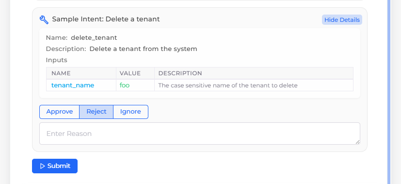

# Developers

## Prebuilt Agent Integration Guide

### Overview

This guide documents the API standards required for custom agents to integrate with the DuploCloud Help Desk. By following these standards, your Agent can leverage Help Desk features like terminal command execution, browser interactions, and file operations.

### Agent API Requirements

All custom Agents must expose a chat endpoint:

```
POST /api/sendMessage
```

This POST endpoint handles message exchanges between your Agent and Help Desk, supporting contextual information and specialized response types.

### Request Format

#### Request from Help Desk to Agent

The Help Desk makes a POST requets to the agent's chat endpoint, and sends a flat array of messages in the body, where the last message is the current user request. All previous messages provide conversation context.

```json
{
  "messages": [
    {
      "role": "user" | "assistant",
      "content": "Message text content",
      "platform_context": {
        // only for user messages
      },
      "data": {
        // Structured data exchanges
      },
      "timestamp": "2025-05-20T18:00:46.123456Z"
    }
    // ... more messages
  ]
}
```

#### Field Descriptions

**messages** (array, required)

* Flat array of all conversation messages
* Last element is the current message
* Follows OpenAI/Anthropic conversation format

**role** (string, required)

* `"user"`: Message from user to agent
* `"assistant"`: Message from agent to user

**content** (string, required)

* Human-readable message text
* Empty string for pure approval/rejection messages

**platform\_context** (object, only for user messages)

* Environment-specific configuration and credentials
* Set by Help Desk
* Example:

```json
{
  "k8s_namespace": "duploservices-andy",
  "tenant_name": "andy",
  "tenant_id": "7859b3f9-6d74-44fd-b20f-2b9c1e056761",
  "duplo_base_url": "duplo.cloud.exmple.com",
  "aws_credentials": { /* ... */ },
  "kubeconfig": "base64...",
  "duplo_token": "DuploCloud Token for the user sending the message to the Agent",
  "grafana_base_url": "https://grafana.example.com",
  "aws_security_group_name": "duploservices-andy",
  "aws_iam_role_name": "duploservices-andy"
}
```

**data** (object, required)

* Structured data for commands, URLs, and other actions
* Contains `cmds`, `executed_cmds`, and `url_configs` arrays

**timestamp** (string, optional)

* formatted timestamp

### Response Format

#### Response from Agent to Help Desk

```json
{
  "role": "assistant",
  "content": "Agent's text response to the user",
  "data": {
    "cmds": [],
    "executed_cmds": [],
    "url_configs": []
  }
}
```

### Capability-Specific Formats

#### Terminal Commands

Agents can provide terminal commands for user approval and execution through a human-in-the-loop workflow.

**Command Proposal (Agent → User)**

```json
{
  "role": "assistant",
  "content": "I'll check the pod status in your namespace.",
  "data": {
    "cmds": [
      {
        "command": "kubectl get pods -n duploservices-andy",
        "execute": false,
        "files": [
          {
            "file_path": "config/app.yaml",
            "file_content": "apiVersion: v1\nkind: ConfigMap..."
          }
        ]
      }
    ]
  }
}
```

**Command Fields**

**command** (string, required)

* The shell command to execute

**execute** (boolean, required)

* `false`: Command proposed by agent, awaiting approval
* `true`: Command approved by user

**files** (array, optional)

* Files to create before command execution
* Each file object contains:
  * `file_path`: Relative path where file should be created
  * `file_content`: Content of the file

**rejection\_reason** (string, optional in user response)

* User's reason for rejecting a command (when execute=false)

#### Terminal Command Workflow

**1. Agent Proposes Commands**

Agent suggests commands with `execute: false`:

```json
{
  "role": "assistant",
  "content": "Let me check your pod status and recent events.",
  "data": {
    "cmds": [
      {
        "command": "kubectl get pods -n duploservices-andy",
        "execute": false
      },
      {
        "command": "kubectl get events -n duploservices-andy --sort-by=.metadata.creationTimestamp",
        "execute": false
      }
    ]
  }
}
```

**2. User Approves/Rejects Commands**

When the user responds, they send back commands with updated execute status:

```json
{
  "role": "user",
  "content": "",  // Empty for pure approval
  "data": {
    "cmds": [
      {
        "command": "kubectl get pods -n duploservices-andy",
        "execute": true  // Approved
      },
      {
        "command": "kubectl get events -n duploservices-andy --sort-by=.metadata.creationTimestamp",
        "execute": false,  // Rejected
        "rejection_reason": "Too much output, let's focus on pods first" //Optional Field may or may not be provided by the user
      }
    ]
  }
}
```

**3. User can send Executed Commands to the agent**

In the next request, the user can also share commands and outputs executed by him on his own in a shared user terminal to the agent:

```json
{
  "role": "user",
  "content": "I ran my own commands, analyze them",
  "data": {
    "executed_cmds": [
      {
        "command": "kubectl get pods -n duploservices-andy",
        "output": "NAME                    READY   STATUS    RESTARTS   AGE\napp-69fb74d9d4-j2l6x   1/1     Running   0          22h"
      }
    ]
  }
}
```

**4. Agent Analyzes and Responds**

**The agent can share the commands it executed to the user via the executed\_cmds array.**

```json
{
  "content": "All pods are running successfully. The app pod has been stable for 22 hours.",
  "data": {
    "executed_cmds": [
      {
        "command": "kubectl get pods -n duploservices-andy",
        "output": "NAME                    READY   STATUS    RESTARTS   AGE\napp-69fb74d9d4-j2l6x   1/1     Running   0          22h"
      }
    ],
    "cmds": [
      {
        "command": "kubectl logs app-69fb74d9d4-j2l6x --tail=50",
        "execute": false
      }
    ]
  }
}
```

#### User-Initiated Commands

Users can run their own terminal commands between agent messages. These appear in the next user message:

```json
{
  "role": "user",
  "content": "I checked the logs myself and found errors",
  "data": {
    "executed_cmds": [
      {
        "command": "kubectl logs app-69fb74d9d4-j2l6x | grep ERROR",
        "output": "ERROR: Database connection timeout\nERROR: Failed to fetch user data"
      }
    ]
  }
}
```

#### File Operations with Commands

For commands requiring file creation (e.g., Helm charts, configurations):

```json
{
  "role": "assistant",
  "content": "I'll deploy a monitoring agent to help diagnose the issue.",
  "data": {
    "cmds": [
      {
        "command": "helm install monitor ./monitor-agent --namespace=duploservices-andy",
        "execute": false,
        "files": [
          {
            "file_path": "monitor-agent/Chart.yaml",
            "file_content": "apiVersion: v2\nname: monitor-agent\nversion: 1.0.0\ndescription: Monitoring agent for debugging"
          },
          {
            "file_path": "monitor-agent/values.yaml", 
            "file_content": "replicaCount: 1\nimage:\n  repository: monitor\n  tag: latest"
          }
        ]
      }
    ]
  }
}
```

### Tool Calls

Agents can request approval for any function or tool execution, not just terminal commands. This enables agents to perform actions like deleting tenants, updating configurations, or managing cloud resources with human oversight.

Tool calls follow the same human-in-the-loop pattern as terminal commands but support any programmatic action your agent needs to perform.

#### Tool Call Object Format

Each tool call in the `tool_calls` array contains these fields:

```json
{
  "id": "unique-call-id-123",
  "name": "delete_tenant", 
  "input": {
    "tenant_name": "staging-env",
    "force": true
  },
  "execute": false,
  "tool_description": "Delete a tenant from the system",
  "input_description": {
    "tenant_name": {
      "type": "string",
      "description": "The case sensitive name of the tenant to delete"
    },
    "force": {
      "type": "boolean", 
      "description": "Skip confirmation prompts during deletion"
    }
  },
  "intent": "Delete the staging environment tenant",
  "rejection_reason": null
}
```

#### Field Descriptions

* **id** (string, required): Unique identifier for this tool call within the request
* **name** (string, required): Function or tool name to execute
* **input** (object, required): Dictionary of arguments passed to the function
* **execute** (boolean, required): Approval flag - `false` for proposals, `true` when approved
* **tool\_description** (string, required): Human-readable description of what this tool does
* **input\_description** (object, required): Schema describing each input parameter with type and description
* **intent** (string, optional): User-friendly summary of the specific action being performed
* **rejection\_reason** (string, optional): User's reason for rejecting the tool call. Present in the tool call object sent back to the user by HelpDesk, after a user rejects a tool call and provides a reason.&#x20;

### Tool Call Workflow

#### 1. Agent Proposes Tool Calls

Agent suggests actions with `execute: false`:

```json
{
  "role": "assistant",
  "content": "I need to clean up your development environment by removing unused tenants and updating the database configuration.",
  "data": {
    "tool_calls": [
      {
        "id": "cleanup-001",
        "name": "delete_tenant",
        "input": {
          "tenant_name": "old-dev-env"
        },
        "execute": false,
        "tool_description": "Delete a tenant from the system",
        "input_description": {
          "tenant_name": {
            "type": "string",
            "description": "The case sensitive name of the tenant to delete"
          }
        },
        "intent": "Remove the unused 'old-dev-env' tenant"
      },
      {
        "id": "config-002", 
        "name": "update_database_config",
        "input": {
          "connection_pool_size": 20,
          "timeout_seconds": 30
        },
        "execute": false,
        "tool_description": "Update database connection configuration",
        "input_description": {
          "connection_pool_size": {
            "type": "integer",
            "description": "Maximum number of database connections"
          },
          "timeout_seconds": {
            "type": "integer", 
            "description": "Query timeout in seconds"
          }
        }
      }
    ]
  }
}
```

#### 2. User Interface Display

The UI renders a tool call like shown in the image below:

<figure><figcaption></figcaption></figure>

Corresponding Tool Call Object:

```json
{
  "id": "asdf1234", // unique ID
  "name": "delete_tenant", // function/tool name
  "input": {
    "tenant_name": "foo"
  }, // function arguments
  "execute": false, // approval flag
  "tool_description": "Delete a tenant from the system",
  "input_description": {
    "tenant_name": {
      "type": "string",
      "description": "The case sensitive name of the tenant to delete"
    }
  },
  "intent": "Sample Intent: Delete a tenant" // Optional: Single user-friendly string describing the action. If provided, the UI will show this intent when asking for approval and other details (tool_name, description etc) will be shown in in the details section.
}
```

#### 3. User Approves/Rejects Tool Calls

User responds with updated approval status, just like terminal commands, Help Desk will set the execute flag to true or false based on the user's input and simply pass all the tool call objects back in the tool\_calls array when sending the next request:&#x20;

```json
{
  "role": "user",
  "content": "Approve the tenant deletion but reject the database config change for now.",
  "data": {
    "tool_calls": [
      {
        "id": "cleanup-001",
        "name": "delete_tenant", 
        "input": {
          "tenant_name": "old-dev-env"
        },
        "execute": true,
        "tool_description": "Delete a tenant from the system",
        "input_description": {
          "tenant_name": {
            "type": "string",
            "description": "The case sensitive name of the tenant to delete"
          }
        },
        "intent": "Remove the unused 'old-dev-env' tenant"
      },
      {
        "id": "config-002",
        "name": "update_database_config",
        "input": {
          "connection_pool_size": 20,
          "timeout_seconds": 30  
        },
        "execute": false,
        "tool_description": "Update database connection configuration", 
        "input_description": {
          "connection_pool_size": {
            "type": "integer",
            "description": "Maximum number of database connections"
          },
          "timeout_seconds": {
            "type": "integer",
            "description": "Query timeout in seconds"
          }
        },
        "rejection_reason": "Let's test the current settings under load first"
      }
    ]
  }
}
```

#### 4. Agent Executes and Reports Results

Agent executes approved tool calls and can **optionally** shares the outputs of the tool calls results by sending them in a executed\_tool\_calls array:

```json
{
  "role": "assistant",
  "content": "Successfully deleted the old development tenant. I'll skip the database configuration update as requested and monitor current performance instead.",
  "data": {
    "executed_tool_calls": [
      {
        "id": "cleanup-001",
        "name": "delete_tenant",
        "input": {
          "tenant_name": "old-dev-env"
        },
        "output": {
          "success": true,
          "message": "Tenant 'old-dev-env' deleted successfully",
          "resources_freed": ["2 services", "1 database", "3 storage buckets"]
        }
      }
    ],
    "tool_calls": [
      {
        "id": "monitor-003",
        "name": "setup_performance_monitoring", 
        "input": {
          "duration_hours": 24,
          "metrics": ["cpu", "memory", "db_connections"]
        },
        "execute": false,
        "tool_description": "Monitor system performance metrics",
        "input_description": {
          "duration_hours": {
            "type": "integer",
            "description": "How long to monitor in hours"
          },
          "metrics": {
            "type": "array",
            "description": "List of metrics to track"
          }
        },
        "intent": "Monitor current database performance for 24 hours"
      }
    ]
  }
}
```

Like terminal commands, agents can share executed tool call results using `executed_tool_calls`:

```json
{
  "role": "assistant", 
  "content": "I've completed the tenant setup and database initialization.",
  "data": {
    "executed_tool_calls": [
      {
        "id": "create-001",
        "name": "create_tenant",
        "input": {
          "tenant_name": "production",
          "region": "us-west-2"
        },
        "output": {
          "tenant_id": "tenant-abc123",
          "status": "active",
          "endpoints": {
            "api": "https://api.prod.example.com",
            "dashboard": "https://dashboard.prod.example.com"
          }
        }
      }
    ]
  }
}
```

### Best Practices

**Clear Descriptions**: Always provide meaningful `tool_description` and detailed `input_description` for each parameter. Users need to understand exactly what each tool call will do.

**Use Intent Wisely**: Include `intent` for complex operations or when the tool name isn't self-explanatory. This creates a cleaner user experience.

**Unique IDs**: Generate unique `id` values for each tool call within a request. These IDs track approvals across the conversation.

**Handle Rejections**: Respect rejections and adjust your approach. Use `rejection_reason` to understand user concerns and propose alternatives.

**Progressive Actions**: Start with diagnostic tool calls before suggesting changes. Build user trust through transparency.

**Output Sharing**: Use `executed_tool_calls` to share results and maintain conversation context. This helps users understand what happened and enables follow-up actions.

#### Browser Actions

Agents can direct users to web resources:

```json
{
  "role": "assistant",
  "content": "Here are the relevant monitoring dashboards for your issue:",
  "data": {
    "url_configs": [
      {
        "url": "https://grafana.example.com/d/k8s-pods",
        "description": "Kubernetes pod health dashboard"
      },
      {
        "url": "https://grafana.example.com/d/app-metrics",
        "description": "Application performance metrics"
      }
    ]
  }
}
```

### Complete Workflow Example

Here's a full conversation flow showing all capabilities:

```json
{
  "messages": [
    // 1. User reports issue
    {
      "role": "user",
      "content": "My application is running slow",
      "platform_context": {
        "k8s_namespace": "duploservices-app",
        "tenant_name": "app-team"
      },
      "data": {}
    },
    
    // 2. Agent proposes diagnostic commands
    {
      "role": "assistant",
      "content": "I'll help diagnose the performance issue. Let me check your pod resources first.",
      "data": {
        "cmds": [
          {
            "command": "kubectl top pods -n duploservices-app",
            "execute": false
          }
        ]
      }
    },
    
    // 3. User approves and also 
    {
      "role": "user",
      "content": "",
      "platform_context": { /* ... */ },
      "data": {
        "cmds": [
          {
            "command": "kubectl top pods -n duploservices-app",
            "execute": true
          }
        ]
      }
    },
    
    // 4. Agent analyzes results and suggests scaling
    {
      "role": "assistant",
      "content": "Your pod is using 95% CPU, which explains the slowdown. I recommend scaling your deployment to distribute the load.",
      "data": {
        "executed_cmds": [
          {
            "command": "kubectl top pods -n duploservices-app",
            "output": "NAME              CPU(cores)   MEMORY(bytes)\napp-pod-abc123    950m         1900Mi"
          }
        ],
        "cmds": [
          {
            "command": "kubectl scale deployment app --replicas=3 -n duploservices-app",
            "execute": false
          }
        ]
      }
    },
    
    // 5. User approves scaling and checks deployment status
    {
      "role": "user",
      "content": "Good idea, let's scale it up. I also want to check the current deployment status.",
      "platform_context": { /* ... */ },
      "data": {
        "cmds": [
          {
            "command": "kubectl scale deployment app --replicas=3 -n duploservices-app",
            "execute": true
          }
        ],
        "executed_cmds": [
          {
            "command": "kubectl get deployment app -n duploservices-app",
            "output": "NAME   READY   UP-TO-DATE   AVAILABLE   AGE\napp    1/1     1            1           5d"
          }
        ]
      }
    },
    
    // 6. Agent confirms scaling and provides monitoring dashboards
    {
      "role": "assistant",
      "content": "Scaling complete! Your deployment is now running 3 replicas. Here are dashboards to monitor the performance improvement:",
      "data": {
        "executed_cmds": [
          {
            "command": "kubectl scale deployment app --replicas=3 -n duploservices-app",
            "output": "deployment.apps/app scaled"
          }
        ],
        "url_configs": [
          {
            "url": "https://grafana.example.com/d/cpu-analysis",
            "description": "CPU usage trends across all replicas"
          },
          {
            "url": "https://grafana.example.com/d/load-distribution",
            "description": "Load distribution between pods"
          }
        ]
      }
    }
```

### Best Practices

1. **Use Platform Context**: Always use provided platform context values instead of hardcoded values
2. **Clear Explanations**: Provide clear explanations with suggested actions
3. **Human-in-the-Loop**: Set `execute: false` for commands requiring approval
4. **Maintain State**: Include your executed commands in responses to maintain context
5. **Progressive Disclosure**: Start with diagnostic commands before suggesting changes
6. **Analyze Outputs**: Always analyze command outputs and provide insights
7. **Handle Rejections**: Respect command rejections and adjust your approach
8. **Symmetric Patterns**: Use `executed_cmds` consistently for sharing command results
