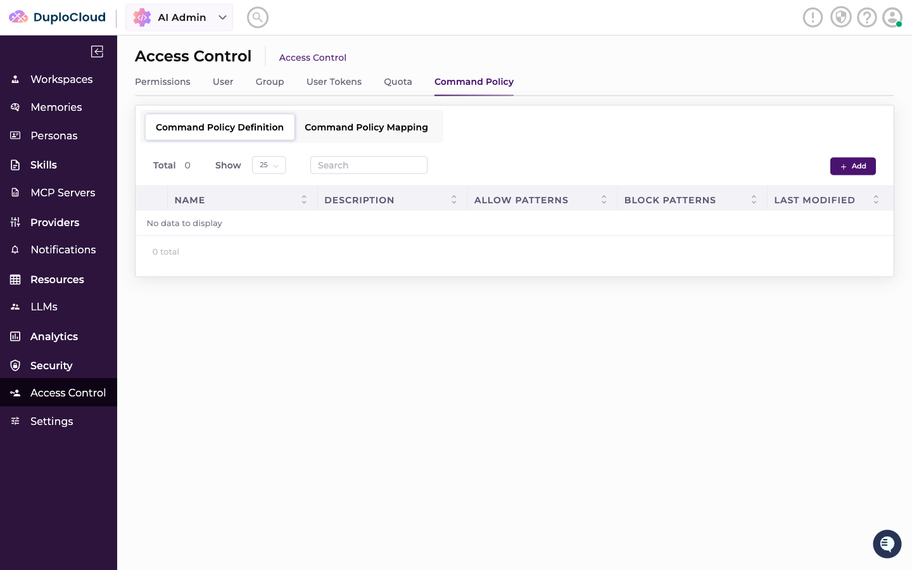
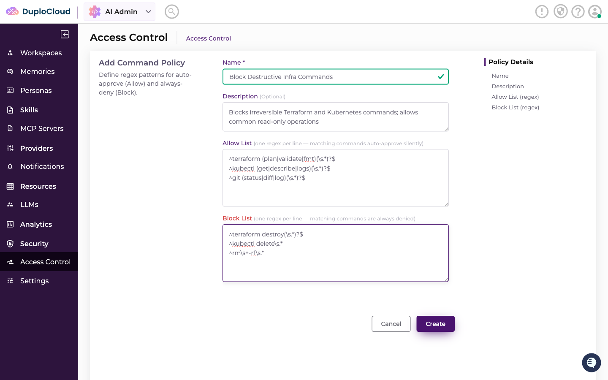
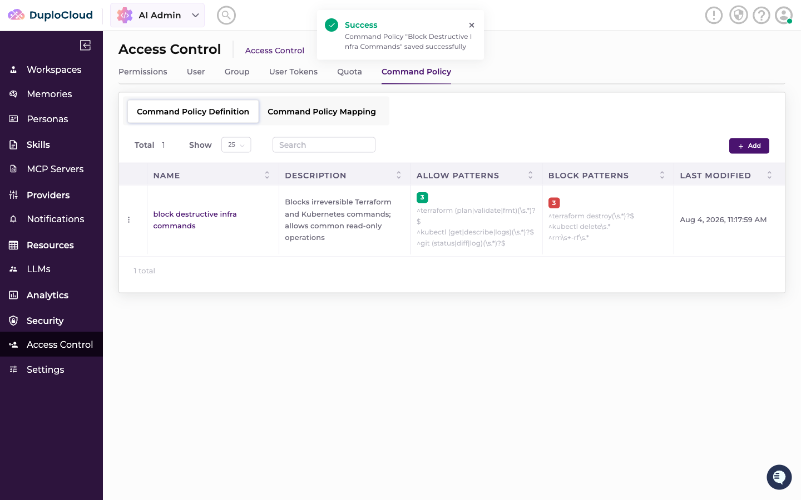
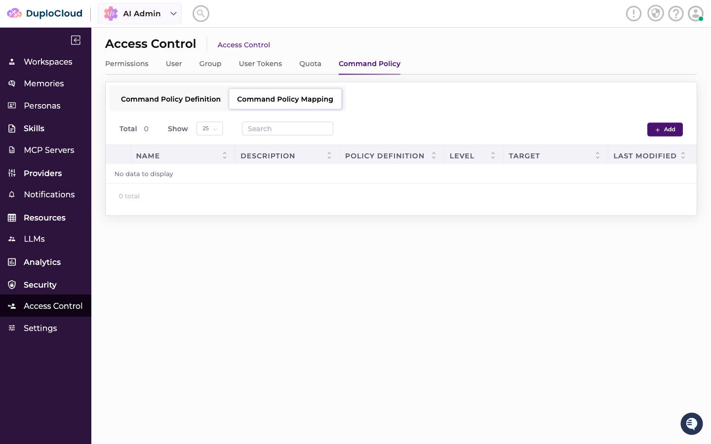
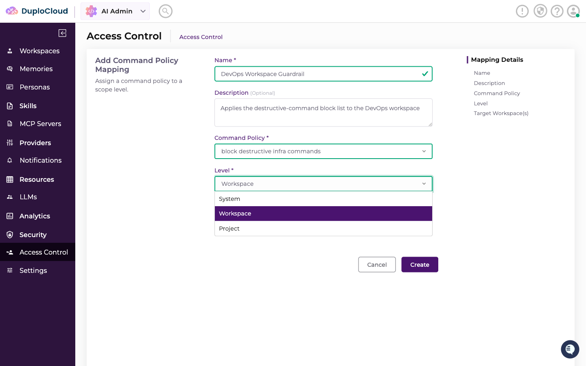
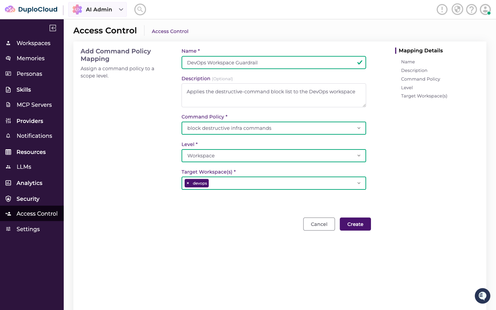
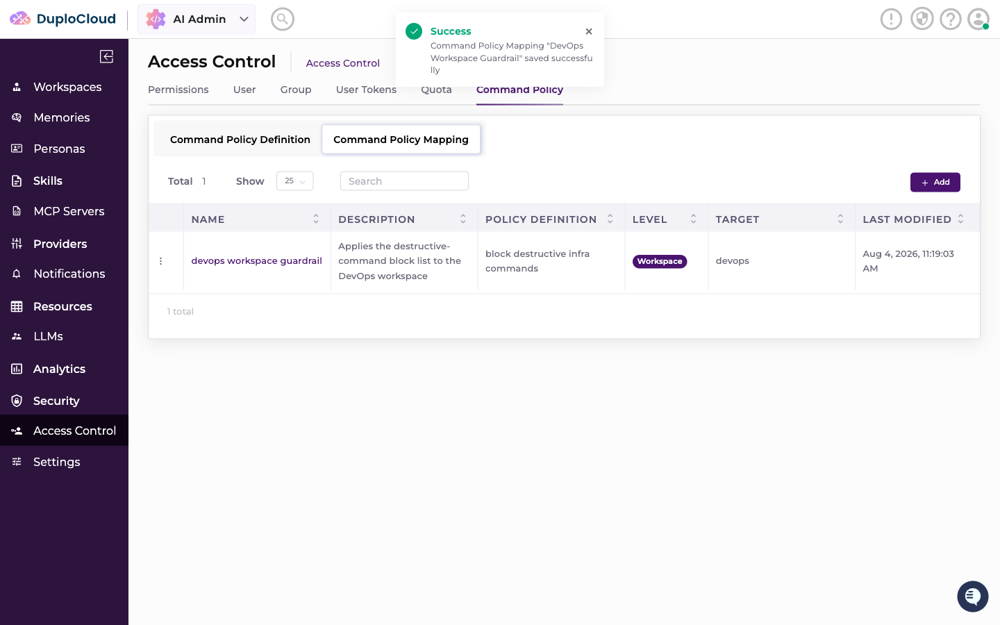

# Command Policy

Command Policies let administrators define, once, which shell commands an agent is allowed to auto-run and which are always denied — enforced platform-wide, per workspace, or per project, rather than set up manually on every ticket. It's a **Definition** (the regex rules) paired with a **Mapping** (where those rules apply).

Go to **AI Admin → Access Control → Command Policy**.

***

## Command Policy Definition

A Definition holds two lists of regular expressions — one per line:

* **Allow List** — commands matching any pattern here are auto-approved
* **Block List** — commands matching any pattern here are always denied, even if they also match an allow pattern

Click **+ Add** and fill in:

* **Name\*** — a label for the policy
* **Description** — optional
* **Allow List** — one regex per line
* **Block List** — one regex per line


The Block List always wins — if a command matches both an allow and a block pattern, it's denied. A command that matches neither list isn't auto-decided either way; it falls through to manual approval in the ticket, the same **Command Permissions** approval prompt described in [Command Permissions](../tickets.md#command-permissions).


***

## Command Policy Mapping

A Mapping binds a Definition to the scope it should apply to.

Click **+ Add** and fill in:

* **Name\*** — a label for the mapping
* **Description** — optional
* **Command Policy\*** — the Definition to apply
* **Level\*** — **System**, **Workspace**, or **Project**
* **Target Workspace(s)\*** / **Target Project(s)\*** — shown only for Workspace/Project level; select one or more

Only one active mapping is allowed per level/target combination — for example, only one active System-level mapping platform-wide, and only one active mapping per workspace at the Workspace level.


Command Policies are an admin-configured layer on top of the per-ticket **Command Permissions** patterns — both are combined when a command is evaluated. A command is denied if it matches a block pattern anywhere (the ticket's own patterns, or the System/Workspace/Project policy covering it); it's auto-approved only if it matches an allow pattern everywhere it's checked. Anything else is left for a person to approve on the ticket.

