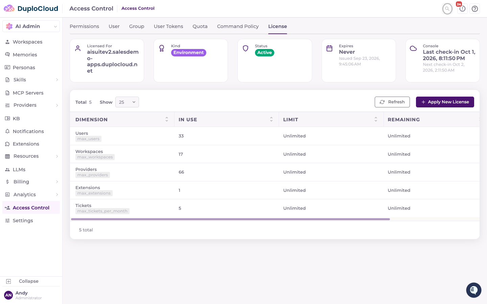
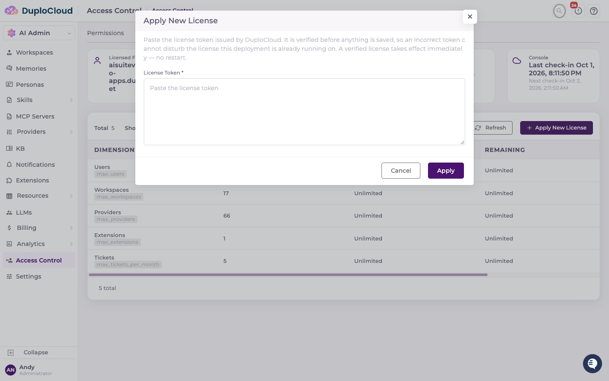

# License

Every DuploCloud AI Suite deployment requires a license issued by DuploCloud. The license is a signed token that identifies the deployment it belongs to and carries the entitlements (user, workspace, provider, and extension limits) the platform enforces.

This page explains what the license does, the two ways to supply it, and how to read and troubleshoot the **License** tab under Access Control.

***

## How licensing works

* **Issued by DuploCloud.** Licenses are minted by the DuploCloud Console and signed with a private key that never leaves DuploCloud. The platform verifies the signature against an embedded public key, so a token cannot be forged or edited.
* **Bound to one deployment.** An environment license carries the hostname of the deployment it was issued for (for example `helpdesk.example.com`). The platform compares that host against its own public URL (`config.authFrontendBaseUrl`) and refuses a license issued for a different host. If you move the deployment to a new URL, request a new license.
* **Carries entitlements.** The token sets the maximum number of users, workspaces, providers, extensions, and tickets per month. A value of unlimited is the norm for customer licenses. Entitlements can only be changed by DuploCloud re-issuing the token.
* **Online or offline.** By default a license checks in with the DuploCloud Console (`https://console.duplocloud.com`) at startup, when applied, and every 6 hours afterwards, which allows DuploCloud to revoke a license or deliver a re-issued one. If the Console is unreachable, the license stays in force for a 72-hour grace period measured from the last successful check-in. A license issued with offline verification never contacts the Console and is bounded only by its expiry date — this is the form used for air-gapped installs.


**Without a valid license, the platform starts but refuses every create.** Users can sign in and the License tab remains reachable so an administrator can apply a token, but creating users, workspaces, providers, extensions, or tickets is blocked until a valid license is in force. The reason is shown on the License tab and in the backend startup log.


***

## Two ways to supply the license

| Method                     | When to use                                                                    | How                                                                          |
| -------------------------- | ------------------------------------------------------------------------------ | ---------------------------------------------------------------------------- |
| **Helm values** (install)  | New installs, GitOps-managed deployments, and anywhere the token should be part of the deployed configuration | Set `secrets.licensingToken` in `values.yaml` before `helm install`          |
| **License page** (manual)  | Applying a license after install, replacing a lapsed or re-issued license, recovering from a failed license without a redeploy | **AI Admin → Access Control → License → Apply New License** (steps below)    |

Both methods result in the same thing: a verified license persisted in the platform database and in force immediately. A license applied from the License page survives restarts and upgrades. When more than one token has been supplied, the **most recently issued** one wins — a token older than the one already installed is refused.

### Option 1 — Helm values

Add the token to the `secrets` block of your values file:

```yaml
secrets:
  licensingToken: "<LICENSE_TOKEN>"
```

Then install or upgrade the release:

```bash
helm upgrade --install helpdesk oci://quay.io/duplocloud/helpdesk \
  --version <VERSION> \
  --namespace helpdesk \
  --values values.yaml
```

If you manage secrets outside the chart with `secrets.existingSecret`, the chart ignores `secrets.licensingToken`; your Secret must carry the token under the key `Licensing__Token` instead.


Treat the license token like any other credential. Keep it out of source control, and prefer an external secret manager (Vault, External Secrets Operator, Sealed Secrets) for production.


### Option 2 — Apply a license from the License page

Use this when the deployment is already running — for example when the Helm values did not include a token, the token has lapsed, or DuploCloud has re-issued a license with new entitlements. No restart is required.

#### Prerequisites

* Administrator access to the DuploCloud AI Suite
* The license token issued by DuploCloud for **this deployment's hostname**

#### Step 1 — Navigate to Access Control → License

Go to **AI Admin → Access Control** in the left-hand navigation and click the **License** tab. The page shows the installed license (if any) at the top and the entitlement limits in the table below.



#### Step 2 — Click "Apply New License"

Click the **Apply New License** button above the limits table. The **Apply New License** dialog opens with a single **License Token** field.



#### Step 3 — Paste the token and click "Apply"

Paste the complete token exactly as DuploCloud issued it, then click **Apply**. Leading and trailing whitespace is trimmed automatically, but the token must otherwise be unmodified.

The token is verified **before** anything is saved. If verification fails, the dialog shows the reason and the license already installed (if any) is left untouched. If it succeeds, a **License Applied** confirmation appears, the dialog closes, and the license cards and limits table refresh to show the new license.


A verified license takes effect immediately. Creates that were blocked are allowed as soon as the dialog closes — no restart or redeploy is needed.


***

## Reading the License tab

The cards across the top summarize the installed license:

| Card                              | Meaning                                                                                                                                           |
| --------------------------------- | ------------------------------------------------------------------------------------------------------------------------------------------------- |
| **Licensed For** / **License Holder** | The deployment hostname the license is bound to, or, for a user license, the licensee's email address                                        |
| **Kind**                          | `environment` for a host-bound license; otherwise the commercial kind (`trial`, `standard`, `customer`)                                          |
| **Status**                        | `Active` — in force; `Lapsed` — installed but no longer valid; `Not Installed` — no license has been supplied                                   |
| **Expires**                       | The expiry date, or `Never` for a perpetual license. The issue date is shown underneath.                                                        |
| **Console**                       | Shown only for a Console-managed (online) license: the last and next scheduled check-in with the DuploCloud Console                             |

The table below the cards lists each licensed dimension:

| Column          | Meaning                                                                                                                           |
| --------------- | --------------------------------------------------------------------------------------------------------------------------------- |
| **Dimension**   | What is being limited (for example Users, Workspaces), with the token claim name underneath                                       |
| **In Use**      | How many currently exist                                                                                                          |
| **Limit**       | The cap from the license, or `Unlimited`                                                                                          |
| **Remaining**   | Headroom under the cap                                                                                                            |
| **Enforcement** | `Enforced` — the cap is being applied; `Blocked — No Valid License` — every create in this dimension is refused until a valid license is applied; `Not Enforced` — this build applies no cap to the dimension |

A banner above the table explains why rows are blocked when no valid license is in force, and a red alert appears if the DuploCloud Console has revoked the license.

***

## Troubleshooting

| Symptom or reason                           | Cause                                                                                     | Fix                                                                                                      |
| ------------------------------------------- | ----------------------------------------------------------------------------------------- | -------------------------------------------------------------------------------------------------------- |
| Status `Not Installed`; all creates refused | No token was supplied in Helm values or applied from the License page                     | Apply the license from the License page, or set `secrets.licensingToken` and upgrade the release         |
| `HostMismatch`                              | The license was issued for a different hostname than `config.authFrontendBaseUrl`         | Apply the license issued for this environment. If the deployment URL changed, request a new license      |
| `Expired` / Status `Lapsed`                 | The license is past its expiry date                                                       | Request a renewed license from DuploCloud and apply it                                                   |
| Token "could not be verified" (`Malformed`, `InvalidSignature`, `InvalidIssuer`, `InvalidAudience`) | The pasted value is incomplete, altered, or was not issued by DuploCloud | Re-copy the whole token exactly as issued and apply again                                                |
| `OlderThanInstalled`                        | The token is not newer than the license already installed                                 | Nothing to do if the installed license is correct; otherwise request a re-issued token                   |
| `UnsupportedVersion`                        | The token was minted by a newer Console than this installation understands                | Upgrade the installation, then apply the token again                                                     |
| `ConsoleUnreachable`                        | The platform cannot reach `console.duplocloud.com` to verify an online license            | Allow outbound HTTPS to the Console. If the environment is air-gapped, request an offline license        |
| `ConsoleRefused` / revoked banner           | DuploCloud has revoked the license                                                        | Contact DuploCloud                                                                                       |
| Applied from the page, but Helm shows an older token | A License-page apply is persisted in the database and takes precedence over an older Helm value | Update `secrets.licensingToken` to the current token so the two stay in sync                        |

For Helm-based installs, the full list of chart values is on the [Helm Chart Configuration](../../getting-started/installation/helm-chart-configuration.md) page, and licensing as an install prerequisite is covered in the [Systems Integrator Installation Guide](../../getting-started/installation/systems-integrator-installation-guide.md).
