# Quotas

Quotas let administrators set cost limits on LLM usage. A quota definition sets the limit and period, and a quota mapping applies it to a specific context — at the ticket level, workspace level, or across the entire platform. When a limit is reached, the agent stops processing and reports the overage. All limits reset at UTC midnight.

***

## Quota Definitions

Go to **AI Admin → Access Control → Quota → Quota Definition**. This page lists all quota policies, showing their name, period type, and USD limit.

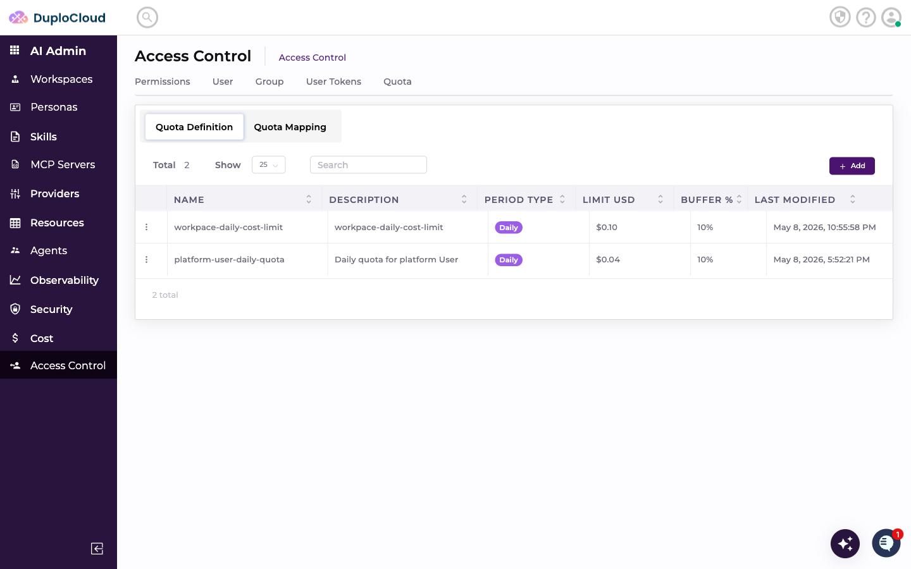

### Add a Quota Definition

Click **+ Add**. Fill in the fields:

* **Name** — a unique identifier for the quota policy
* **Period Type** — how frequently the limit resets (e.g. Daily)
* **Limit (USD)** — the maximum spend allowed within the period

Click **Create**.

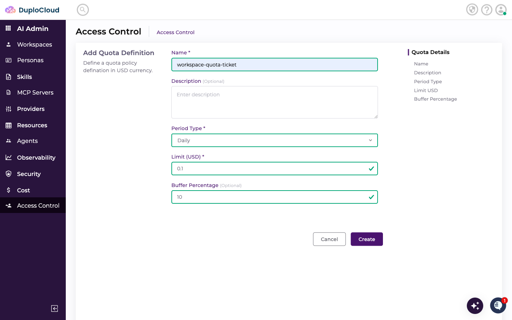

***

## Quota Mappings

Click the **Quota Mapping** tab. Mappings bind a quota definition to a context and an Apply to value, determining which activity the limit applies to.

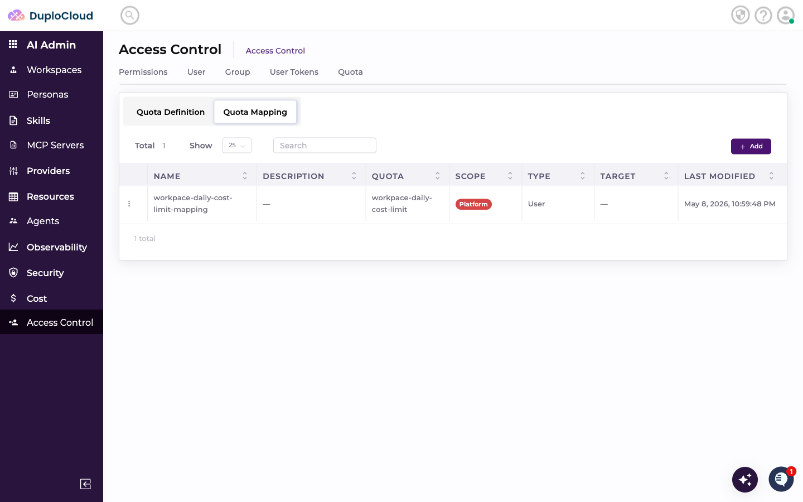

***

## Add a Quota Mapping

Click **+ Add**. Fill in the fields:

* **Name** — a label for this mapping
* **Quota** — the quota definition to apply
* **Context** — whether this applies at the Workspace or Platform level
* **Target Workspace** — the specific workspace (when Context is Workspace)
* **Apply to** — what the limit tracks: **Ticket**, **Workspace**, or **All**

### Ticket Quota

When **Apply to** is set to **Ticket**, the quota limit applies per individual ticket. Each ticket has its own spend counter — one ticket reaching the limit does not affect other tickets in the same workspace.

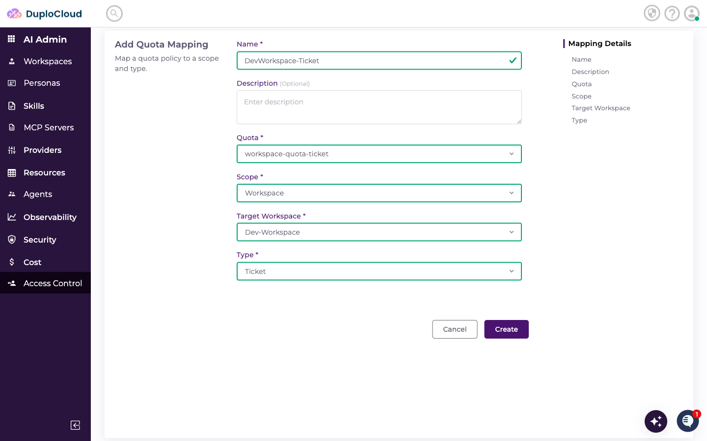

To verify, create a ticket in the target workspace and run a request.

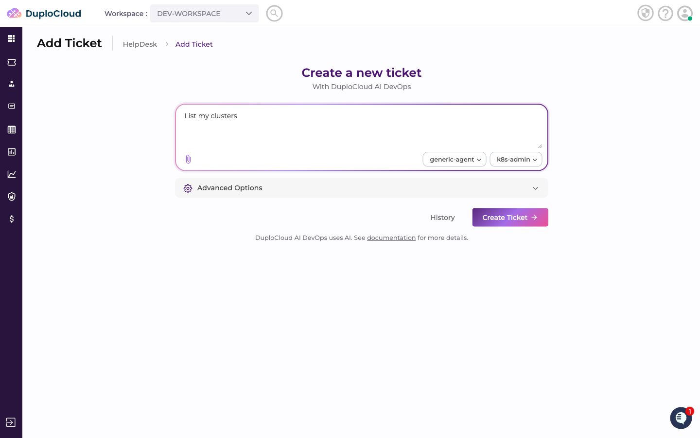

Once the ticket's cumulative cost hits the defined limit, the agent stops and returns an error showing the ticket ID, the amount used, and when the limit resets.

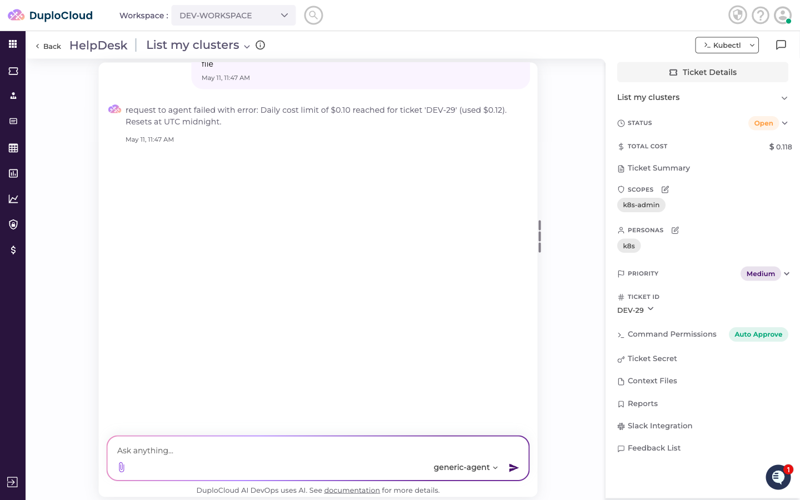

Because the quota is scoped to the individual ticket, a new ticket created in the same workspace starts with a fresh counter and continues working normally.

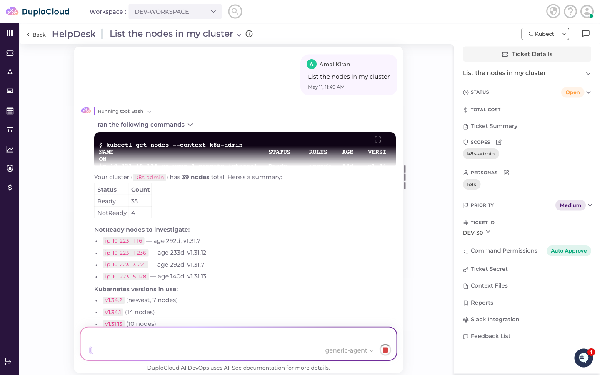

### Workspace Quota

When **Apply to** is set to **Workspace**, the quota limit applies to all activity within a specific workspace. The cumulative spend across all tickets in that workspace counts toward a single shared limit.

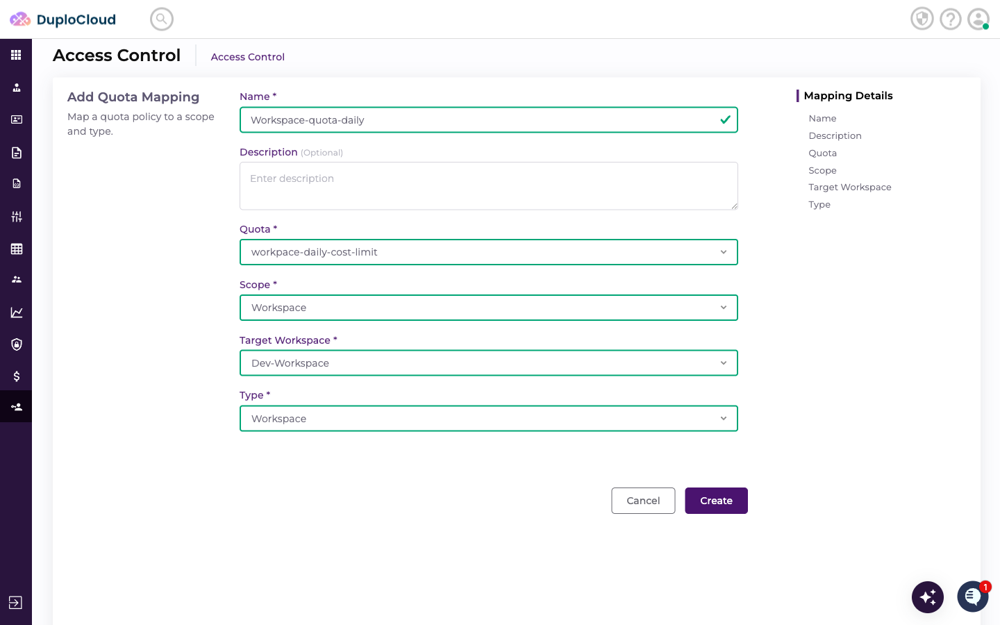

Create a ticket and run a request in the workspace.

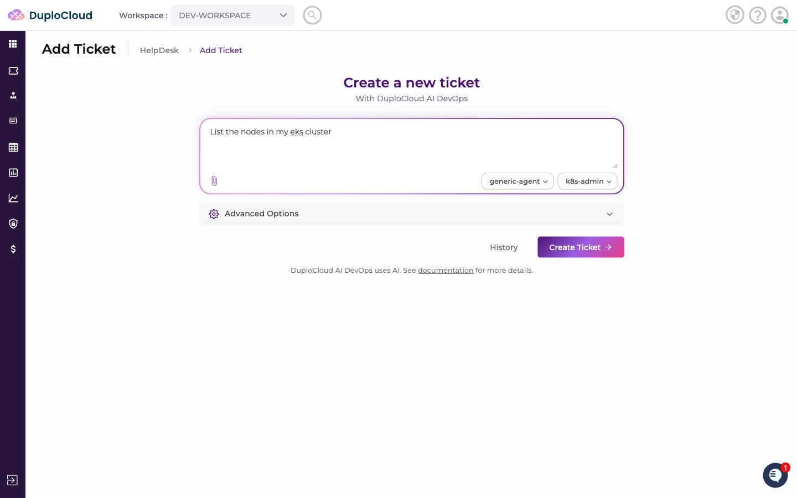

Once the workspace's cumulative spend reaches the limit, the agent blocks all new requests within that workspace, reporting the workspace name, total used, and reset time.

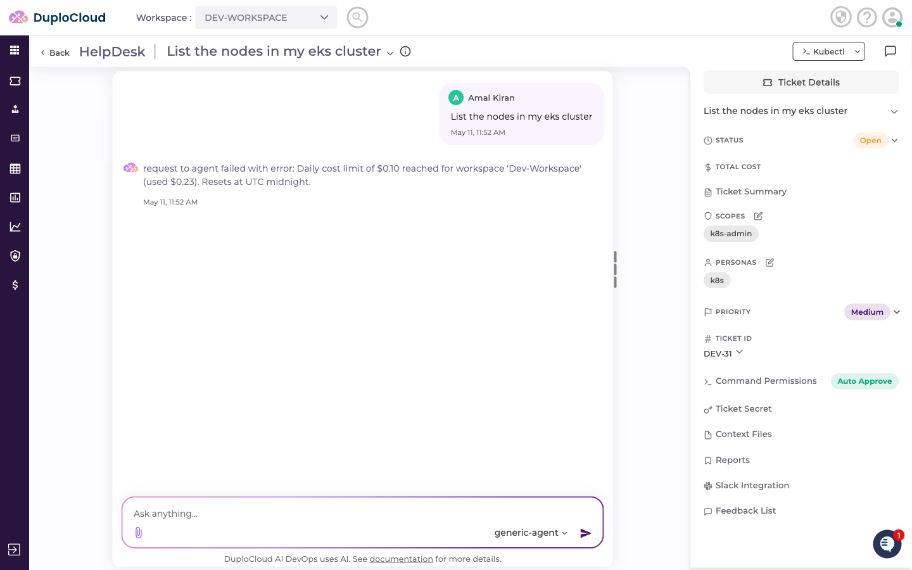

Switching to a different workspace bypasses the limit entirely — the quota is scoped to the specific workspace it was mapped to, so other workspaces are unaffected.

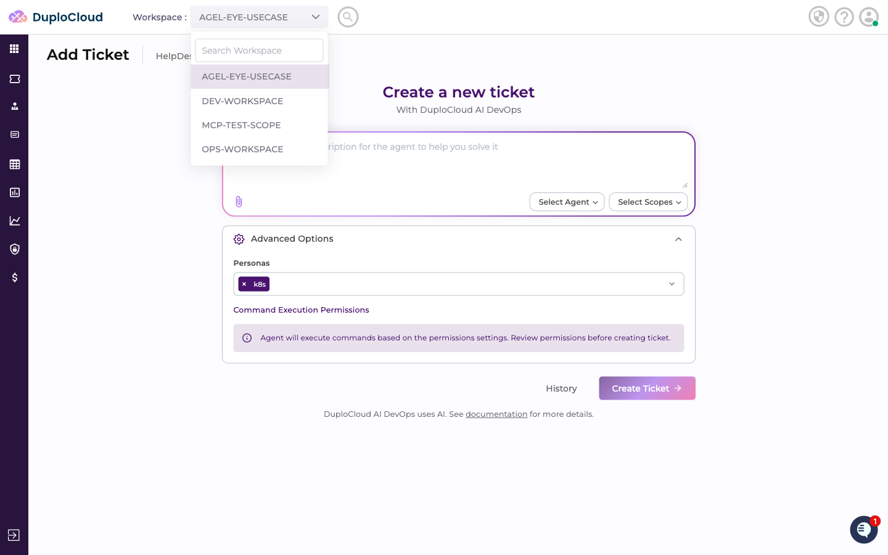

A ticket in the new workspace runs successfully with its own independent cost counter.

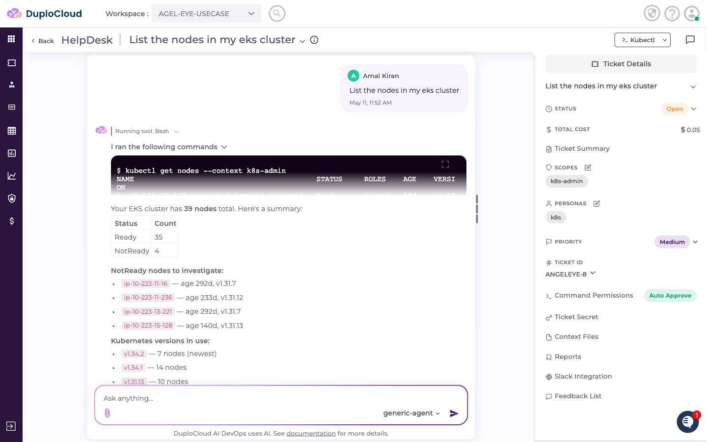

### Platform Quota

When **Context** is set to **Platform**, the quota applies across all workspaces on the platform. Set **Apply to** to **All** to enforce it globally regardless of workspace.

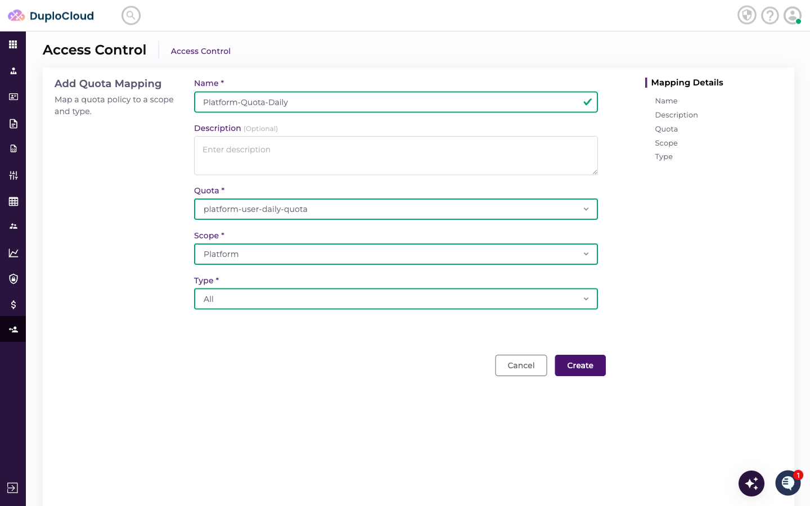

Once the platform-wide limit is reached, all agent requests across every workspace are blocked, regardless of which workspace or ticket they originate from.

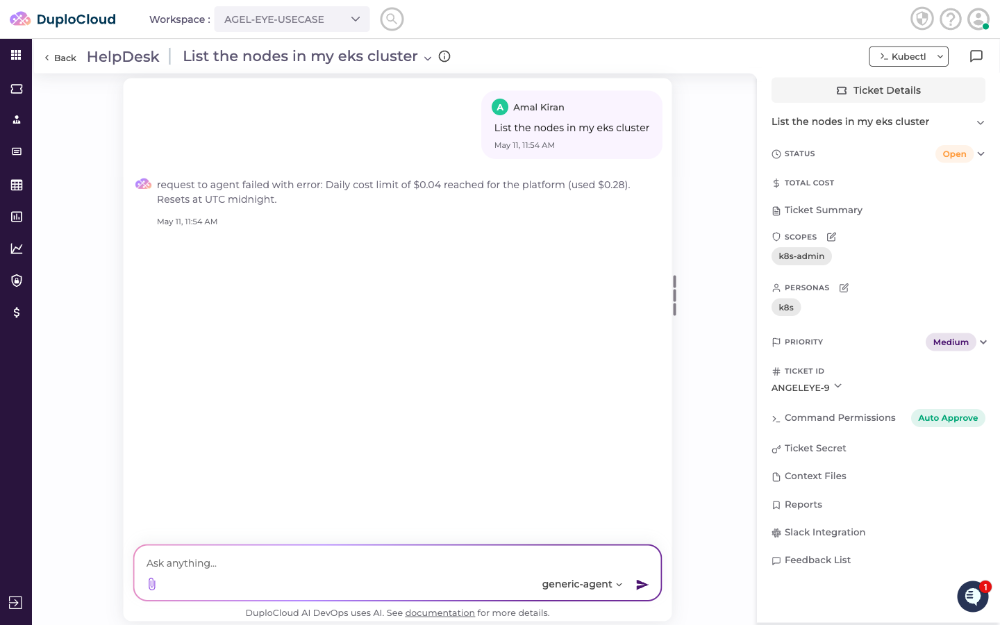
