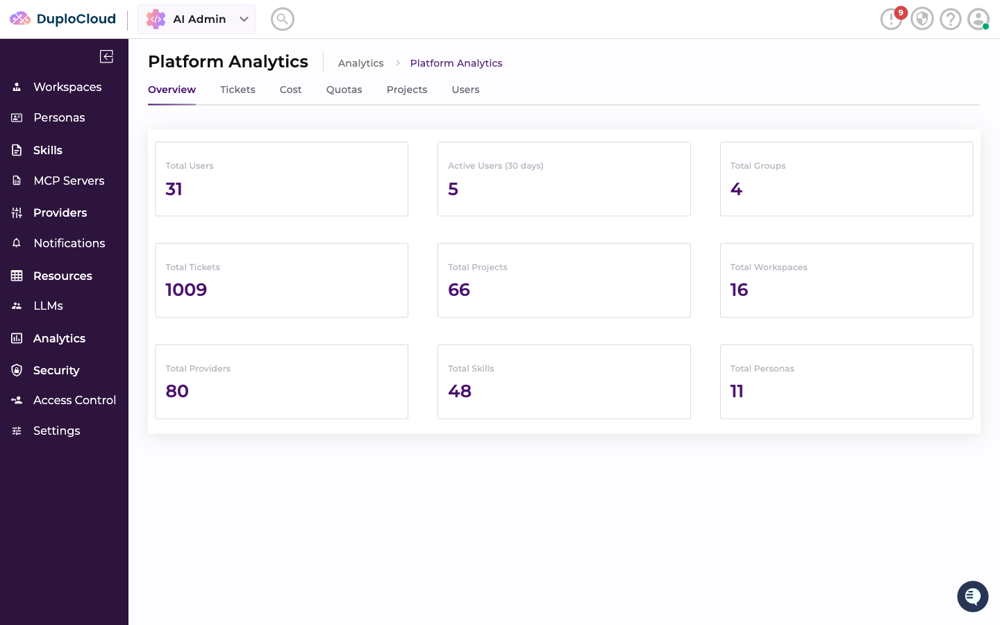
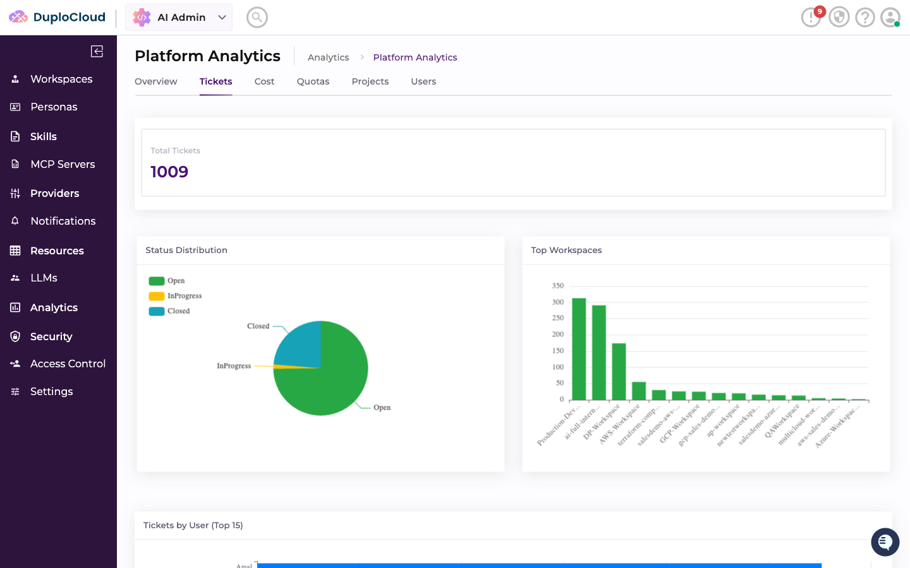
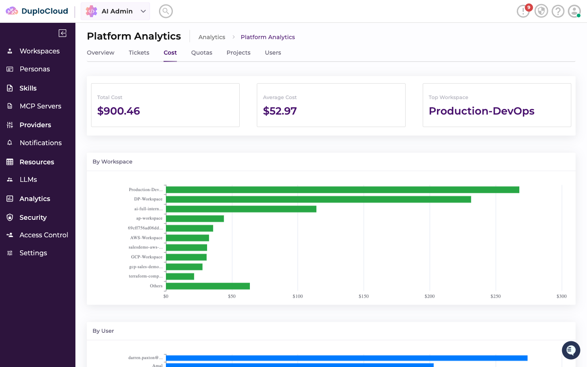
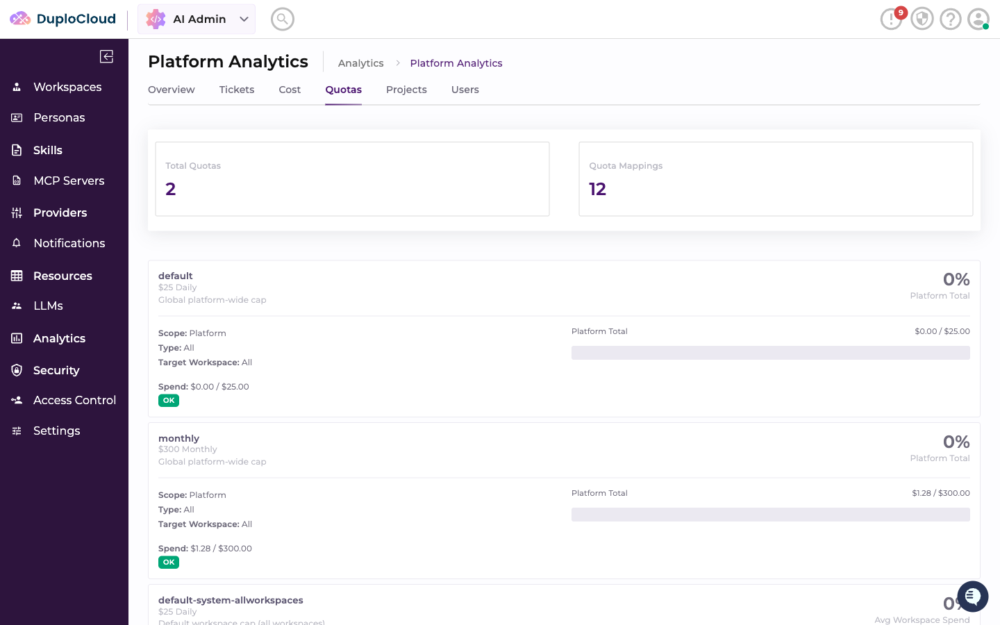
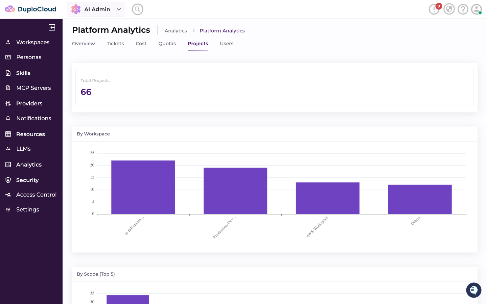
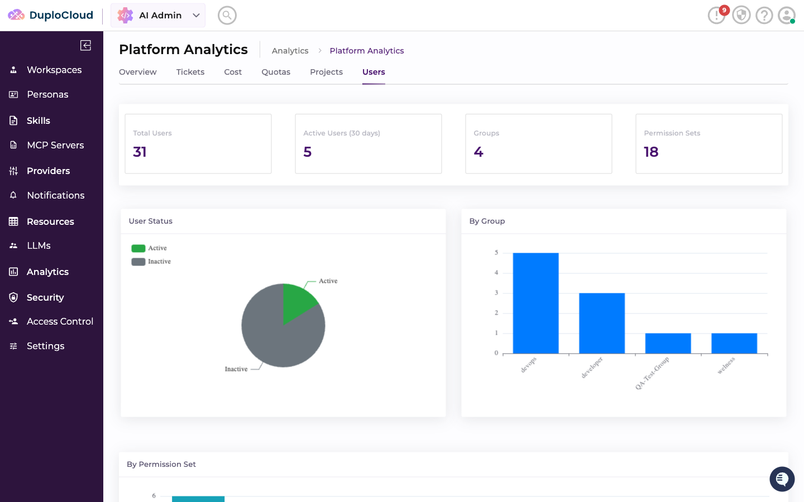

# Analytics

The **Analytics** section covers two admin-only screens: the **Platform Analytics** dashboard (usage/cost/ticket metrics across the whole platform) and **Observability** (an embedded LangFuse view for agent traces).


This is distinct from [AI Dashboards](ai-dashboards.md), which are agent-built dashboards over your connected cloud/infra providers. Platform Analytics is a fixed, built-in view over DuploCloud's own usage data — it isn't agent-generated and isn't scoped to a provider.


## Platform Analytics Dashboard

Go to **AI Admin → Analytics → Platform Analytics**. The **Overview** tab shows platform-wide totals — users, active users in the last 30 days, groups, tickets, projects, workspaces, providers, skills, and personas.

The remaining tabs break these totals down further:

* **Tickets** — status distribution (Open/In Progress/Closed), top workspaces by ticket volume, and tickets by user

* **Cost** — total and average cost, and cost broken down by workspace and by user

* **Quotas** — every quota definition, its current spend against its limit, and how many mappings apply it

* **Projects** — project counts by workspace and by scope

* **Users** — active vs. inactive users (based on login in the last 30 days), plus breakdowns by group and by permission set


Nothing needs to be configured for this dashboard — it's computed from data that already exists (workspaces, tickets, users, quotas, and so on), so it populates automatically as your platform is used.


## Observability

Go to **AI Admin → Analytics → Observability → LangFuse**. This page embeds [LangFuse](https://langfuse.com), a third-party, open-source LLM observability tool, so you can inspect detailed agent traces — it isn't hosted or provided by DuploCloud.

To use it, you need your own LangFuse project (LangFuse Cloud or self-hosted) and set its URL as the `langfuse-url` [System Setting](settings.md#system-settings). Until that's set, the page shows an empty state with a link that jumps straight to the Add System Setting form, pre-filled to `langfuse-url` — save it there and the page embeds that URL directly.

Setting the URL only controls what's *displayed*; it doesn't make trace data appear. For traces to actually reach your LangFuse project, the underlying agent runtime deployment also needs LangFuse API credentials configured — a separate, deployment-level setup step, not something done from this page. Once that's in place, each trace is automatically tagged with the originating ticket, workspace, user, and model, so a trace in LangFuse can be traced back to the exact ticket that produced it.
