# MCP Server

MCP (Model Context Protocol) servers extend the AI agent with external tool capabilities. Once an MCP server is registered in DuploCloud AI Suite, agents can call its tools from any ticket that includes the server's scope.

Setting one up takes two stages:

1. **Register the MCP server** under **AI Admin → MCP Servers** — its endpoint and transport, or a raw JSON config.
2. **Create a Provider, credential, and Scope** that bind the server to a set of credentials. The Scope is what you attach to a ticket.

---

## Stage 1 — Register the MCP server

Navigate to **AI Admin → MCP Servers**. The page lists every registered server as a card showing its transport and endpoint, with search, a provider-type filter, and sorting.

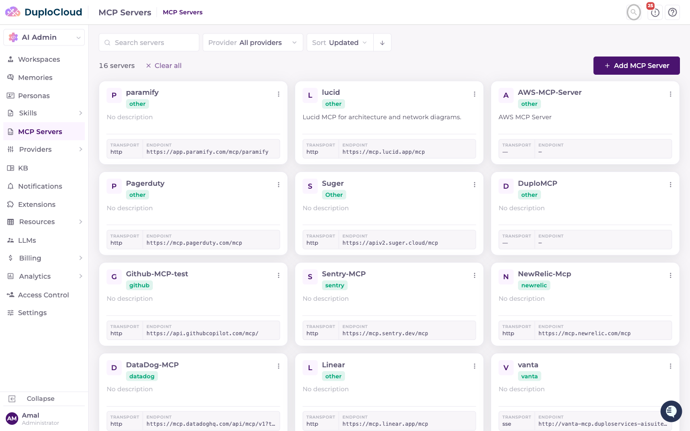

Click **+ Add MCP Server**. The form opens in two sections — **Basic** and **Metadata** — tracked in the rail on the right.

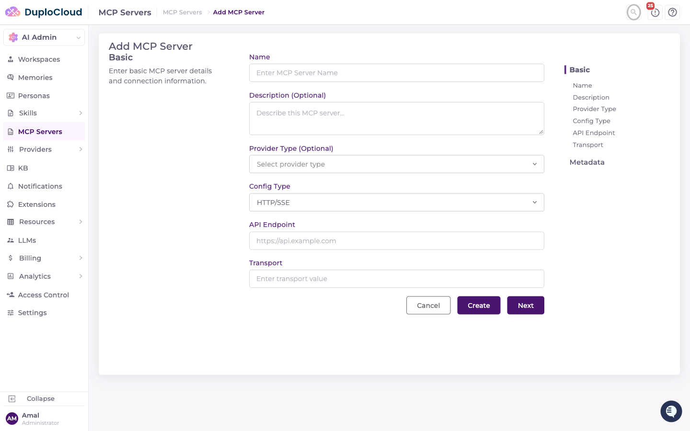

Fill in the **Basic** section:

* **Name** — a display name for the server
* **Description** _(optional)_
* **Provider Type** _(optional)_ — links the server to a provider category for organizational purposes
* **Config Type** — **HTTP/SSE** for a standard remote endpoint, or **Raw** to supply a full JSON config
* **API Endpoint** — the MCP server's HTTP endpoint URL
* **Transport** — `http` for standard HTTP, or `sse` for Server-Sent Events

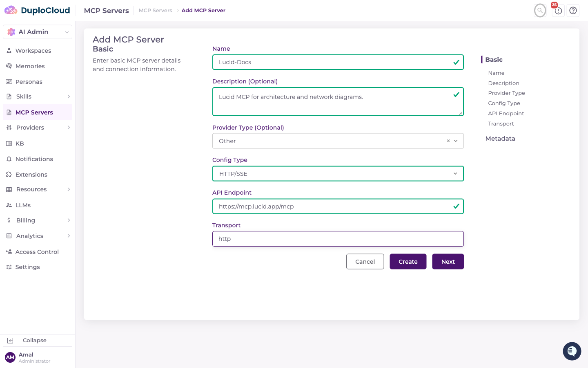

Click **Next** for the optional **Metadata** section, where you can attach arbitrary key/value pairs to the server.

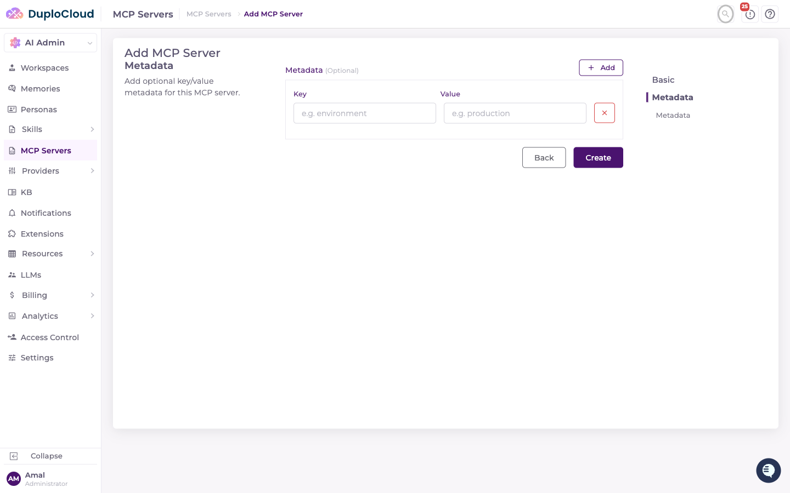

Click **Create**. The new server appears in the list and is available to be linked to a Scope.

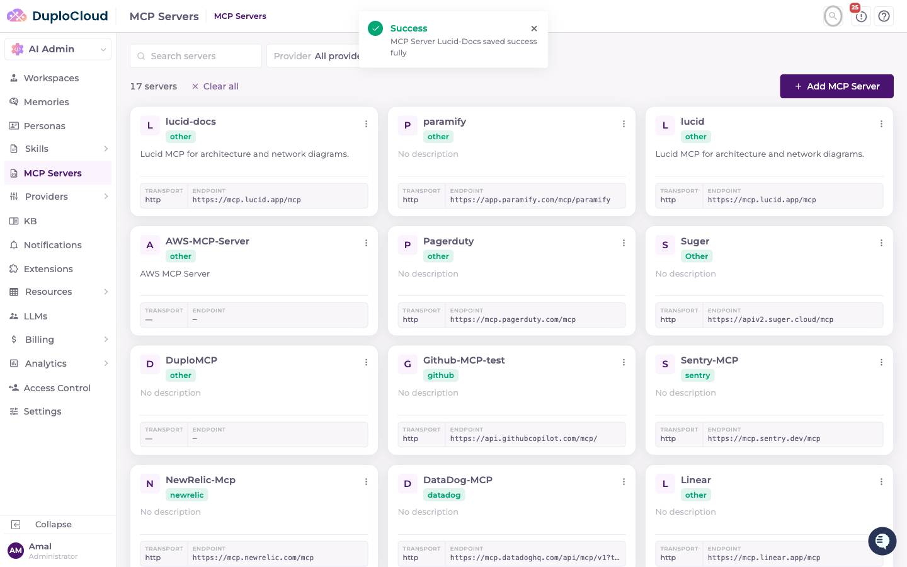

### Using a raw JSON config instead

Selecting **Config Type → Raw** replaces the endpoint and transport fields with a **Raw Config** editor, for servers that need a full configuration block rather than a single URL — for example a command-launched server.

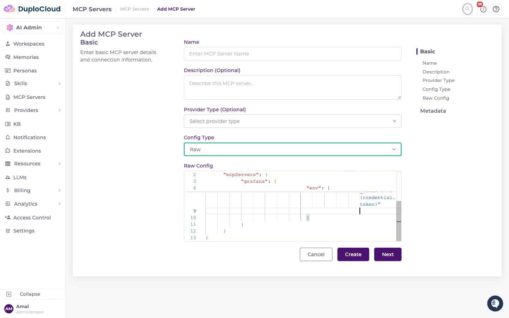

Raw configs support **credential placeholders**, so secrets and per-environment values are resolved at runtime rather than stored inline. Use `${credential.<key>}` for any value that should come from the Scope's bound credentials:

```json
{
  "mcpServers": {
    "grafana": {
      "command": "uvx",
      "args": ["mcp-grafana"],
      "env": {
        "GRAFANA_URL": "${credential.url}",
        "GRAFANA_SERVICE_ACCOUNT_TOKEN": "${credential.token}"
      }
    }
  }
}
```

See [Credential Placeholders](credential-masking-for-mcp-servers.md) for the full reference.


Placeholder keys are case-sensitive and must match the credential field names exactly — `${credential.token}` resolves a credential field named `token`, not `Token` or `TOKEN`.


---

## Stage 2 — Create the Provider, credential, and Scope

A **Provider** holds the credentials, and a **Scope** binds those credentials to the MCP server. Both are created in a single flow.

Navigate to **AI Admin → Providers**, select the tab matching your server's category (for example **Other** for a generic tool, or **Observability** for Grafana), and click **+ Add Provider**.

The page walks through three sections in order — **Provider Details**, **Credentials**, and **Scope** — shown in the rail on the right.

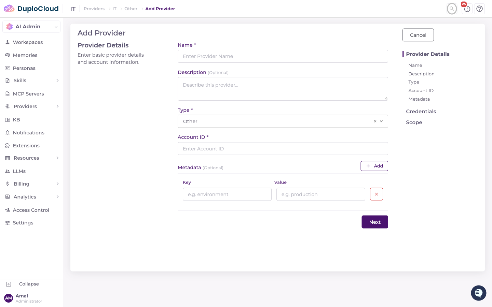

### Provider Details

* **Name** — a name for this provider
* **Description** _(optional)_
* **Type** — the provider category
* **Account ID** — an identifier for the provider account; any string works if it isn't needed for routing
* **Metadata** _(optional)_ — key/value pairs

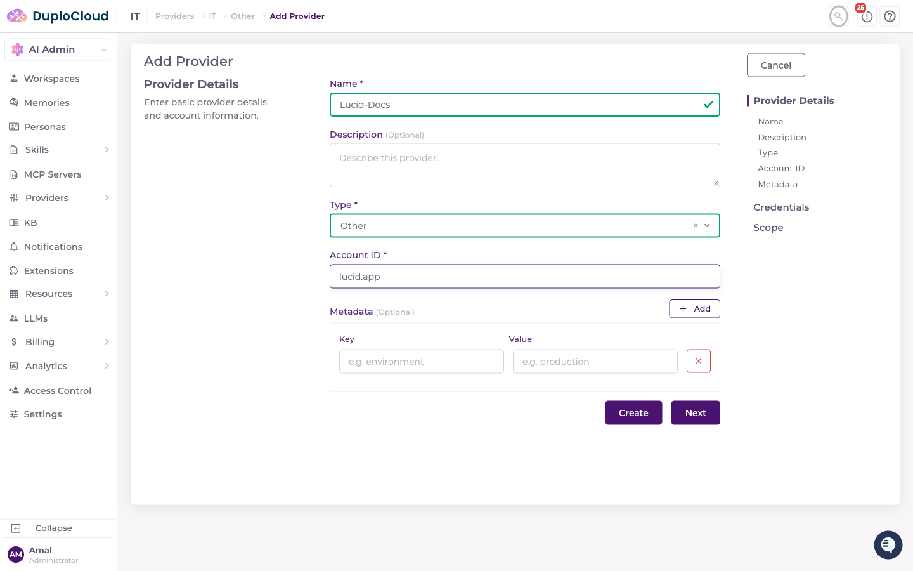

Click **Next**.

### Credentials

Give the credential set a **Name**. The fields below it depend on the provider **Type** you chose — an AWS provider asks for a credential type and access keys, a Kubernetes provider asks for a token or role, and a generic provider takes key/value pairs.

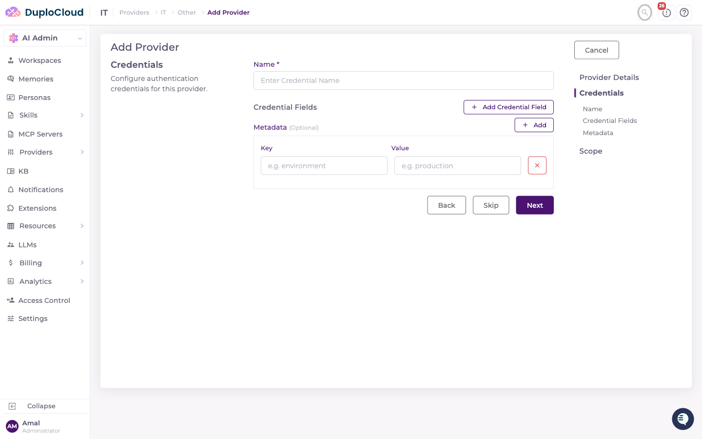

For a raw-config MCP server, add one credential field per `${credential.*}` placeholder used in the config, matching the placeholder keys exactly.

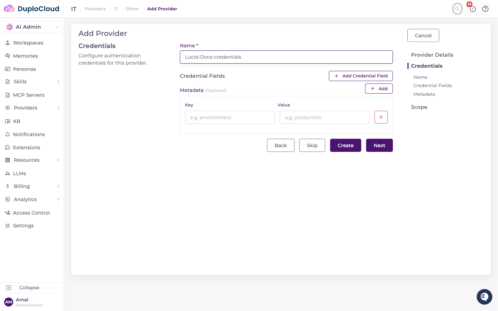

Click **Next**. You can also **Skip** this section and add credentials later from the provider's detail page.

### Scope

The Scope is what ties everything together and what you select when creating a ticket.

* **Name** — the scope name shown in the ticket form
* **Description** _(optional)_
* **MCP Server** — select the server registered in Stage 1
* **Resource Map** _(optional)_ — **Key** plus one or more **Values**, passed to the agent as additional context

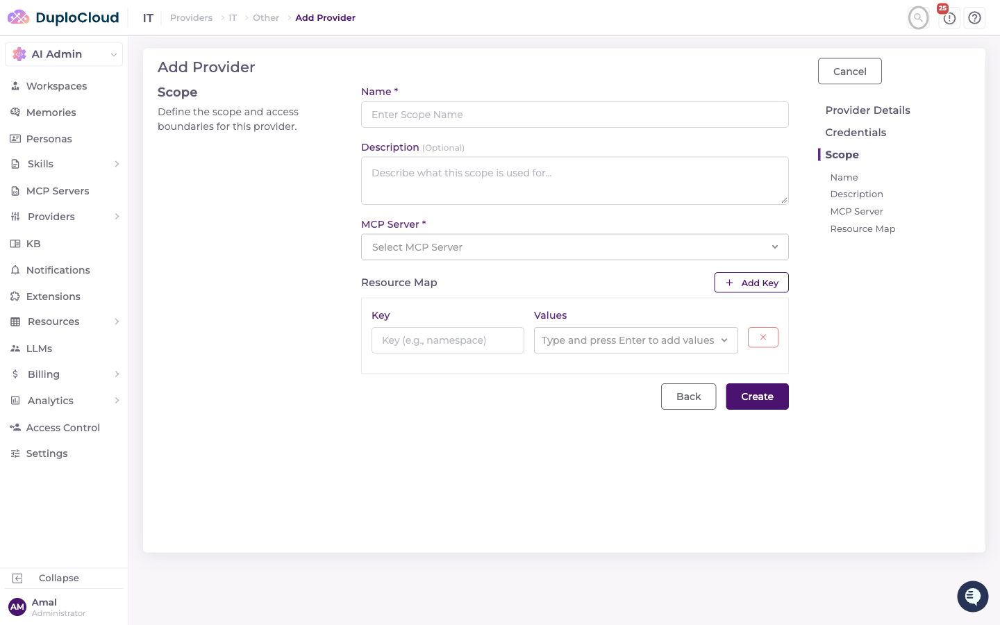

The credential created in the previous section is carried forward automatically and shown read-only.

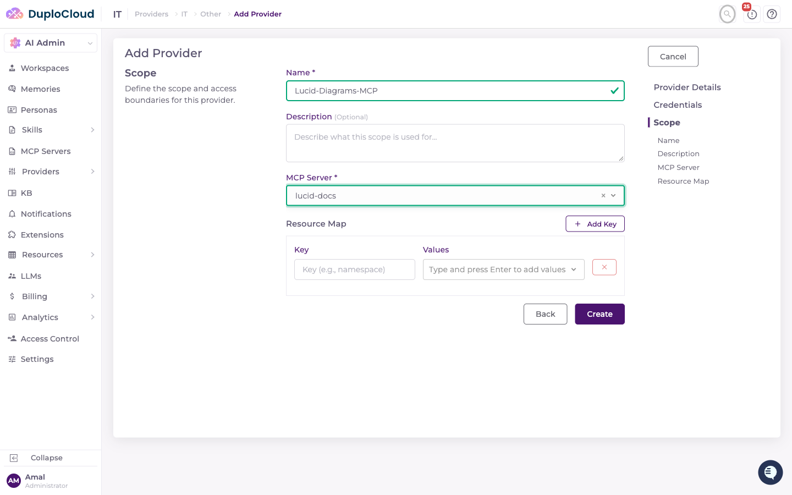

Click **Create**. A confirmation appears, followed by an **Attach Scope to Workspaces** prompt — select the workspaces that should have access to this scope, or **Skip** to attach them later.

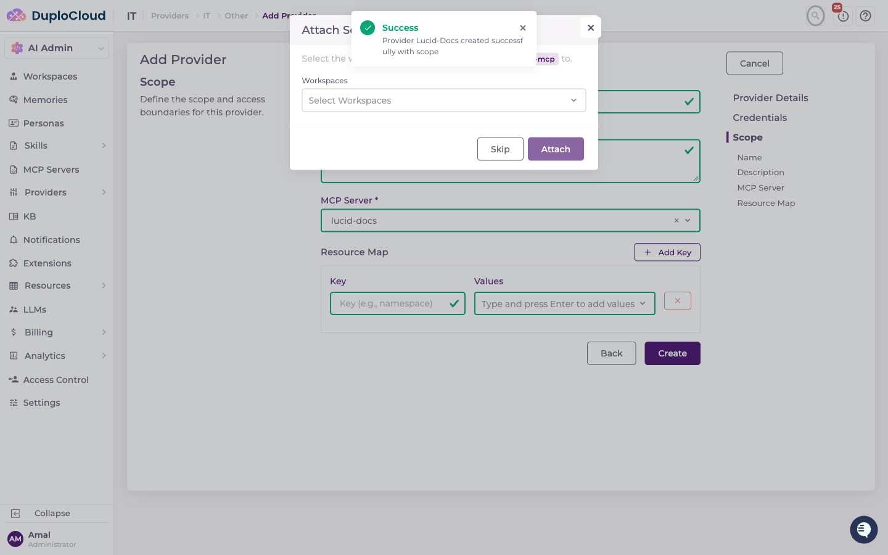

---

## Using the MCP server from a ticket

With the Scope configured, create a ticket and select that scope. The agent then has access to the server's tools for the life of that ticket, using the credentials bound to the scope — tools are named `mcp__<server>__<tool>`.

For a raw-config server, the platform resolves every `${credential.*}` placeholder from the bound credentials before the session starts, writes the resolved `.mcp.json` for the agent, and the agent calls the server's tools transparently. Secrets are never written into the stored config.

### Controlling which tools the agent may call

By default the agent asks before running any MCP tool. Each ticket's **Details** panel has an **MCP Tool Permissions** entry for changing that.

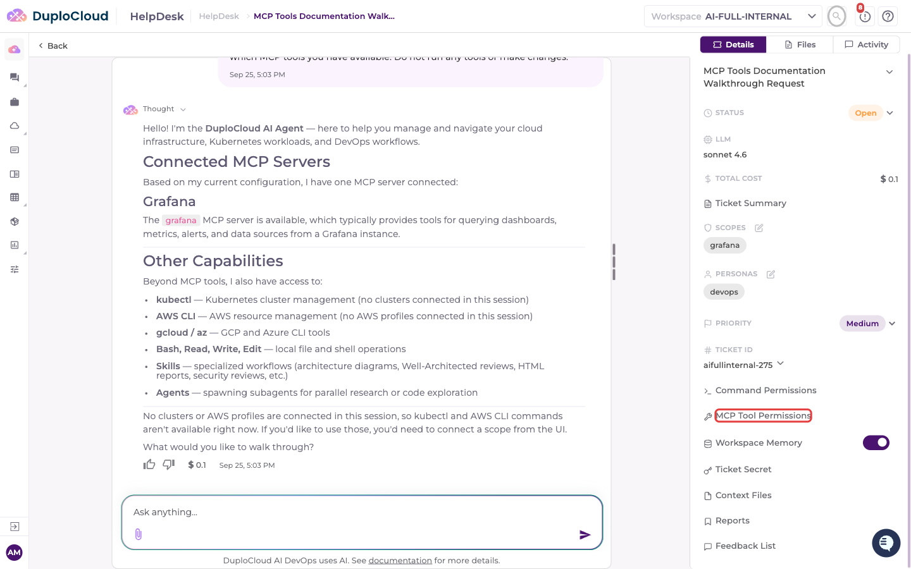

It opens the **MCP Tool Approval Settings** dialog:

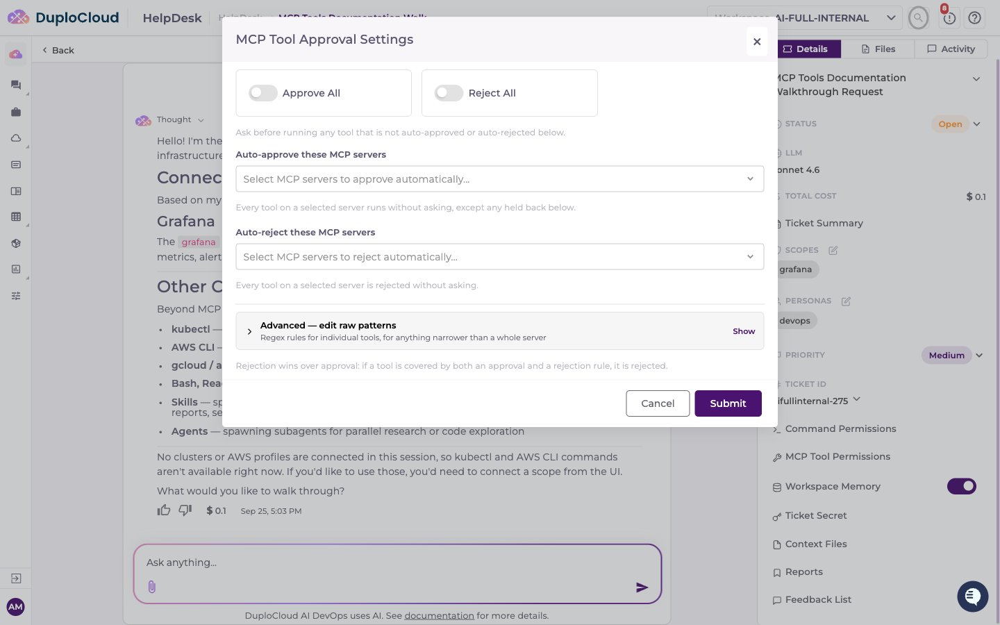

* **Approve All** / **Reject All** — blanket rules for every tool on every server
* **Auto-approve these MCP servers** — every tool on a selected server runs without asking
* **Auto-reject these MCP servers** — every tool on a selected server is refused without asking

The server pickers list only the servers reachable from that ticket's scopes.

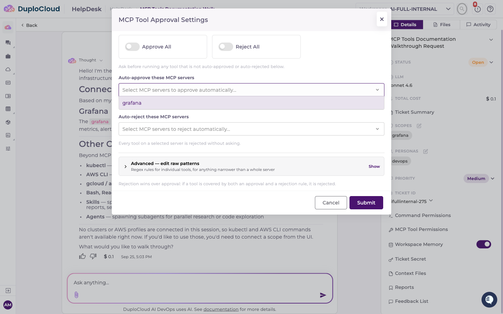

For anything narrower than a whole server, expand **Advanced — edit raw patterns**. Patterns are regular expressions matched end to end against the full tool name, which always looks like `mcp__<server>__<tool>`; the `mcp__` prefix is required.

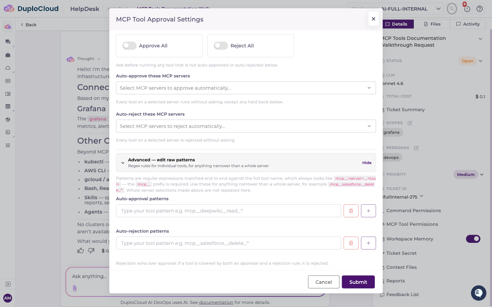


Rejection wins over approval — if a tool is covered by both an approval and a rejection rule, it is rejected.


These settings apply to the one ticket, overriding the workspace defaults for that conversation only.
