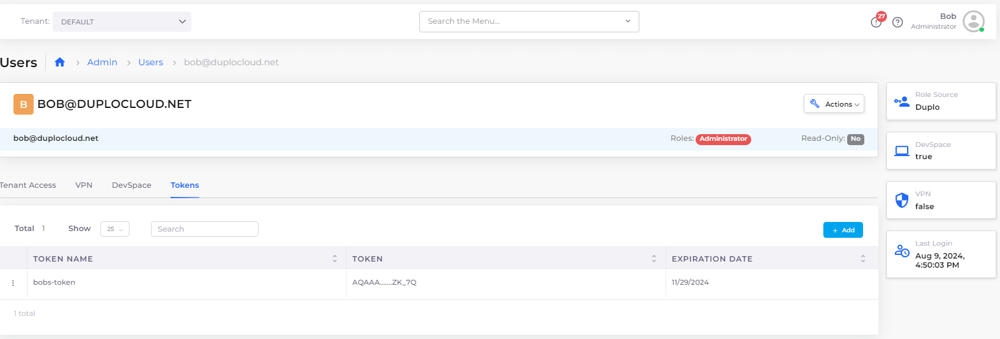

# API Tokens

DuploCloud supports two kinds of API tokens: temporary and permanent. For normal use cases, we recommend using a temporary API token. A permanent API token is warranted for CI/CD or other DevOps automation. Permanent API tokens expire after one year.

## Temporary API Tokens

### Retrieving a Temporary API token

Every time a user logs in to DuploCloud, a temporary API token is created for that user that only lasts for their session. Any user can retrieve their temporary API token from DuploCloud:

1. Click on the user icon () in the upper right, and select **Profile**.&#x20;
2. Click the copy icon () in the **Temporary API Token** area.
3. Click on the person icon in the upper right, and select **Profile**.&#x20;
4. Click the copy icon (

<figure><figcaption>
<strong>Profile</strong> page with <strong>Temporary API Token</strong> area
</figcaption></figure>

## Permanent API Tokens

Permanent tokens can be created by Administrators from the **Users** page or the **Profile** page. These tokens are always associated with a specific DuploCloud user.&#x20;


**Note:** Permanent API tokens expire after one year.


### Creating a Permanent API Token from the Users Page

1. In the DuploCloud Portal, navigate to **Administrator** -> **Users**.&#x20;
2.  Select the user from the **USERNAME** list. The user's page displays.  

    <figure><figcaption>
<strong>Users</strong> page with <strong>Tokens</strong> tab
</figcaption></figure>

3. Select the **Tokens** tab.
4.  Click **Add**. The **Create a new token** pane displays. 

    

5. Create a meaningful **Token Name**.
6.  Click **Create**. A window containing the token displays. 

    

7. Click the **Copy** button to copy your token to the clipboard. Store it somewhere safe. You cannot retrieve it from DuploCloud.

### Creating a Permanent API Token from the Profile Page

Only administrators can access this option.

1. Click the user icon () in the top-right corner, then select **Profile**.
2.  Under **Permanent API Token**, click **Add**. The **Add User Token** screen displays. 

    
<figure><figcaption>
<strong>Add User Token</strong> screen
</figcaption></figure>

3. Enter a meaningful **Token Name**.
4. Click **Create**. A window containing the token displays.
5. Click **Copy** to copy your token to the clipboard. Store it somewhere safe. You cannot retrieve it from DuploCloud.


You will not be able to retrieve your token from DuploCloud after you have created it. However, if you lose your token, you can always create a new one.


## Configuring Notifications for API Tokens Nearing Expiration

You can configure DuploCloud system settings to generate faults and send notification emails when API tokens are nearing expiration.

### Generating a Fault When API Tokens are Near Expiration

1. From the DuploCloud portal, navigate to **Administrator** -> **Systems Settings**.&#x20;
2.  Select the **Config** tab, and click **Add**. The **Add Config** pane displays. 

    
<figure><figcaption>
<strong>Add Config</strong> pane 
</figcaption></figure>

3. Complete the following fields:

<table data-header-hidden><thead><tr><th width="209.5555419921875">Field</th><th>Value/Action</th></tr></thead><tbody><tr><td><strong>Config Type</strong></td><td>Select <strong>App Config</strong></td></tr><tr><td><strong>Key</strong></td><td>Select <strong>Enable User Token Expiration Notifications</strong></td></tr><tr><td><strong>Value</strong></td><td>Enter the number of days before token expiration when faults should appear</td></tr></tbody></table>

4. Click **Submit**. DuploCloud will generate a fault when an API token is the set number of days from expiration.&#x20;

### Sending Automatic Notifications when API Tokens Near Expiration

1. From the DuploCloud portal, navigate to **Administrator** -> **Systems Settings**.&#x20;
2.  Select the **Config** tab, and click **Add**. The Add **Config** pane displays. 

    
<figure><figcaption>
<strong>Add Config</strong> pane
</figcaption></figure>

3. Complete the following fields:

<table data-header-hidden><thead><tr><th width="198.888916015625">Field</th><th>Value/Action</th></tr></thead><tbody><tr><td><strong>Config Type</strong></td><td>Select <strong>App Config</strong></td></tr><tr><td><strong>Key</strong></td><td>Select <strong>User Token Expiration Notification Emails</strong></td></tr><tr><td><strong>Value</strong></td><td>Enter the user email addresses (separated by semicolons) to receive notifications</td></tr></tbody></table>

4. Click **Submit**. DuploCloud will email the listed email address(es) when an API token is set to expire in a set number of days.
