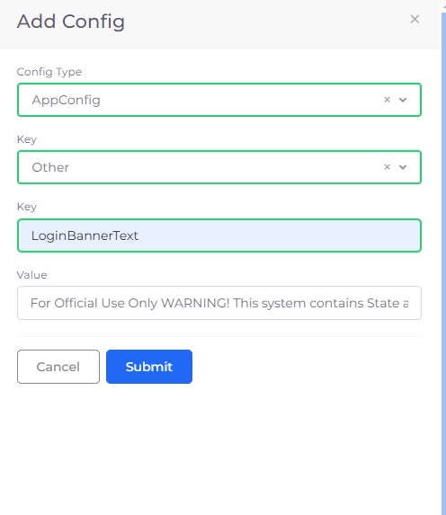

# Login Screen Customization

## Adding custom login banner text

Display a custom message on the DuploCloud login screen to provide context, branding, security instructions, etc.

1. Navigate to **Administrator** -> **Systems Settings**.
2. Click on the **System Config** tab.
3.  Click **Add**. The **Add Config** pane displays. 

    
<figure><figcaption>
The <strong>Add Config</strong> pane.
</figcaption></figure>

4. In the **Config Type** list box, select **AppConfig**.
5. In the **Key** list box, select **Other**.
6. In the **Key** text field, enter **LoginBannerText**.
7. In the **Value** field, enter the text that will display on the login banner.
8. Click **Submit**. The entered text displays on the login banner.

 

<figure><figcaption>
The <strong>DuploCloud</strong> login screen with customized banner text.
</figcaption></figure>

## Adding custom login button text

Adds custom text to the beginning of the login buttons on the DuploCloud login screen, for example, context, branding, or security instructions.

1. Navigate to **Administrator** -> **Systems Settings**.
2. Click on the **System Config** tab.
3.  Click **Add**. The **Add Config** pane displays. 

    
<figure><figcaption>
The <strong>Add Config</strong> pane.
</figcaption></figure>

4. In the **Config Type** list box, select **AppConfig**.
5. In the **Key** list box, select **Other**.
6. In the **Key** text field, enter **LoginButtonText**.
7. In the **Value** field, enter the text that will display on the login button.
8. Click **Submit**. The entered text displays on the login button.

<figure><figcaption></figcaption></figure>

## Updating custom login screen text

1. Navigate to **Administrator** -> **Systems Settings**.
2. Click on the **System Config** tab.
3. Click on the **menu** **icon** () on the left of the **LoginBannerText** or **LoginButtonText** row and select **Update**.

<figure><figcaption>
The <strong>System Config</strong> tab with the menu icon for the <strong>LoginBannerText</strong> row highlighted.
</figcaption></figure>

4. The **Update Config** **AppConfig** pane displays.
5. Update the text in the **Value** field and click **Submi**t.

<figure><figcaption>
The <strong>Update Config AppConfig</strong> pane.
</figcaption></figure>

6. The configuration is updated and the updated text displays on your DuploCloud login screen banner/button.

