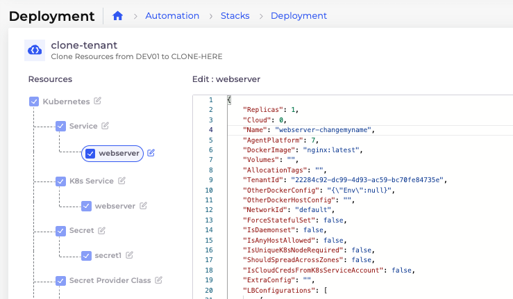

# Clone from a Tenant

## Cloning Resources from a Tenant

Clone resources (Nodes, Hosts, Services, Secrets, storage, etc.) from one Tenant to another using DuploCloud Stacks.

1. Select the destination Tenant from the **Tenant** list box.&#x20;
2. Navigate to **Automation** -> **Stacks**.
3.  On the **Deployments** tab, click **Clone**. The **Create Tenant Clone Job** pane displays.  

    
<figure><figcaption>
The <strong>Create Tenant Clone Job</strong> in the DuploCloud Portal
</figcaption></figure>

4. Provide a **Name** for the clone Tenant, select the source Tenant from the **Source Tenant** list box, and specify the resources to be cloned in the **Scope** field.&#x20;
5. Click **Next**. The **Deployment** page for the clone job displays.

<figure><figcaption>
The <strong>Deployment</strong> page for a Tenant clone job in the DuploCloud Portal
</figcaption></figure>

6. On the **Deployment** page, configure the clone job details:

* Select or unselect the resources you want to include in the clone job.
* Click the **edit icon** () beside a resource to open and edit its settings. Click **Save** to save your changes.&#x20;

7. Click **Submit**. The selected resources from the source Tenant are cloned into the destination Tenant.&#x20;
