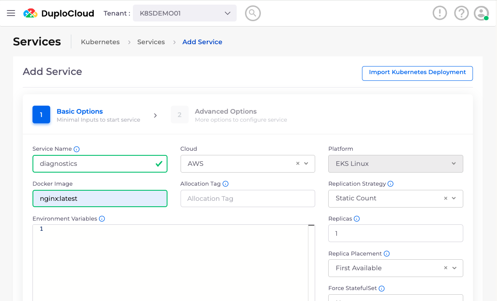
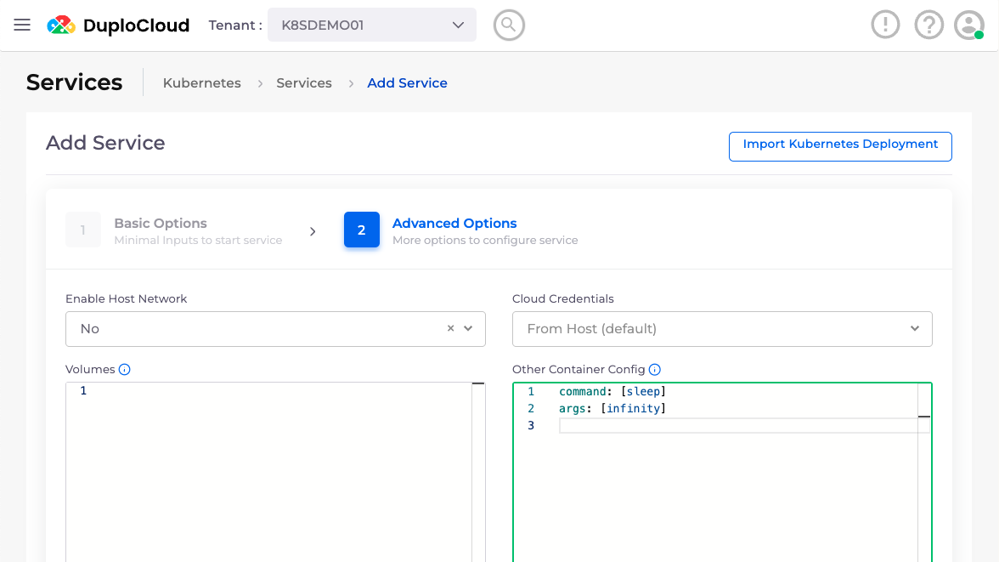

# Create a Diagnostics Application Service

In some cases, you may need to run shell commands inside an application container, for example, to use tools like the Rails console or Django shell that are included in your application's Docker image. DuploCloud supports two convenient ways to do this:

* **Access the shell for the app containers (Recommended)**: This is the simplest option and is recommend for most cases. For detailed instructions, see the [DuploCloud documentation](../overview/prerequisites/kubectl-shell.md).
* **Create a temporary "diagnostics" Service in the same cluster, and access a shell on one of its containers (Advanced)**: This is a more advanced option. It's useful when you don't want your session to interfere with running workloads or end if the container you connected to is shut down by scaling events or deployments. Follow the instructions below:&#x20;

## Creating a Diagnostics Service

To create a temporary diagnostics Service in the same cluster as your application:

1. In the DuploCloud Portal, navigate to **Kubernetes** -> **Services**.&#x20;
2. Click **Add**. The **Add Service - Basic Options** pane displays.&#x20;
3. Complete the fields:
   * **Service Name**: Give the Service a name (e.g., `diagnostics`) to distinguish it from your other application Services.
   * **Docker Image**: Use the same Docker image as your main application service. In the example below, we use `nginx:latest` as a placeholder—replace it with the exact image used by your application (you can find this in the application service configuration).

<figure><figcaption><p>The <strong>Add Service - Basic Options</strong> pane in the DuploCloud Portal</p></figcaption></figure>

3. Click **Next**. The **Add Service - Advanced Options** pane displays.
4. In the **Other Container Config** section, set the container’s command and arguments to keep it running without starting the application:

```
command: [sleep]
args: [infinity]
```

This ensures the container stays running for shell access. If your image doesn’t support `sleep infinity`, use `sleep 100000` instead.

<figure><figcaption><p>The <strong>Add Service - Advanced Options</strong> pane in the DuploCloud Portal</p></figcaption></figure>

5. Click **Create**. The container will start in a few minutes.
6. Once the diagnostics service container is running, [open a shell session to it](../overview/prerequisites/kubectl-shell.md).

This minimal setup launches a container using your application’s image without starting the application itself, allowing you to run tools and commands interactively.

Depending on what you need to do, you may need to copy additional configurations from your application Service. A common example is the `EnvFrom` setting under **Other Container Config**, which imports the same environment variables from ConfigMaps and Secrets. This is often required for tools like the Rails console or Django shell to connect to databases and other services.
