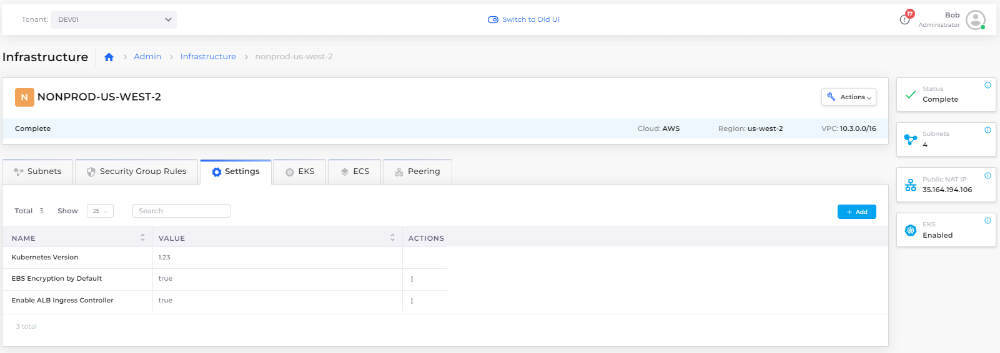

# EKS Ingress

Ingress controllers abstract the complexity of routed Kubernetes application traffic, providing a bridge between Kubernetes services and services that you define.

## Prerequisites

### Creating Services with EKS

See the DuploCloud documentation for instructions to add [Tenants](../../overview/use-cases/tenant-environment/), [Hosts](../../overview/use-cases/hosts-vms/), and [Services](../../overview/aws-services/).&#x20;

### Enabling the AWS Application Load Balancer&#x20;

An administrator needs to enable the AWS Application Load Balancer controller for your Infrastructure before you can use Ingress.

1. In the DuploCloud Portal, navigate to **Administrator ->** **Infrastructure** and select the Infrastructure name from the **NAME** column.&#x20;
2. Select the **Settings** tab and click **Add**. The **Infra - Custom Data** pane displays.
3. From the **Setting Name** list box, select **Enable ALB Ingress Controller**.
4. Select **Enable**.
5. Click **Set**. In the Settings tab, the **Enable ALB Ingress Controller** setting displays a value of **true**.&#x20;

<figure><figcaption>
The <strong>Settings</strong> tab on the <strong>Infrastructure</strong> page
</figcaption></figure>

## Adding a Load Balancer with Kubernetes NodePort

1. In the DuploCloud Portal, navigate to **Kubernetes** -> **Services**.&#x20;
2. Select your Service name from the **NAME** column.
3. Select the **Load Balancers** tab.
4.  Click **Configure Load Balancer**. The **Add Load Balancer Listener** pane appears. 

    
<figure><figcaption>
<strong>Add Load Balancer Listener</strong> pane
</figcaption></figure>

5. In the **Select Type** field, select **K8S Node Port**.&#x20;
6. Enter the **Container port** and **External port**.
7. In the **Health Check** field, enter the path should be used to check the health of backend services.
   * Common value: `/` (checks the root path).
   * If your service has a dedicated health check endpoint, enter it (e.g., `/health` or `/status`).&#x20;
8. From the **Backend Protocol** list box, select **TCP** or **UDP**.
9.  Kubernetes Health Check and Probes are enabled by default. To manually configure Health Check settings, select **Additional health check configs**. 

    
<figure><figcaption></figcaption></figure>

10. If needed, enable and configure **Advanced Kubernetes settings**.&#x20;
11. Click **Add**. The Load Balancer listener is displayed under **LB Listeners** on the **Load Balancers** tab.

<figure><figcaption>
The <strong>Load Balancers</strong> tab for the Service
</figcaption></figure>

## Adding a Kubernetes Ingress

1. Navigate to **Kubernetes** -> **Ingress**.
2. Click **Add**. The **Add Kubernetes Ingress** page displays.

<figure><figcaption>
The <strong>Add Kubernetes Ingress</strong> page in the DuploCloud Portal
</figcaption></figure>

3. Complete the following fields to configure the Ingress.

<table data-header-hidden><thead><tr><th width="243.33331298828125"></th><th></th></tr></thead><tbody><tr><td><strong>Ingress Name</strong></td><td>Enter a unique name for the Ingress resource.</td></tr><tr><td><strong>Ingress Controller</strong></td><td>Select the Ingress controller to use (e.g., <strong>alb</strong> for AWS Load Balancer Controller).</td></tr><tr><td><strong>Visibility</strong></td><td>Choose whether the Ingress is <strong>Public</strong> or <strong>Internal Only</strong>.</td></tr><tr><td><strong>DNS Prefix</strong></td><td>Enter the DNS prefix to be used for the Ingress hostname (e.g., <code>app1</code>).</td></tr><tr><td><strong>HTTP Listener Port</strong> <em>(ALB controllers)</em></td><td>Enter the port for the HTTP listener (default is <strong>80</strong>). If you dontt want to expose your service over HTTP, make it blank.</td></tr><tr><td><strong>HTTPS Listener Port</strong> <em>(ALB controllers)</em></td><td>Enter the port for the HTTPS listener (default is <strong>443</strong>).</td></tr><tr><td><strong>Target Type</strong></td><td>
Specify how you want to route traffic to Pods. You can choose between <strong>Instance (Worker Nodes)</strong> or <strong>IP (Pod IPs)</strong>. 
<ul><li><strong>Instance (Worker Nodes)</strong> routes traffic to all EC2 instances within the cluster on the NodePort opened for your Service. To use the Instance target type, the Service must be <strong>NodePort</strong> or <strong>LoadBalancer</strong> type.</li><li><strong>IP (Pod IPs)</strong> routes traffic directly to the Pod IP. The network plugin must use secondary IP addresses on ENI (e.g., <code>amazon-vpc-cni-k8s</code>) for the Pod IP to use IP mode. The Service can be of any type (e.g., <strong>ClusterIP</strong>, <strong>NodePort</strong>, or <strong>LoadBalancer</strong>). IP mode is required for sticky sessions to work with ALBs.</li></ul></td></tr><tr><td><strong>HTTP to HTTPS Redirect</strong></td><td>Optionally, enable this option to automatically redirect all traffic to HTTPS.</td></tr><tr><td><strong>TLS Hosts</strong></td><td>Enter one or more comma-separated hostnames to secure with TLS (e.g., <code>example.com,api.example.com</code>).</td></tr><tr><td><strong>TLS Secret Name</strong></td><td>Enter the name of the Kubernetes secret containing TLS certificate and private key (optional).</td></tr></tbody></table>

To complete the Ingress setup, you must define at least one rule. Continue to the next section.

### Defining Ingress rules

Define the Ingress rules to control how requests are routed based on hostnames, paths, and ports.

Complete the following steps to add routing rules to the Ingress.

1. On the **Add Kubernetes Ingress** page, click **Add Rule**. The **Add Ingress Rule pane** displays.&#x20;

<figure><figcaption>
The <strong>Add Ingress Rule</strong> pane
</figcaption></figure>

2. Complete the fields to configure the rule.

<table data-header-hidden><thead><tr><th width="224.6666259765625"></th><th></th></tr></thead><tbody><tr><td><strong>Path</strong></td><td>Enter the request path that should trigger the rule (e.g., <code>/</code>).</td></tr><tr><td><strong>Path Type</strong></td><td>Select the path matching behavior: <strong>Exact</strong>, <strong>Prefix</strong>, or <strong>Implementation Specific</strong>.</td></tr><tr><td><strong>Host</strong></td><td>Optionally, <em>e</em>nter the hostname to apply the rule to.</td></tr><tr><td><strong>Use Container Port Name</strong></td><td>Toggle on to manually enter <strong>Service</strong> and <strong>Container Port.</strong></td></tr><tr><td><strong>Service Name</strong></td><td>Select or enter the service to route traffic to. </td></tr><tr><td><strong>Container Port</strong></td><td>Enter the container port to forward traffic to.</td></tr></tbody></table>

3. Click **Add Rule**. The rule will be displayed on the **Add Kubernetes Ingress** page.&#x20;
4. Repeat steps 1-5 to add additional rules.

With routing rules defined, you can now add certificates to secure your Ingress and enable HTTPS traffic.

### Adding certificates to the Ingress

Before attaching certificates to an Ingress, you must add the ACM certificates to your DuploCloud Plan. For detailed instructions, see the [DuploCloud ACM documentation](../../overview/prerequisites/acm-certificate.md#adding-an-acm-certificate-with-arn-to-a-duplocloud-plan).&#x20;

Once your certificates have been added to the plan, complete the following steps to attach them to the Ingress configuration:

1.  On the **Add Kubernetes Ingress** page, click **Add Certificate**. The **Add Certificate** pane displays. 

    
<figure><figcaption>
 <strong>Add Certificate</strong> pane
</figcaption></figure>

2. In the **Certificate** list box, select the certificate to associate with this Ingress.
3. To set the certificate as the default, enable the **Set as Default** toggle.&#x20;
   * **Note**: The first certificate you add is selected as the default automatically. You can change this option for additional certificates.
4. Click **Add** to save the certificate to the Ingress configuration.
5. Repeat steps 1-4 above to add additional certificates.&#x20;


You can attach up to 25 ACM certificates per Application Load Balancer (ALB) listener to support HTTPS across multiple domains using Server Name Indication (SNI). One certificate acts as the default, while the ALB selects the appropriate certificate based on the client’s requested hostname.

If you need more than 25 certificates, you can request a quota increase for **Certificates per Application Load Balancer** in AWS.


Now that the necessary certificates have been added, you can optionally configure Ingress redirect rules and annotations to continue creating the Ingress.

### Configuring Ingress redirect configurations and annotations

1.  On the **Add Kubernetes Ingress** page, click **Add Redirect Config**. The **Add Redirect Config** pane displays. 

    
<figure><figcaption>
The <strong>Add Redirect Config</strong> pane
</figcaption></figure>

2. In the **Name** field, enter a descriptive name for the Ingress redirect configuration.&#x20;
3. &#x20;In the **Host** field, specify the domain name for which this redirect rule will apply.
4. In the **Path** field, define the path that should trigger the redirect.
5. Enter the **Port** for the backend service or redirect.
6. Enter the **Protocol** to enforce (e.g., HTTPS).
7. If Applicable, in the **Query** field, specify query parameters for the redirect.
8. In the **Status Codes** field, enter the HTTP status code for the redirect.
9. Optionally, in the **Annotations** field, enter additional configuration options specific to the Ingress controller.
10. Click **Add** to add the Kubernetes Ingress with defined rules and configurations.&#x20;
11. On the **Add Kubernetes Ingress** page, click **Add Redirect Config**. The **Add Redirect Config** pane displays.

<figure><figcaption>
The <strong>Add Redirect Config</strong> pane
</figcaption></figure>

2. Complete the following fields.

<table data-header-hidden><thead><tr><th width="152.88885498046875"></th><th></th></tr></thead><tbody><tr><td><strong>Name</strong></td><td>Enter a descriptive name for the Ingress redirect configuration.</td></tr><tr><td><strong>Host</strong></td><td>Specify the domain name for which this redirect rule will apply.</td></tr><tr><td><strong>Path</strong></td><td>Define the path that should trigger the redirect.</td></tr><tr><td><strong>Port</strong></td><td>Enter the port for the backend service or redirect.</td></tr><tr><td><strong>Protocol</strong></td><td>Enter the protocol to enforce (e.g., <strong>HTTPS</strong>).</td></tr><tr><td><strong>Query</strong></td><td>Optionally, <em>s</em>pecify query parameters for the redirect.</td></tr><tr><td><strong>Status Codes</strong></td><td>Enter the HTTP status code for the redirect.</td></tr></tbody></table>

### Finish Creating the Ingress

After completing all required fields, adding rules and certificates, and optionally configuring annotations and labels, click **Add** at the bottom of the **Add Kubernetes Ingress** page to finalize and create your Ingress resource.

You will then see your new Ingress listed on the **Kubernetes** → **Ingress** page.

<figure><figcaption>
 <strong>The Ingress</strong> page displaying the added Ingress
</figcaption></figure>

## Viewing an Ingress

### Viewing Ingress details in the DuploCloud Portal

1. View Ingress details by navigating to **Kubernetes** -> **Ingress** and selecting your Ingress from the **NAME** column. The Ingress details page displays.
2. Use the tabs to view Ingress details:
   * In the **Configuration** tab, you can view the overall Ingress settings such as the Ingress controller, visibility, certificate details, listener ports, and target type. The DNS address displayed here is a clickable link that opens the ingress endpoint in a new browser tab, enabling you to quickly access the exposed service.
   * In the **Ingress Rules** tab, you can review the list of rules that define how traffic is routed based on hostnames and paths. Each rule includes a clickable **Access Path** link () that opens the full URL for that specific path in a new browser tab, allowing you to quickly verify and test routing behavior for individual paths.

<figure><figcaption>
 <strong>Configuration</strong> tab on the <strong>Ingress</strong> details page
</figcaption></figure>

<figure><figcaption>
 <strong>Ingress Rules</strong> tab on the <strong>Ingress</strong> details page
</figcaption></figure>

### Viewing Ingress details using `curl` Commands

You can also view Ingress details using `curl` commands. Curl commands are configured with the DNS names and paths (as defined in your Ingress rules) in the format: `curl http://<dns1>/<path1>`. The responses from these requests will show how traffic is being routed according to the Ingress configuration. For example, see the following three commands and responses:&#x20;

Command: `curl http://ig-nev-ingress-ing-t2-1-duplopoc.net/path-x/`

Respons&#x65;**:** `this is service1`

Command: `curl http://ing-doc-ingress-ing-t2-1-duplopoc.net/path-y/`

Respons&#x65;**:**  `this is service2`

Command: `curl http://ing-public-ingress-ing-t2.1.duplopoc.net/path-z/`

Respons&#x65;**:** `this is ING2-PUBLIC`
