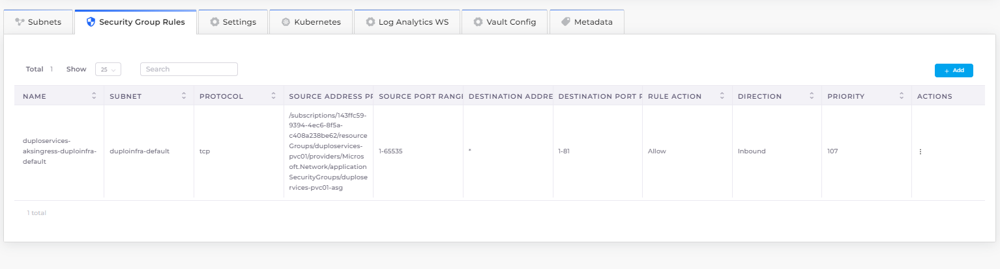

# AKS Shared Application Gateway

Azure's Shared Application Gateway provides a secure and scalable way to expose Kubernetes services to the internet or internal networks. DuploCloud integrates directly with the Azure Shared Application Gateway, allowing you to manage routing, SSL certificates, and health checks through the DuploCloud Portal.

This integration abstracts the complexity of Kubernetes-native Ingress resources while providing similar capabilities. You can also configure access to container and pod shells via the DuploCloud Portal for both Docker-based and Kubernetes-based deployments. 


**Note:** To add an SSL certificate when exposing a service through the Shared Application Gateway, see the . [SSL certificates](https://docs.duplocloud.com/docs/overview-2/prerequisites/import-ssl-certificates) documentation.


## Prerequisites

**Create Services**: To configure the Shared Application Gateway, you must first create one or more Kubernetes Services. See the [Services](../../../overview-2/azure-services/containers-and-services/#adding-a-duplocloud-service) documentation for steps.

**Enable the Ingress controller**: To enable Shared Application Gateway support:

1. In the DuploCloud Portal, navigate to **Administrator** -> **Infrastructure**.
2. Select the Infrastructure from the **NAME** column.
3. Select the **Settings** tab, and click **Add**. The **Infra-Set Custom Data** pane displays.
4. In the **Setting Name** list box, select **Enable App Gateway Ingress Controller**. 
5. Enable the setting and click **Set**. The value should be **true**. This enables the AKS Ingress controller to integrate with Azure’s Shared Application Gateway.

<figure><figcaption>
The <strong>Enable App Gateway Ingress Controller</strong> setting on the <strong>Settings</strong> tab
</figcaption></figure>

## Adding a Load Balancer Listener (K8S NodePort)

To expose a service via NodePort using the Application Gateway:

1. In the DuploCloud Portal, navigate to **Kubernetes** -> **Services**.
2. Select your Service from the **NAME** column.
3. Select the **Load Balancers** tab.
4. Click **Configure Load Balancer**. The **Add Load Balancer Listener** pane appears.
5. In the **Select Type** field, select **K8S Node Port**.&#x20;
6. In the **Health Check** field, add the Kubernetes Health Check URL for the container (used for availability checks). Using a Kubernetes Health Check allows the Shared Application Gateway to monitor service health and route traffic accordingly.
7. Fill in the remaining fields as appropriate.
8. Click **Add** to create the Load Balancer listener.

## Creating a Shared Application Gateway Ingress

To configure Ingress through the Azure Shared Application Gateway:

1. In the DuploCloud Portal, navigate to **Kubernetes** -> **Ingress**.
2. Click **Add**. The **Add Kubernetes Ingress** page displays.
3. In the **Ingress Name** field, enter a name for the Ingress.
4. In the **Ingress Controller** field, select the controller (Shared Application Gateway)
5.  Set **Visibility** to **Public** or **Internal Only**.\

    <figure><figcaption>
<strong>Add Kubernetes Ingress</strong> page
</figcaption></figure>
6. Optionally, configure the following fields:
   * **DNS Prefix**: Provide the DNS prefix to expose services.
   * **Certificate Name:** Select or enter the name of the TLS/SSL certificate to secure the Ingress traffic.
   * **Port Override**: Specify a custom port (e.g., 8080). If used, add a matching Security Group Rule
   * **HTTP to HTTPS Redirect**: Enable to automatically redirect all HTTP traffic to HTTPS.
7. Follow the steps below to configure Ingress rules.
8. Click **Add** to create the Ingress resource.

### Configuring Ingress Rules

To define routing rules for your Ingress:

1.  On the **Add Kubernetes Ingress** page, click **Add Rule**. The **Add Ingress Rule** pane displays.\

    
<figure><figcaption>
<strong>Add Ingress Rule</strong> pane
</figcaption></figure>

2. Enter a **Path**.
3. In the **Path Type** list box, select **Exact**, **Prefix,** or **Implementation Specific**.
4. In the **Service Name** field, select the Service (**s1-alb:80** in this example).&#x20;
5. Click **Add Rule**.
6. Repeat to define multiple routing rules or paths&#x20;


The DuploCloud Platform supports defining multiple rules/paths in Ingress.


## Adding a Security Group Rule (Custom Ports)

Port 80 is allowed by default. If using a custom port, add a security rule:

1. In the DuploCloud Portal, navigate to **Administrator** -> **Infrastructure**.
2. Select your Infrastructure from the **NAME** column.
3. Select the **Security Group Rules** tab.&#x20;
4.  Click **Add**. The **Add Infrastructure Security** pane displays.\

    
<figure><figcaption>
<strong>Add Infrastructure Security</strong> pane
</figcaption></figure>

5. Define your rule (e.g., port 8080) and click **Add**. The rule is added to the **Security Group Rules** list.

<figure><figcaption>
The <strong>Security Group Rules</strong> tab
</figcaption></figure>

## Viewing Ingress

### Viewing Ingress details in the DuploCloud Portal

To view details of your configured Ingress in the DuploCloud Portal:

1. Navigate to **Kubernetes** -> **Ingress**, and select your Ingress from the **NAME** column.

<figure><figcaption>
The <strong>Kubernetes Ingress</strong> page
</figcaption></figure>

### Viewing Ingress details using curl Commands

To confirm that traffic is being routed according to your Ingress rules, you can use curl commands:

1. Use the following format for the curl command:\
   `curl http://<dns-name>/<path>`
2. Replace `<dns-name>` with the DNS name defined in your Ingress, and `<path>` with the path configured in the Ingress rules.

For example:

* **Command**: `curl http://ig-nev-ingress-ing-t2-1.duplopoc.net/path1/`
* **Response:** `this is IG-NEV`

* **Command**: `curl http://ing-doc-ingress-ing-t2-1.duplopoc.net/path2/`
* **Response**: `this is ING-DOC`

* **Command**: `curl http://ing-public-ingress-ing-t2.1.duplopoc.net/path3/`
* **Response**: `this is ING2-PUBLIC`
