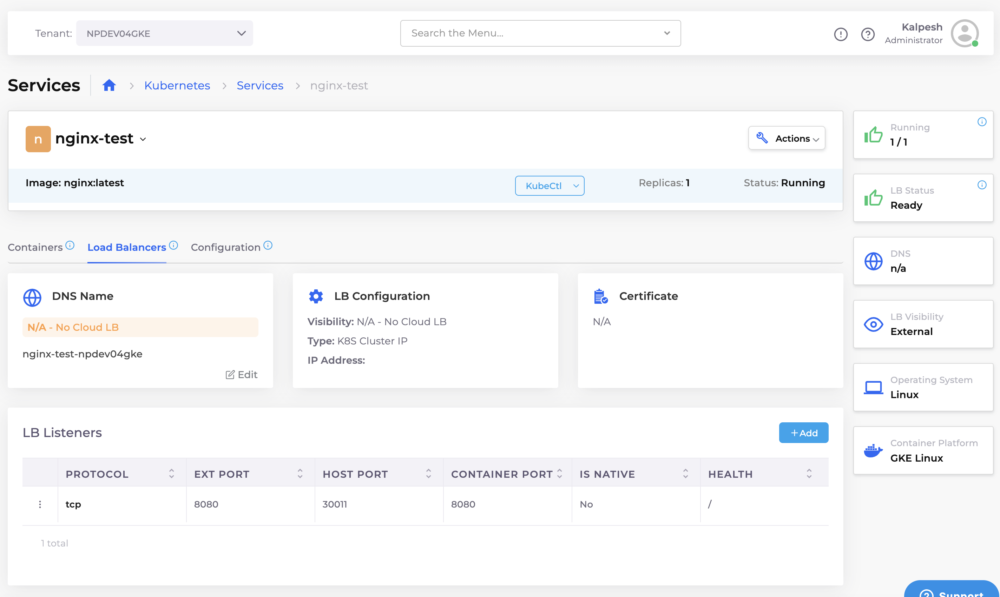

# GKE Ingress

GCP's Ingress Controller for GKE automatically manages traffic routing to Kubernetes services, integrating Kubernetes workloads with Google Cloud's load-balancing infrastructure. It simplifies external access to applications, handling SSL termination and global load distribution.

GCP offers its own Ingress Controller, specifically created for Google Kubernetes Engine (GKE), to seamlessly integrate Kubernetes services with Google Cloud's advanced load balancing features.

## Container-native load balancing with GKE Ingress

Container-native load balancing on Google Cloud Platform (GCP) allows Load Balancers to directly target Kubernetes Pods instead of using a node-based proxy. This approach improves performance by enabling more efficient routing, reducing latency by eliminating extra hops, and providing better health-checking capabilities.&#x20;

It leverages the network endpoint groups (NEGs) feature to ensure that traffic is directed to the appropriate container instances, enabling more granular and efficient load distribution for applications running on GKE.

<figure><figcaption><p><strong>GKE Container Native Load Balancing</strong></p></figcaption></figure>

## Prerequisites

Before you can create an Ingress, you must create the following DuploCloud resources:

* **GKE Standard** users: create a DuploCloud **Tenant**, **Node Pool**, and **Service**.
* **GKE Autopilot** users: create a DuploCloud **Tenant**, and **Service**.&#x20;

See the [DuploCloud GCP User Guide](../../overview-1/) for steps on how to create Tenants, Node Pools and Services. Once your Tenant and Service are deployed, you can add and configure a Load Balancer listener.

## Adding a Load Balancer listener with Kubernetes ClusterIP

1. In the DuploCloud Portal, navigate **Kubernetes** -> **Services.**
2. On the **Services** page, select the Service name from the **NAME** column.
3. Click the **Load Balancers** tab.
4. Click **Configure Load Balancer**. The **Add Load Balancer Listener** pane appears.

<div align="left"><figure><figcaption><p><strong>Add Load Balancer Listener</strong> pane</p></figcaption></figure></div>

5. From the **Select Type** list box, select **K8s ClusterIP**.&#x20;
6. Optionally, enable **Advanced Kubernetes Settings** and configure the **External Traffic Policy** and **Extra Selector Labels** fields.
7. Optionally, select **Set HealthCheck annotations** (this ensures the Kubernetes Service is recognized by the GKE Ingress Controller).
8. Optionally, enable **Additional health check configs**.
9. Click **Add**. The Load Balancer listener details will appear in the **Load Balancers** tab on the Service details page.

<figure><figcaption><p><strong>Load Balancers</strong> tab</p></figcaption></figure>

## Creating a GCP Managed Certificate (optional)

To enable SSL, create a GCP-managed certificate resource in the application namespace, as shown in the example below.

```
apiVersion: networking.gke.io/v1
kind: ManagedCertificate
metadata:
  name: my-managed-cert
  namespace: duploservices-npdev04gke
spec:
  domains:
  - npdev04.duplocloud.net #your A record name in DNS
```

## Adding a Kubernetes Ingress

Once a Service and Load Balancer are deployed, complete the following steps to add an Ingress:

### Configuring the Ingress

1. Select **Kubernetes** -> **Ingress** from the navigation pane.
2. Click **Add**. The **Add Kubernetes Ingress** page displays.

<div align="left"><figure><figcaption><p>The <strong>Add Kubernetes Ingress</strong> page </p></figcaption></figure></div>

1. Complete the fields to configure the Ingress:

<table data-header-hidden><thead><tr><th width="232.888916015625">Field</th><th>Description</th></tr></thead><tbody><tr><td><strong>Ingress Name</strong></td><td>Enter a unique name for your Ingress.</td></tr><tr><td><strong>Ingress Controller</strong></td><td>Select <strong>GCE</strong> to use the Google Cloud Ingress Controller for GKE.</td></tr><tr><td><strong>Visibility</strong></td><td>Choose <strong>Internal Only</strong> or <strong>Public</strong> to define load balancer visibility.</td></tr><tr><td><strong>DNS Prefix</strong></td><td>Specify the DNS prefix for the Ingress (e.g., <code>myapp</code>).</td></tr><tr><td><strong>TLS Hosts</strong></td><td>Enter the domain names to secure with TLS (e.g., <code>example.com,www.example.com</code>), separated by commas.</td></tr><tr><td><strong>TLS Secret Name</strong></td><td>Enter the Kubernetes TLS secret containing the certificate and key. Must exist in the Ingress namespace.</td></tr><tr><td><strong>Annotations</strong></td><td>Optional: Add Kubernetes annotations in <code>key=value</code> format. Use this to configure Ingress behavior or link to a GCP Managed Certificate.</td></tr><tr><td><strong>Labels</strong></td><td>Optionally, enter labels to organize the Ingress resource.</td></tr></tbody></table>


**Note:**\
The **Certificate ARN** field from previous versions has been removed. TLS is now configured using:

* The **TLS Hosts** and **TLS Secret Name** fields
*   Or annotations such as:

    ```
    networking.gke.io/managed-certificates=my-managed-cert
    kubernetes.io/ingress.allow-http=false
    ```

This update reflects GCP’s native Ingress TLS behavior.


4. Before you can save the Ingress, you must add at least one rule. In the **Ingress Rules** section, click **Add Rule**. The **Add Ingress Rule** pane displays.

<div align="left"><figure><figcaption><p><strong>Add Ingress Rule</strong> pane</p></figcaption></figure></div>

2. Complete the fields to configure the rule:

<table data-header-hidden><thead><tr><th width="189.11102294921875">Field</th><th>Description</th></tr></thead><tbody><tr><td><strong>Path</strong></td><td>Enter the URL path to match (e.g., <code>/samplePath</code>).</td></tr><tr><td><strong>Path Type</strong></td><td>Select the path matching behavior, such as <code>Exact</code>, <code>Prefix</code>, or <code>ImplementationSpecific</code>.</td></tr><tr><td><strong>Host</strong></td><td>Optionally, enter the hostname to match (e.g., <code>api.example.com</code>).</td></tr><tr><td><strong>Service</strong></td><td>Select the Kubernetes Service to expose through the Ingress. Only Services using K8s ClusterIP are valid.</td></tr><tr><td><strong>Container Port</strong></td><td>Select the port from the Kubernetes service that ingress will use as backend port to serve the requests.</td></tr></tbody></table>

3. Click **Add Rule** to add the rule to the Ingress. Repeat the steps to define additional rules as needed.
4. After at least one rule is added, click **Add** to create the Ingress. Ingress creation will take a few minutes. Once the IP is attached to the Ingress, the Ingress displays on the **Ingress** page and you are ready to use your path- or host-based routing defined via Ingress.

## Viewing an Ingress

You can view the Ingresses you have created by navigating to **Kubernetes** -> **Ingress**.&#x20;

Click on an Ingress name in the **NAME** column to view Ingress details.

<figure><figcaption><p><strong>Ingress</strong> page displaying the added Ingress</p></figcaption></figure>
