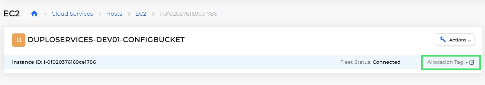
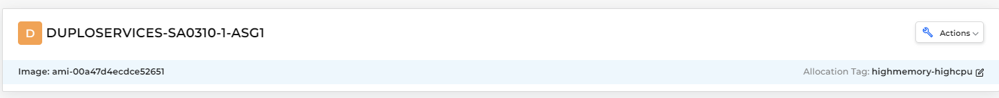

# Allocation Tagging

In DuploCloud, allocation tags give you control over where containers and Services are deployed within a Kubernetes cluster. By default, DuploCloud spreads container replicas across available Hosts to balance resource usage. Allocation tags allow you to label Hosts and Services with specific characteristics, capabilities, or preferences, and to "pin" Services to certain Hosts to meet your operational and resource needs. Allocation tags are useful for deployment requirements like using Hosts with specialized resources, meeting compliance standards, or isolating workloads.


For a Service to run on a specific Host, the Host and the Service must have matching allocation tags. Services without allocation tags are deployed on any available Host in the Kubernetes cluster.&#x20;


## **Allocation Tag Rules**

Before you assign an allocation tag, review the following:

For Docker-based Services, tag matching is substring-based and case-insensitive. This means a Service tag only needs to appear as part of a Host tag, regardless of case. For example, a Host tagged `HighCpu;HighMem` would match a Service tagged `highcpu`, but not one tagged `highcpu;gpu` unless both substrings are included in the Host tag.

In contrast, Kubernetes-based Services use exact and case-sensitive tag matching. The tag on the Service must exactly match the tag on the Host or Node Pool, including case and spelling. For example, a Service tagged `gpu.large` would match a Host tagged `gpu.large`, but not `Gpu.Large` or `gpu-large`.

Kubernetes tags also have character restrictions:

* Tags must start and end with an alphanumeric character.
* Allowed characters: letters, numbers, hyphens (`-`), and periods (`.`).

**Notes:**

* If a Service does not have any allocation tag, it may be placed on any Host.
* Hosts tagged with specific values can still run untagged Services. For exclusive placement, make sure that every Service in the Tenant has at least one allocation tag.

## Adding an Allocation Tag to a Host

Assign a tag describing the Host's characteristics or capabilities, such as resource capacity, geographic location, or compliance needs.&#x20;

1. In the DuploCloud Portal, navigate to **Cloud Services** -> **Hosts**. The **Hosts** page displays.
2. Select the Host from the **NAME** column. If the Host is part of an Auto-Scaling Group (ASG), select the **ASG** tab and select the correct ASG.
3. Click the **Allocation Tag** Edit Icon ( ). The **Set Allocation Tag** pane displays.

<figure><figcaption></figcaption></figure>

4. In the **Allocation Tag** field, enter a tag name following the [allocation tag rules](creating-advanced-functions.md#allocation-tag-rules).&#x20;
5.  Click **Set**. The allocation tag you set displays in the heading banner for the Host or ASG. 

    <figure><figcaption>
The heading banner for an Auto-Scaling Group (ASG) with an allocation tag
</figcaption></figure>

## Assigning an Allocation Tag to a Service

In the DuploCloud Portal, navigate to the **Add Service** or **Edit Service** page, and enter a tag name in the **Allocation Tag** field. Refer to the [allocation tag rules](creating-advanced-functions.md#allocation-tag-rules) for details. When the Service runs, DuploCloud will attempt to select a Host with a matching allocation tag. To pin the Service to run on a specific Host, apply matching allocation tags to the Host and Service.&#x20;

## Editing or deleting an Allocation Tag

On the **Host** or **ASG** page, select the **Metadata** tab, and edit or delete the existing allocation tag.

