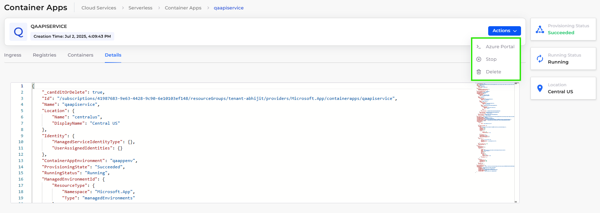
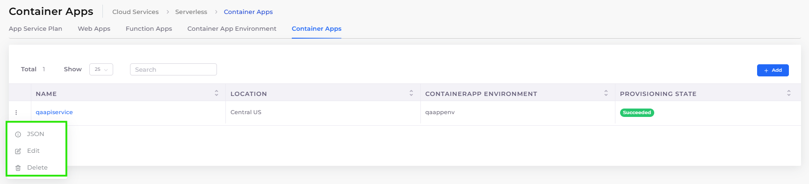

# Azure Container Apps

DuploCloud supports [Azure Container Apps](https://learn.microsoft.com/en-us/azure/container-apps/overview), a fully managed serverless container service that enables you to deploy and manage containerized applications easily on Azure without managing Kubernetes clusters.

## Prerequisites

Before creating Container App Environments and deploying Container Apps in DuploCloud, ensure the following:

* Your container image is accessible:
  * For public images, you can use registries like [Microsoft Container Registry](https://mcr.microsoft.com).
  * For private registries, make sure authentication credentials are configured.\
    Learn more: [Authenticate with Azure Container Registry](https://learn.microsoft.com/en-us/azure/container-registry/container-registry-authentication)
* If using Log Analytics, a Log Analytics Workspace must already exist and be visible in the DuploCloud Portal. Learn more: [Create a Log Analytics workspace](https://learn.microsoft.com/en-us/azure/azure-monitor/logs/quick-create-workspace)

## Creating a Container App Environment

The Container App Environment is the hosting space for your containerized applications, defining compute profiles, networking, and logging.

To create a Container App Environment in the DuploCloud Portal:

1. In the DuploCloud Portal, navigate to **Cloud Services** → **Serverless.**
2. Select the **Container App Environment** tab.
3.  Click **Add**. The **Create Container App Environment** pane displays. 

    
<figure><figcaption>
<strong>Create Container App Environment</strong> pane
</figcaption></figure>

4. Fill out the fields as follows:

<table data-header-hidden><thead><tr><th width="333.111083984375">Field</th><th>Description / Sample Value</th></tr></thead><tbody><tr><td><strong>Name</strong></td><td>Enter a unique name for the environment.</td></tr><tr><td><strong>Workload Profile Name</strong></td><td>Select the compute profile name (e.g., <strong>default</strong>).</td></tr><tr><td><strong>Instance Min Count</strong></td><td>Specify the minimum number of instances (e.g., <strong>1</strong>).</td></tr><tr><td><strong>Instance Max Count</strong></td><td>Specify the  maximum number of instances (e.g., <strong>3</strong>).</td></tr><tr><td>
<strong>Add New Workload Profile</strong>

<em>(Optional)</em> 
</td><td>Click to add multiple profiles if needed.</td></tr><tr><td><strong>Log Configuration Destination</strong></td><td>Select the log destination (e.g., <strong>Log Analytics</strong>). Provide any additional required details, such as the Log Analytics Workspace name or equivalent configuration for other logging services.</td></tr><tr><td><strong>Subnet</strong></td><td>Select the Azure subnet for deployment (e.g., <code>subnet-containerapps-qa</code>).</td></tr></tbody></table>

4.  Click **Submit**. Once created, the environment will be available under the **Container App Environment** tab. 

    
<figure><figcaption>
<strong>Container App Environment</strong> tab
</figcaption></figure>

## Managing Container App Environments

After creating a Container App Environment, you can manage it in the DuploCloud Portal using the following options:

### Viewing Container App Environments

1. Navigate to **Cloud Services** → **Serverless.**
2. Select the **Container App Environment** tab.
3. Click the name of the environment you want to view in the **NAME** column.
4. On the environment details page, you can:
   * View environment details using the **Workload Profiles** and **Details t**abs.
   * Use the **Actions** button to:
     * Open the environment in the **Azure Portal**.
     * **Delete** the environment permanently.

<figure><figcaption>
<strong>Container App Environment</strong> details page with <strong>Actions</strong> menu options highlighted
</figcaption></figure>

### Viewing, Editing, and Deleting Container App Environments

1. Navigate to **Cloud Services** → **Serverless.**
2. Select the **Container App Environment** tab.
3.  Click the menu icon () in the row of the environment you want to manage. 

    <figure><figcaption>
<strong>Container App Environment</strong> tab with menu options highlighted
</figcaption></figure>
4. Select one of the following actions:
   * **JSON**: View the environment’s JSON configuration.
   * **Edit**: Modify environment settings.
   * **Delete**: Permanently delete the environment.

## Creating a Container App

After setting up the environment, you can deploy a container app.

1. In the DuploCloud Portal, navigate to **Cloud Services** → **Serverless.**
2. Select the **Container Apps** tab.
3.  Click **Add**. The **Create Container App** - **Basic Options** pane displays. 

    <figure><figcaption>
<strong>Create Container App</strong> - <strong>Basic Options</strong> pane
</figcaption></figure>
4. Complete the fields as follows:

<table data-header-hidden><thead><tr><th width="276.22216796875">Field</th><th>What to Enter / Do</th></tr></thead><tbody><tr><td><strong>Container App Name</strong></td><td>Enter a unique name for your app.</td></tr><tr><td><strong>Container App Environment</strong></td><td>Select the container app environment you created.</td></tr><tr><td><strong>Workload Profile</strong></td><td>Select the workload profile to use (e.g., <code>default</code>).</td></tr><tr><td><strong>Ingress</strong></td><td>
Select <code>Enabled</code> to expose the app publicly or <code>Disabled</code> otherwise. 

If enabled, specify: • <strong>Is External</strong>: <code>true</code> or <code>false</code> • <strong>Transport</strong>:  <code>http</code> or <code>https</code> • <strong>Target Port</strong>: Enter the target port, e.g., <code>80</code> • <strong>Allow Insecure</strong>: <code>true</code> or <code>false</code>
</td></tr><tr><td></td><td></td></tr></tbody></table>

5.  Click **Next**. The **Create Container App** - **Advanced Options** pane displays. 

    <figure><figcaption>
<strong>Create Container App</strong> - <strong>Advanced Options</strong> pane
</figcaption></figure>
6. Complete the following fields:

<table data-header-hidden><thead><tr><th width="249.5555419921875">Field</th><th>What to Enter / Do</th></tr></thead><tbody><tr><td><strong>Container Name</strong></td><td>Enter a name for the container instance.</td></tr><tr><td><strong>Container Image</strong></td><td>Enter the container image path without the registry server (e.g., <code>azuredocs/containerapps-helloworld:latest</code>).</td></tr><tr><td><strong>Registry Server</strong></td><td>Enter the registry server domain (e.g., <code>mcr.microsoft.com</code>).</td></tr><tr><td><strong>Username / Password</strong></td><td>If using a private registry, enter your credentials here; otherwise leave blank for public images.</td></tr><tr><td><strong>CPU Cores</strong></td><td>Enter the number of CPU cores to allocate (e.g., <strong>0.5</strong>).</td></tr><tr><td><strong>Memory (Gi)</strong></td><td>Enter the amount of memory in GiB (e.g., <strong>1.0</strong>).</td></tr><tr><td><strong>Command override</strong></td><td>Optionally enter a command to override the container’s default command. Leave blank if not needed.</td></tr><tr><td><strong>Arguments override</strong></td><td>Optionally enter arguments for the container command. Leave blank if not needed.</td></tr><tr><td><strong>Environment Variables</strong></td><td>LOehdndMhNrk</td></tr></tbody></table>

6. Click **Create** to deploy your container app.

## Managing Container Apps

Once you have deployed Container Apps, you can manage them through the DuploCloud Portal using the following methods:

### Viewing Container Apps

1. Navigate to **Cloud Services** → **Serverless.**
2. Select the **Container App** tab.
3. Click the name of the container app you want to view in the **NAME** column.
4. On the app details page, you can:
   * View the **Registries**, **Containers**, and **Details** tabs to review configuration and status.
   * Use the **Actions** button to:
     * Open the app in the **Azure Portal**.
     * **Stop** the container app.
     * **Delete** the container app. You must delete the Container App Environment before you can delete any Container Apps within it. Container Apps cannot be deleted while their environment still exists.

<figure><figcaption>
Container App details with <strong>Actions</strong> menu options highlighted
</figcaption></figure>

### Viewing, Editing, and Deleting from the List

1. Navigate to **Cloud Services** → **Serverless.**
2. Select the **Container App** tab.
3.  Click the menu icon () in the row of the container app you want to manage. 

    <figure><figcaption>
<strong>Container App</strong> tab with menu options highlighted
</figcaption></figure>
4. Select one of the following actions:
   * **JSON**: View the container app’s JSON configuration.
   * **Edit**: Modify container app settings.
   * **Delete**: Permanently delete the container app. You must delete the Container App Environment before you can delete any Container Apps within it. Container Apps cannot be deleted while their environment still exists.

## Additional Resources

For more information on Azure Container Apps and related topics, see the following:

* [Azure Container Apps documentation (Microsoft)](https://learn.microsoft.com/en-us/azure/container-apps/)
* [Container App environments](https://learn.microsoft.com/en-us/azure/container-apps/environment)
