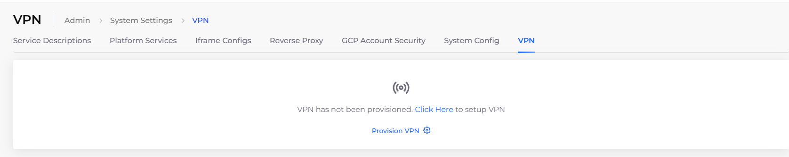

# Provision the VPN

DuploCloud integrates with OpenVPN by provisioning VPN users that you add to the DuploCloud Portal. This integration allows users to securely access your cloud infrastructure. Below are the steps for setting up OpenVPN and managing VPN users.&#x20;

## Accepting OpenVPN in the Azure Marketplace

1. Navigate to [Azure Marketplace](https://azuremarketplace.microsoft.com/en-us/marketplace/apps/openvpn.openvpnas?tab=Overview) and accept OpenVPN.
2. Follow the instructions in the [Quick Start Guide](https://openvpn.net/vpn-server-resources/microsoft-azure-byol-appliance-quick-start-guide/) provided in the Marketplace to set up OpenVPN.

## Provisioning the VPN

1. In the DuploCloud Portal, navigate to **Administrator** -> **System Settings**.
2.  Click on the **VPN** tab. 

    <figure><figcaption></figcaption></figure>
3. Click **Provision VPN.**


**Note:** In Azure environments, VPN provisioning may require manual setup by the DuploCloud team. If VPN access does not become available shortly after provisioning, please contact DuploCloud Support for assistance.


## **Provisioning the VPN and Creating a User**

1. In the DuploCloud Portal, navigate to **Administrator** -> **Users**.
2.  Click **Add**. The **Create User** pane displays. 

    
<figure><figcaption>
The <strong>Create User</strong> pane
</figcaption></figure>

3. Enter a valid email address in the **Username** field.
4. In the **Roles** field, select the appropriate role(s) for the User.
5. Select **Provision VPN**.
6. Click **Submit**. The user will be provisioned with VPN access and can connect using the OpenVPN credentials.

### Deleting VPN Access for a User

To remove VPN access for a user, refer to the section [Deleting a VPN user](../../access-control/add-and-delete-vpn-access-for-users.md#deleting-a-vpn-user) (Administrator privileges are required).&#x20;

## Opening a VPN Port

By default, users connected to a VPN can SSH or RDP into virtual machines and access an application's internal Load Balancers and endpoints. However, to connect to other Services, such as databases, you must configure the appropriate security rules to allow traffic from the VPN.

1. In the DuploCloud Portal, navigate to **Administrator** -> **Infrastructure**.
2. Select the Infrastructure that hosts your Tenant from the **NAME** column.
3. Click the **Security Group Rules** tab.
4. Click **Add**. The **Add Infrastructure Security** pane displays.
5. Fill in the fields:

<table data-header-hidden><thead><tr><th width="212.22222900390625"></th><th></th></tr></thead><tbody><tr><td><strong>Name</strong></td><td>A descriptive name for the rule (e.g., <code>VPN Access to DB</code>).</td></tr><tr><td><strong>Subnet</strong></td><td>Select the DuploCloud-managed subnet (e.g., <code>custom-default</code>).</td></tr><tr><td><strong>Direction</strong></td><td><code>Inbound</code></td></tr><tr><td><strong>Source Type</strong></td><td><code>IP Address</code></td></tr><tr><td><strong>Source Value</strong></td><td>Enter the CIDR block for your VPN (e.g., <code>10.10.0.0/24</code>).</td></tr><tr><td><strong>Source Port Range</strong></td><td><code>*</code> (or specify if you're limiting source ports)</td></tr><tr><td><strong>Destination Type</strong></td><td><code>IP Address</code> (leave blank to allow traffic to all destinations in the subnet, or specify a target if needed)</td></tr><tr><td><strong>Destination Value</strong></td><td>Leave blank or enter an internal IP range</td></tr><tr><td><strong>Destination Port Range</strong></td><td>Enter the port or port range required (e.g., <code>5432</code> for PostgreSQL, or <code>6379</code> for Redis)</td></tr><tr><td><strong>Priority</strong></td><td>Enter a priority number (typically between <code>100</code> and <code>4096</code>). Lower numbers = higher priority.</td></tr><tr><td><strong>Protocol</strong></td><td><code>TCP</code>, <code>UDP</code>, or <code>Both</code>, depending on the service</td></tr><tr><td><strong>Action</strong></td><td><code>Allow</code></td></tr></tbody></table>

6. Click **Add** to save the security rule and allow VPN traffic to the specified internal service.
