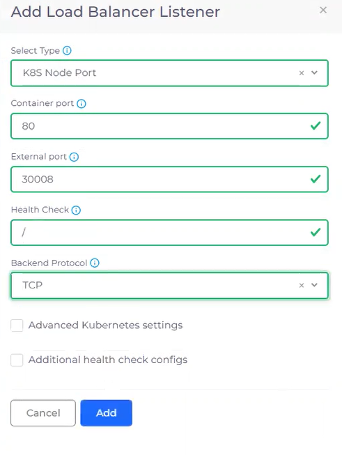

# Step 5: Create a Load Balancer

Now that your DuploCloud Service is running, you have a mechanism to expose the containers and images where your application resides. But because your containers are running inside a private network, you also need a Load Balancer to listen on the correct ports in order to access the application.

In this step, we add a Load Balancer Listener to complete the network configuration.

_Estimated time to complete Step 5: 20 minutes._

## Prerequisites

Before creating your DuploCloud Load Balancer, ensure that:

* All previous steps in this tutorial to create an [Infrastructure and Plan](step-1-infrastructure.md), [Tenant](step-2-tenant.md), [Azure Agent Pool](step-3-create-azure-agent-pool.md), and [Service](step-4-create-app-via-k8s.md) are complete.
* [AKS Kubernetes cluster](step-1-infrastructure.md#enabling-the-aks-kubernetes-cluster) is enabled.
* **dev01**  is selected in the **Tenant** list box, at the top of the DuploCloud Portal.

<figure><figcaption>
<strong>Tenant</strong> list box with Tenant <strong>dev01</strong> selected
</figcaption></figure>

## Adding a Load Balancer

1. In the DuploCloud Portal, navigate to **Kubernetes** -> **Services**.
2. On the **Services** page, select the **nginx-service** you created.
3. Select the **Load Balancers** tab.
4.  Click **Add**. The **Add Load Balancer Listener** pane displays. 

    
<figure><figcaption>
The <strong>Add Load Balancer Listener</strong> pane 
</figcaption></figure>

5. Fill the fields as shown in the following tables. Leave any default values for fields not specified.&#x20;

| **Select Type**      | `K8S Node Port`   |
| -------------------- | ----------------- |
| **Container Port**   | `80`              |
| **External Port**    | `30008`           |
| **Health Check**     | / (forward-slash) |
| **Backend Protocol** | `TCP`             |

6. Click **Add**. After a few minutes, the **LB Status** card displays a status of **Ready**, indicating that the Load Balancer is ready for use.

<figure><figcaption></figcaption></figure>

## Enabling the Ingress Controller

When we created the Load Balancer Listener, we used the [**K8S Node Port**](https://kubernetes.io/docs/concepts/services-networking/service/#type-nodeport) type, which leverages the capabilities of the [Kubernetes Ingress](https://kubernetes.io/docs/concepts/services-networking/ingress/) object.&#x20;

Ingress is an entry point that front-ends multiple services in a cluster. It can be defined as a collection of routing rules that governs how external users access services running inside a Kubernetes cluster. One of the greatest benefits of Ingress is its ability to secure the network traffic to your application. With Ingress, you can define a TLS private key and certificates by leveraging Kubernetes Secrets, instead of directly defining TLS details in the Ingress resource.

To use Ingress, you first enable the [Kubernetes Ingress Controller](https://kubernetes.io/docs/concepts/services-networking/ingress-controllers/) to open the application gateway for Ingress.

1. In the DuploCloud Portal, navigate to **Administrator** -> **Infrastructure**.
2. Select your Infrastructure from the **NAME** column.
3. Click the **Settings** tab.
4. Click **Add**. The **Infra-Set Custom Data** pane displays.
5. In the **Setting Name** field, select **Enable App Gateway Ingress Controller**.&#x20;
6. Click **Enable.**
7. Click **Set**. In the **Settings** tab, the **Enable App Gateway Ingress Controller** setting now contains the **true** in the **Value** column.

<figure><figcaption>
<strong>NONPROD Infrastructure</strong> page with <strong>Enable App Gateway Ingress Controller</strong> set to <strong>true</strong>
</figcaption></figure>

## Adding Kubernetes Ingress

Now that your gateway is established and opened, you add [Kubernetes Ingress](https://kubernetes.io/docs/concepts/services-networking/ingress/) to expose the backend HTTP routes outside the cluster to your service.&#x20;

The Ingress object communicates with the Kubernetes NodePort that your Load Balancer Listener uses. Ingress objects are flexible constructs in Kubernetes, and their use here is an example of how DuploCloud leverages the power of Kubernetes constructs while abstracting away their native complexity. To manually create these components (and maintain them) in Kubernetes, takes a significant amount of developer time.

1. In the DuploCloud Portal, navigate to **Kubernetes** -> **Ingress**.
2. Click **Add**. The **Add Kubernetes Ingress** page displays.
3. In the **Ingress Name** field, type `viewwebsite`.
4. In the **Ingress Controller** list box, select **azure-application-gateway**.
5. In the **Visibility** list box, select **Public**.
6.  Click **Add Rule**. The **Add Ingress Rule** pane displays. 

    <figure><figcaption></figcaption></figure>
7. In the **Path** field, type **/** (forward-slash).
8. In the **Service Name** field, select **nginx-service:80**.&#x20;
9.  Click **Add Rule** to add the rule and to close the **Add Ingress Rule** pane. You should be back to viewing the **Add Kubernetes Ingress** page. 

    
<figure><figcaption>
<strong>Add Ingress Rule</strong> pane
</figcaption></figure>

10. On the **Add Kubernetes Ingress** page, click **Add** to add Ingress. On the **Ingress** page, the **VIEWWEBSITE** Ingress that you defined, with an **Ingress Class** of **azure-application-gateway**, displays. 

    <figure><figcaption>
 <strong>Ingress</strong> page displaying <strong>VIEWWEBSITE</strong> Ingress
</figcaption></figure>

## Checking Your Work

Before you proceed to the final step and run your application, ensure that you:

* Configured a Load Balancer Listener that uses [K8S Node Port](step-5-create-a-load-balancer.md#adding-and-configuring-a-load-balancer).
* Enabled the [App Gateway Ingress Controller](step-5-create-a-load-balancer.md#enable-the-ingress-controller).&#x20;
* [Defined an Ingress and a rule](step-5-create-a-load-balancer.md#add-kubernetes-ingress) for your DuploCloud Service to listen on port 80.
