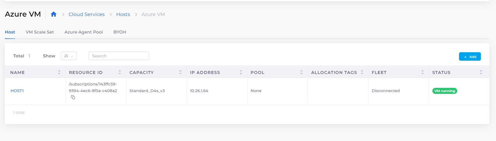

# Hosts (VMs)

Once we have the Infrastructure (Networking, Kubernetes cluster, and other common configurations) and an environment (Tenant) set up, the next step is to create VMs. In DuploCloud, you can create the following types of hosts for your workloads:

* **Host (VM)**: Standard virtual machines for general-purpose workloads, including application hosting and databases.
* **VM Scale Set**: A group of identical VMs that can automatically scale based on demand, ideal for horizontally scalable applications.
* **Azure Agent Pool**: A set of VMs used in container orchestration environments like Azure Kubernetes Service (AKS).
* **Availability Set**: A collection of VMs spread across fault and update domains to ensure high availability and minimize downtime.
* **BYOH (Bring Your Own Host)**: For users with pre-configured VMs or non-Azure infrastructure that they want to bring into DuploCloud. Use **BYOH** for any VM that is not an Azure Host.&#x20;


For convenience, you can [create a link to the Azure Console](../azure-portal-link.md) from the Action Menu on the Host page to quickly access Azure-specific settings or configurations while managing your Hosts in DuploCloud.


## Adding Hosts in DuploCloud

### Adding a Host (VM)

1. Select the appropriate Tenant from the **Tenant** list box.
2. Navigate to **Cloud Services** -> **Hosts**.&#x20;
3. Select the **Host** tab.
4. Click **Add**. The **Add Virtual Machine** pane displays.&#x20;

<figure><figcaption>
The <strong>Add Virtual Machine</strong> page in the DuploCloud Portal
</figcaption></figure>

4. Complete the following fields:

| **Friendly Name** | Enter a descriptive name for the VM in DuploCloud.                                                                                 |
| ----------------- | ---------------------------------------------------------------------------------------------------------------------------------- |
| **Subnet**        | Select the subnet where the VM will reside.                                                                                        |
| **Instance Type** | Select the VM size, e.g., **(2 CPU 8GB)**.                                                                                         |
| **Username**      | Enter the administrator username for the VM.                                                                                       |
| **Password**      | Enter the administrator password for the VM.                                                                                       |
| **Public IP**     | Choose **Enable** to use a public IP address if you want to communicate with the virtual machine from outside the virtual network. |

5. Optionally, check the **Advanced Options** box and configure advanced settings:

| **Computer Name**                   | Enter the computer name (can be the same as the Host Name).                                                                                       |
| ----------------------------------- | ------------------------------------------------------------------------------------------------------------------------------------------------- |
| **Image Id**                        | Select the VM image (e.g., **Linux – Ubuntu20\_04**).                                                                                             |
| **Fleet**                           | Choose deployment type (e.g., **Linux Docker**/**Native**).                                                                                       |
| **Allocation Tag**                  | Enter an allocation tag for tracking or billing purposes.                                                                                         |
| **Disk Controller Type**            | Select the disk controller type for the VM. The default value set is **SCSI**. If you want to set **NVME**, specify the supported Instance Size.  |
| **Disk Type**                       | Select the disk type (**Standard HDD** **(Local Redundant)**).                                                                                    |
| **Disk Size**                       | Enter the disk size in GB (e.g., **128**).                                                                                                        |
| **Disk Encryption**                 | Turn disk encryption **Off** or **On**.                                                                                                           |
| **Join Domain**                     | Select a Domain Type for the Host, if desired.                                                                                                    |
| **Join Log Analytics**              | Select **Yes** to integrate with Log Analytics.                                                                                                   |
| **Timezone**                        | Select the time zone for the Host.                                                                                                                |
| **Availability Set**                | Select an availability set if applicable (or **None**).                                                                                           |
| **Security Type**                   | Select the security type (e.g., **Standard**).                                                                                                    |
| **Enable Encryption at Host**       | Select to enable encryption at Host.                                                                                                              |
| **Base64 Data**                     | Enter any Base64-encoded data for VM initialization.                                                                                              |
| **Install DuploCloud Native Agent** | Check to install the DuploCloud agent on the VM (supports only Linux/Ubuntu).                                                                     |

6. Click **Add**.


It is not necessary to explicitly define Hosts. Instead, you can use [Azure Agent Pools](../../azure-services/agent-pool/) and [VM Scale Sets](../../azure-services/vm-scale-sets.md)**.**


### Adding a VM Scale Set

1. Select the appropriate Tenant from the **Tenant** list box.
2. Navigate to **Cloud Services** → **Hosts**. &#x20;
3. Select the **VM Scale Set** tab.
4. Click **Add**. The **Add VM Scale Set** pane displays.
5. In the **Name** field, provide a unique name for the VM Scale Set.
6. Select the **Subnet** from the available options.
7. Choose the **Instance Type** for the VMs in the scale set (e.g., **2GB, 4GB**, etc.).
8. Define the **Capacity**, specifying the desired number of VMs for the scale set.
9. Select the **Image Id** for the base image of the VMs (e.g., `Ubuntu20_04`).
10. Choose the **Fleet** to which the VM Scale Set will belong.
11. Optionally, enter an **Allocation Tag** for organizational purposes.
12. Provide the **Username** and **Password** for accessing the VMs in the scale set.
13. Click **Add** to create the VM Scale Set.

### Adding an Azure Agent Pool

1. Select the appropriate Tenant from the **Tenant** list box.
2. Navigate to **Cloud Services** → **Hosts**.
3. Select the **Azure Agent Pool** tab.
4.  Click **Add**. The **Add Azure Agent Pool** pane displays. 

    <figure><figcaption>
The <strong>Add Azure Agent Pool</strong> pane
</figcaption></figure>
5. In the **Name** field, enter a unique name for the agent pool.
6. Choose the **Instance Type** (e.g., **2GB, 4GB**, etc.).
7. Set the **Min Capacity**, specifying the minimum number of nodes in the agent pool.
8. Set the **Max Capacity**, specifying the maximum number of nodes in the agent pool.
9. Set the **Desired Capacity**, specifying the desired number of nodes.
10. Select the **OS** for the agent pool (e.g., **Linux**, **Windows**).
11. Choose the **OS SKU**, (e.g., **Ubuntu**).
12. Optionally, enter an **Allocation Tag** for organizational purposes.
13. Specify the **Availability Zones** in which the agent pool nodes should be located.
14. Choose the **Scale Set Priority** (e.g., **Regular**, **Spot**).
15. Set the **Max Pods Per Node**, specifying the maximum number of pods for each node.
16. Optionally, select **Enable Autoscaling** to automatically scale the agent pool based on usage.
17. Click **Add** to create the Azure Agent Pool.

### Adding an Azure Availability Set

For detailed instructions, see the [DuploCloud Azure Availability Set documentation](./#adding-an-azure-availability-set).

### Adding a BYOH (Bring Your Own Host)

1. Select the appropriate Tenant from the **Tenant** list box.
2. Navigate to **Cloud Services** → **Hosts**.
3. Select the **BYOH** tab.
4.  Click **Add**. The **Add BYOH** pane displays. 

    <figure><figcaption>
The <strong>Add BYOH</strong> pane 
</figcaption></figure>
5. In the **Friendly Name** field, enter a unique name for the Host.
6. In the **Direct Address** field, enter the direct IP address of the Host.
7. In the **Fleet Type** field, select the appropriate fleet type (e.g., **Linux Docker/Native**).
8. In the **Username** field, enter the username for accessing the Host (optional).
9. In the **Password** field, enter the password for the Host (optional).
10. Optionally, provide a **Private Key** for SSH access if necessary.
11. Click **Add** to create the BYOH Host.

## Viewing Hosts (VMs)

To view your Hosts (VMs), navigate to **Cloud Services** -> **Hosts** and select the **Host** tab.&#x20;

<figure><figcaption>
<strong>Azure VM</strong> <strong>Hosts</strong> page with <strong>Host</strong>, <strong>VM Scale Set</strong>, <strong>Azure Agent Pool</strong>, and <strong>BYOH</strong> options, as tabs
</figcaption></figure>

## Creating Kubernetes StorageClass and PVC constructs in the DuploCloud Portal.

See [Kubernetes StorageClass and PVC](../../../kubernetes-overview/kubernetes-storageclass-and-pvc/).

## Host abstraction and isolation&#x20;

While lower-level details such as IAM roles and security groups are abstracted, deriving instead from the Tenant, only the most application-centric inputs are required to set up Hosts.&#x20;

<figure><figcaption>
<strong>Add Virtual Machine</strong> page 
</figcaption></figure>

Most of these inputs are optional and some are available as list box selections, set by the administrator in the Plan (for example, **Image ID**, in Host **Advanced Options**).&#x20;

There are two additional parameters

**Fleet**: This is applicable if the VM is to be used as a host for [container orchestration](../../container-deployments/container-orchestrators.md) by the platform. The choices are:

* **Linux Docker/Native**: To be used for hosting Linux containers using the [Built-in Container orchestration](../../container-deployments/).      &#x20;
* **Docker Windows**: To be used for hosting Windows containers using the [Built-in Container orchestration](../../container-deployments/).
* **None**: To be used for non-Container Orchestration purposes and contents inside the VM are self-managed by the user.

**Allocation Tags (Optional)**: If the VM is used for containers, you can optionally set a label on the VM. This label is specified during Docker application deployment to ensure that the application containers are pinned to a specific set of nodes, giving you the ability to split a tenant further into separate pools of servers and deploy applications on them.&#x20;


If a VM is used for container orchestration, ensure that the **Image ID** corresponds to the Image in the container. Any name that begins with **Duplo** is an image that DuploCloud generates for Built-in container orchestration &#x20;

