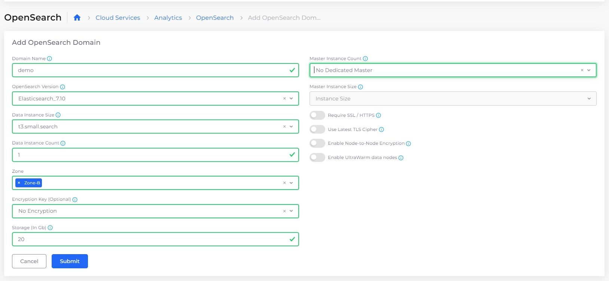
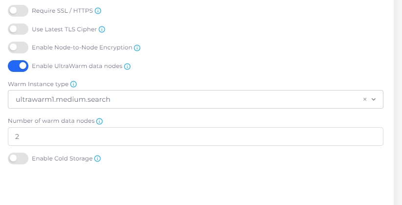

# OpenSearch

OpenSearch provides scalable search and analytics capabilities for your applications. With DuploCloud, you can easily create, configure, and manage OpenSearch instances to support your data indexing and search needs.

## Creating an OpenSearch domain

1. Navigate to **Cloud Services** → **Analytics**, select the **OpenSearch** tab, and click the **Add** button. The **Add OpenSearch Domain** page displays.&#x20;
2. In the **Domain Name** field, create a name for the OpenSearch domain.
3. In the **OpenSearch Version** field, select the OpenSearch version you are using.
4. Select your needed instance size from the **Data Instance Size** list box.
5. Enter the the instance count in the **Data Instance Count** field, and choose the correct zone(s) from the **Zone** list box.
6. Optionally, enter a key in the **Encryption Key (Optional)** field.&#x20;
7. In the **Storage (In Gb)** field, enter the amount of storage needed.&#x20;
8. If needed, select a **Master Instance Count** and **Master Instance Size**.&#x20;
9. Use the toggle switches to enable encryption options (**Require SSL/HTTPS, Use Latest TLS Cipher,** or **Enable Node-to-Node Encryption**), if needed.

<figure><figcaption>
The <strong>Add OpenSearch Domain</strong> page.
</figcaption></figure>

10. Optionally, use the toggle switch to **Enable UltraWarm data nodes** (nodes that are optimized for storing large volumes of data cost-effectively). When this option is enabled, additional fields display. Select a **Warm Instance type**, enter **Number of warm data nodes**, and **Enable Cold Storage** as your application requires. 

    <figure><figcaption>
<strong>Enable UltraWarm data nodes</strong> selected, displaying additional options <strong>(Warm Instance type</strong>, <strong>Number of warm data nodes</strong>, and <strong>Enable Cold Storage</strong>)
</figcaption></figure>
11. Click **Submit**. The OpenSearch domain is created.&#x20;

## Creating an OpenSearch domain without EBS storage

To create an OpenSearch without EBS storage, follow the steps to [create an OpenSearch domain](elasticsearch.md#creating-an-opensearch-domain). In the **Data Instance Size** list box, select **Other**, and enter a storage type instance, For example, `i3.2xlarge.search`. Complete the remaining steps and click **Submit**. &#x20;

<figure><figcaption></figcaption></figure>

## Managing an OpenSearch Instance

From the DuploCloud Portal, you can view OpenSearch instance details, open the AWS Console for the instance, edit configuration settings, upgrade the OpenSearch version, or delete the instance.

1. In the DuploCloud Portal, go to **Cloud Services** → **Analytics**.
2. Select the **OpenSearch** tab.
3.  Click the menu icon () at the end of the row for the OpenSearch instance you want to manage. 

    <figure><figcaption>
<strong>OpenSearch</strong> tab with menu options highlighted
</figcaption></figure>
4. Choose one of the following actions:

<table data-header-hidden><thead><tr><th width="195.33331298828125">Option</th><th>Description</th></tr></thead><tbody><tr><td><strong>View JSON</strong></td><td>View the JSON representation of the OpenSearch instance configuration.</td></tr><tr><td><strong>Console</strong></td><td>Open the AWS Console to view and manage the OpenSearch domain.</td></tr><tr><td><strong>Edit</strong></td><td>Open the <strong>Edit OpenSearch Domain</strong> pane to update instance configurations, such as node count or size.</td></tr><tr><td><strong>Upgrade</strong></td><td>Upgrade the OpenSearch version for the selected instance.</td></tr><tr><td><strong>Delete</strong></td><td>Permanently remove the OpenSearch instance.</td></tr></tbody></table>

## Managing OpenSearch Logging

See the[ Logging documentation](../use-cases/central-logging/custom-log-collection.md).
