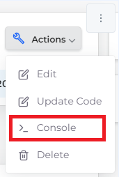

# Lambda Functions

[Lambda ](https://aws.amazon.com/pm/lambda/?trk=73f686c8-9606-40ad-852f-7b2bcafa68fe\&sc_channel=ps\&ef_id=CjwKCAjwm4ukBhAuEiwA0zQxk0SFVZUD3BCwJFOwlrHAFxzGF6anGJulF49mrridyhHjXRxfSHnmGxoCQw0QAvD_BwE:G:s\&s_kwcid=AL!4422!3!651212652666!e!!g!!amazon%20lambda!909122559!45462427876)is a serverless computing platform provided by AWS that allows you to run code without provisioning or managing servers. It enables you to build and run applications in response to events or triggers from Lambda Functions.

Lambda Functions are event-driven and designed to perform small, specific tasks or functions. They can be written in supported programming languages such as Python, JavaScript (`Node.js`), Java, C#, PowerShell, or Ruby. Once you create a Lambda function, you can configure it to respond to various types of events, such as changes in data stored in an Amazon [S3 bucket](../s3-bucket/), updates in an Amazon [DynamoDB](../database/dynamodb.md) table, incoming HTTP requests via Amazon API Gateway, or custom events triggered by other [AWS services](../).

Using Lambda, you write your code and upload it to AWS. Lambda executes and scales the code as needed, abstracting away the underlying infrastructure, and allowing you to focus on writing the actual business logic of your application. Lambda Functions are the principal resource of the Lambda serverless platform.&#x20;


Use [CI/CD GitHub Actions to update Lambda functions](../../../introduction-to-ci-cd/github-actions/update-a-lambda-function.md) with images or S3 bucket updates.


## Creating a Zip file 

In a Zip file, the Lambda Function code resides at the root of the package. If you are using a virtual environment, all dependencies should be packaged.&#x20;

Refer to the [AWS documentation](https://docs.aws.amazon.com/lambda/latest/dg/configuration-function-zip.html) for detailed instructions on how to generate the package, using tools such as [Zappa ](https://github.com/zappa/Zappa)and [Serverless](https://www.serverless.com/framework/docs/providers/aws/guide/functions).

## Creating an S3 Bucket 

1. [Create an S3 Bucket](../s3-bucket/).
2. Use [JIT ](../../use-cases/jit-access.md)to access the AWS Console.
3. Upload the Zip package in the AWS Console.

## Creating a Lambda function 

1. In the DuploCloud Portal, navigate to **Cloud Services** -> **Serverless**.
2. Click the **Lambda** tab. The **Lambda Function** page displays.
3.  Click **Add**. The **Create a Lambda Function** page displays. 

    
<figure><figcaption>
The <strong>Create a Lambda Function</strong> page 
</figcaption></figure>

4. In the **Name** field, enter the name of your Lambda Function.
5. In the **Description** field, enter a useful description of the function.
6. From the **Package Type** list box, select **Zip**. For type **Image**, see the [Configure Lambda with Container Images](create-lambda-using-container-image.md) topic.
7. In the **Runtime** field, enter the runtime for your programming language.
8. From the the **Architecture** list box, select the correct Lambda Architecture.&#x20;
9. To allocate a temporary file share, enter the value in megabytes (MB) in the **Ephemeral Storage** field. The minimum value is **512**; the maximum value is **10240**.
10. In the **Function Handler** field, enter the handler: the handler setting is the file name and the name of the exported handler method, separated by a dot. For example, `index.handler`. This indicates the `handler` method that's exported from the `index.js` file.
11. In the **S3 Bucket** list box, select an existing [S3 bucket](../s3-bucket/).
12. In the **Function Package** field, enter the name of the **Zip** package containing your Lambda Function.&#x20;
    * DuploCloud Lambda supports Java-based function packages, such as **HelloWorld.jar**, stored in **S3**. Ensure that the JAR file is uploaded to the S3 bucket before configuring the Lambda function.
13. In the **Dead Letter Queue** list box, select an Amazon Simple Queue Service (SQS) queue or Amazon Simple Notification Service (SNS) topic.
14. Optionally, configure **Maximum Retry Attempts** and **Maximum Event Age**.&#x20;
    * **Maximum Retry Attempts**: **d**efines how many times Lambda will retry a failed function invocation. You can set it to 0, 1, or 2 retries.
    * **Maximum Event Age**: specifies the maximum time (in seconds) an event can stay in the queue before being discarded. The range is 60 seconds to 21,600 seconds (6 hours).
15. Click **Submit**. The Lambda Function is created.

## Testing a Lambda Function

You can test the Lambda function created in DuploCloud by navigating to the AWS Console.&#x20;

1. In the DuploCloud Portal, navigate to **Cloud Services** -> **Serverless**.
2. Click the **Lambda** tab. The **Lambda Function** page displays.
3. On the **Lambda Function** page, from the **NAME** column, select the function you created.
4.  From the **Actions** menu, click **Console**. You are redirected to the AWS Console. 

    
<figure><figcaption>
The <strong>Lambda Function</strong> page <strong>Actions</strong> menu  
</figcaption></figure>

5. Test the function using the AWS Console.

### Integrating with other resources 

DuploCloud enables you to create a classic micro-services-based architecture where your Lambda function integrates with any resource within your Tenant, such as S3 Buckets, Dynamo database instances, RDS database instances, or Docker-based microservices. DuploCloud implicitly enables the Lambda function to communicate with other resources but blocks any communication outside the Tenant, except Elastic Load Balancers (ELB).

### Trigger and event sources 

To set up a trigger or event source, create the resource in the DuploCloud Portal. You can then trigger directly from the resource to the Lambda function in the AWS console menu of your Lambda function. Resources can be S3 Buckets, API gateways, DynamoDB database instances, and so on.&#x20;

### Passing secrets 

Passing secrets to a Lambda function can be done in much the same manner as passing secrets to a Docker-based service using Environmental Variables. For example, you can create a relational database from the **Cloud Services** -> **Database** -> **RDS** menu in DuploCloud, providing a Username and Password. In the Lambda menu, supply the same credentials. No secrets need to be stored in an AWS Key Vault, a Git repository, and so on.

## Updating Lambda Functions and configurations 

To update the code for the Lambda function:

1. Create a new Zip package with a different name and upload it in the S3 bucket.
2. Select the Lambda Function (with the updated S3 Bucket). From the **Actions** menu, click **Edit**.&#x20;
3. Enter the updated **Name** of the Lambda Function.
4. Use the **Image Configuration** field to update an additional configuration parameter.
5. Click **Submit**.


#### Forwarding Lambda Logs to Elasticsearch

Enabling the `enable_aws_lambda_log_forwarding_to_elastic_search` Tenant setting sends AWS Lambda logs to Elasticsearch, allowing you to view Lambda execution logs directly in the DuploCloud Logs dashboard. For detailed instructions, see [AWS Tenant Settings](../../aws-systems-settings/aws-tenant-settings.md).&#x20;


## References

* [Duplocloud Lambda](https://docs.duplocloud.com/docs/aws-user-guide/aws-services/lambda)
* [Duploctl Lambda Resource](https://github.com/duplocloud/duploctl/wiki/Lambda)
* [AWS Deploying Lambda functions as .zip file archives](https://docs.aws.amazon.com/lambda/latest/dg/configuration-function-zip.html)
