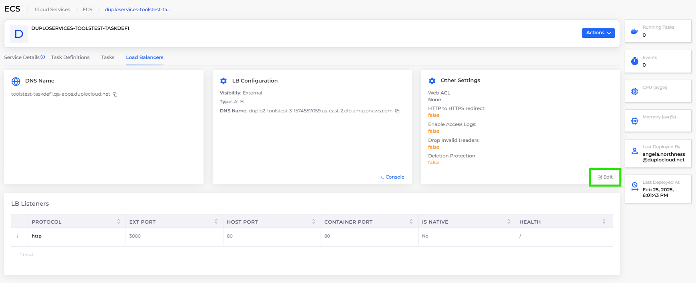

# ECS Services and Load Balancers

## Prerequisites

Before you create an ECS Service and Load Balancer, you must create a [Task Definition](../containers/ecs-containers-and-task-definitions/) to run the Service. You can define multiple containers in your Task Definition.

## Adding an ECS Service and Load Balancer Listener


For an end-to-end example of deploying an application using an ECS Service, see the [AWS Quick Start Tutorial](../../quick-start/) and choose the [Creating an ECS Service](../../quick-start/quick-start-ecs-services/) option.


Tasks run until an error occurs or a user terminates the Task in the ECS Cluster.

1. Navigate to **Cloud Services** -> **ECS**.
2. In the **Task Definitions** tab, select the Task Definition Family Name. This is the [Task Definition **Name** that you created ](../containers/ecs-containers-and-task-definitions/)prepended by a unique DuploCloud identifier. &#x20;
3. In the **Service Details** tab, click the **Configure ECS Service** link. The **Add ECS Service** page displays.
4. In the **Name** field, enter the Service name.
5.  In the **LB Listeners** area, click **Add**. The **Add Load Balancer Listener** pane displays.\

    
<figure><figcaption>
<strong>Add Load Balancer Listener</strong> pane for an ECS Service
</figcaption></figure>

6. Complete the fields on the **Add Load Balancer Listener** pane, and click **Add**.
7. On the **Add ECS Service** page, click **Submit**.&#x20;

## Viewing ECS Services

Verify that the Service and Load Balancer configuration details in the Service Details tab are correct.&#x20;

1. Navigate to **Cloud Services** -> **ECS**.
2. Select the **Services** tab.
3. Select the Service you want to view from the **NAME** column. Service details display.

<figure><figcaption>
<strong>Service Details</strong> tab displaying Service and Load Balancer configuration details
</figcaption></figure>

## Additional Load Balancer Settings

You can use the **Other Settings** card in the DuploCloud Portal to set the following features:

* WAF Web ACL
* Enable HTTP to HTTPS redirects
* Enable Access Logging
* Set Idle Timeout
* Drop invalid headers
* Delete Protection

1. In the DuploCloud Portal, navigate to **Cloud Services** -> **ECS**, and select the **Services** tab.
2. Select the Service to which your Load Balancer is attached from the **NAME** column.
3. Click the **Load Balancers** tab.
4.  In the **Other Settings** card, click **Edit**. \

    <figure><figcaption>
The <strong>ECS</strong> details page with the <strong>Edit Other Settings</strong> option highlighted
</figcaption></figure>
5.  The **Other Load Balancer Settings** pane displays.\

    
<figure><figcaption>
<strong>Other Load Balancer Settings</strong> pane
</figcaption></figure>

6. Configure the settings, as needed.
7. Click **Save**. The Load Balancer settings are updated.&#x20;
