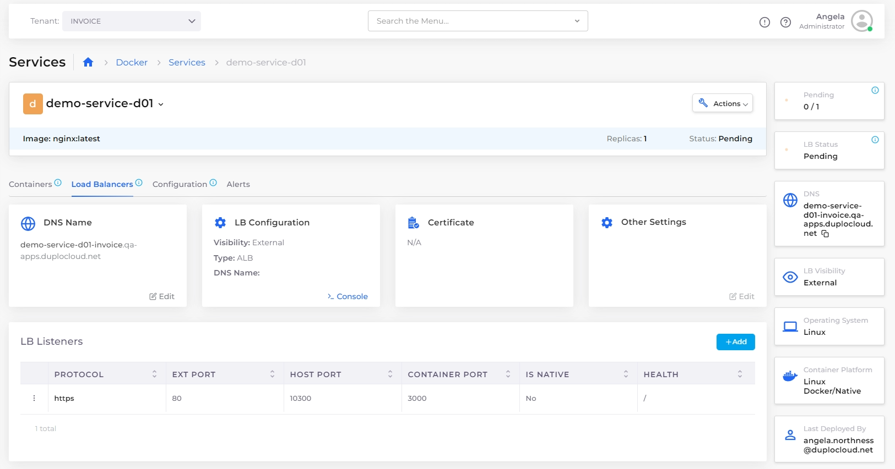

# Native Docker Load Balancers

## Adding a Load Balancer using Native Docker


For an end-to-end example of deploying an application using a Native Docker Service, see the [AWS Quick Start Tutorial](../../quick-start/) and choose the [Creating a Native Docker Service](../../quick-start/quick-start-duplocloud-docker-services/) option.


1. In the DuploCloud Portal, navigate to **Docker** -> **Services.**
2. Select the Service [that you created](../../quick-start/quick-start-duplocloud-docker-services/step-5-create-app-via-docker-native.md).
3. Click the **Load Balancers** tab.
4. Click the **Configure Load Balancer** link. The **Add Load Balancer Listener** pane displays.
5. From the **Select Type** list box, select your Load Balancer type.
6. Complete other fields as required and click **Add** to add the Load Balancer Listener.

<figure><figcaption>
<strong>Add Load Balancer Listener</strong> pane
</figcaption></figure>

When the **LB Status** card displays **Ready**, your Load Balancer is running and ready for use.

<figure><figcaption>
<strong>Services</strong> page with <strong>LB Status</strong> card displaying <strong>Ready</strong>
</figcaption></figure>

## Additional Load Balancer Settings

You can use the **Other Settings** card in the DuploCloud Portal to set the following features:

* WAF Web ACL
* Enable HTTP to HTTPS redirects
* Enable Access Logging
* Set Idle Timeout
* Drop invalid headers
* Delete Protection

1. In the DuploCloud Portal, navigate to **Docker** -> **Services**. The **Services** page displays.
2. Select the Service to which your Load Balancer is attached from the **NAME** column.
3. Click the **Load Balancers** tab.&#x20;
4.  In the **Other Settings** card, click **Edit**. 

    <figure><figcaption></figcaption></figure>
5.  The **Other Load Balancer Settings** pane displays. 

    
<figure><figcaption>
The <strong>Other Load Balancer Settings</strong> pane
</figcaption></figure>

6. Configure the settings, as needed.
7. Click **Save**. The Load Balancer settings are updated.
