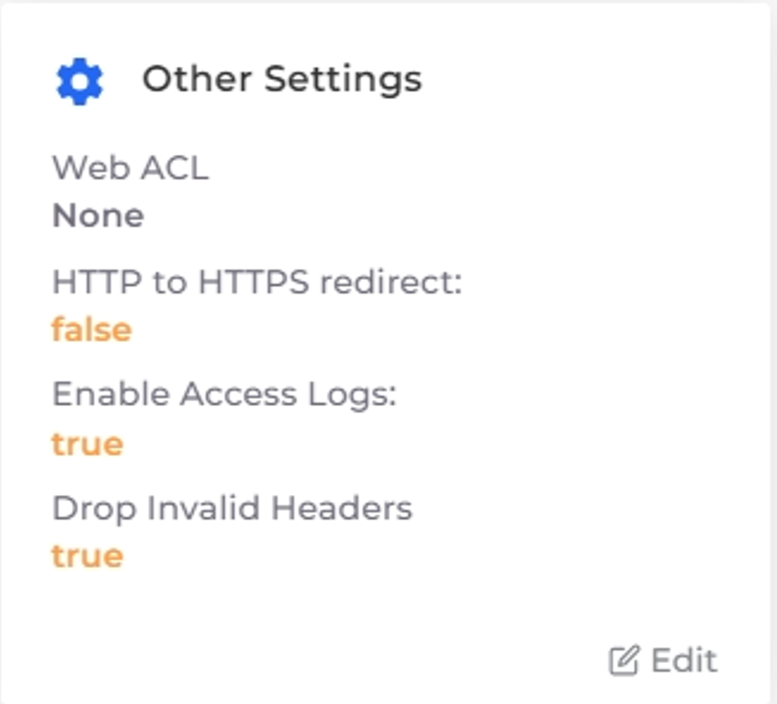

# Step 7: Enable Additional Load Balancer Options (Optional)


This step is optional and unneeded for the example application in this tutorial; however,  production cloud apps require an elevated level of protection.

To set up a Web Application Firewall (WAF) for a production application, follow the steps in the [Web Application Firewall procedure](../../aws-services/web-application-firewall-waf.md).&#x20;


In this tutorial step, for the Application Load Balancer (ALB) you created in [Step 6](../quick-start-duplocloud-docker-services/step-6-create-loadbalancer.md), you will:

* Enable access logging to monitor [HTTP message](https://en.wikipedia.org/wiki/HTTP_message_body) details and record incoming traffic data. Access logs are crucial for analyzing traffic patterns and identifying potential threats, but they are not enabled by default. You must manually activate them in the Load Balancer settings.
* Protect against requests that contain [invalid headers](https://en.wikipedia.org/wiki/List_of_HTTP_header_fields).

_Estimated time to complete Step 7: 5 minutes._

## Prerequisites

Before securing a Load Balancer, verify that you accomplished the tasks in the previous tutorial steps. Using the DuploCloud Portal, confirm that:

* An [Infrastructure and Plan](../step-1-infrastructure.md) exist, both named **NONPROD**.
* The **NONPROD** infrastructure has EKS[ **Enabled**](../step-1-infrastructure.md#check-your-work).
* A Tenant named [**dev01** has been created](../step-2-tenant.md).
* A Host named [**host01** has been created](step-3-create-host.md).
* A Service named [**demo-service** has been created](step-5-create-app-via-k8s.md).
* An [Load Balancer](../quick-start-duplocloud-docker-services/step-6-create-loadbalancer.md) has been created.

## Securing the Load Balancer

1. In the **Tenant** list box, select the **dev01** Tenant.
2. In the DuploCloud Portal, navigate to **Kubernetes** -> **Services**.&#x20;
3. From the **NAME** column, select the Service (**demo-service**).
4. Select the **Load Balancers** tab.
5.  In the **Other Settings** card, click **Edit**. The **Other Load Balancer Settings** pane displays.\

    <figure><figcaption>
The <strong>Load Balancers</strong> tab with the <strong>Other Settings Edit</strong> option highlighted
</figcaption></figure>
6.  Select the **Enable Access Logs** and **Drop Invalid Headers** options.\

    
<figure><figcaption>
The <strong>Other Load Balancer Settings</strong> pane
</figcaption></figure>

7. Accept the remaining default settings and click **Save**. The settings are updated.

## Checking Your Work

1. In the **Tenant** list box, select the **dev01** Tenant.
2. In the DuploCloud Portal, navigate to **Kubernetes** -> **Services**.&#x20;
3. From the **NAME** column, select the Service (**demo-service**).
4. Select the **Load Balancers** tab.
5. Verify that the **Other Settings** card contains the selections you made above for:

* **Web ACL** - `None`
* **HTTP to HTTPS Redirect** - `False`
* **Enable Access Logs** - `True`
* **Drop Invalid Headers** - `True`

<figure><figcaption>
The <strong>Other Settings</strong> card
</figcaption></figure>

Enabling access logs enhances the security and monitoring capabilities of your Load Balancer and provides insights into the traffic accessing your application, for a more robust security posture.
