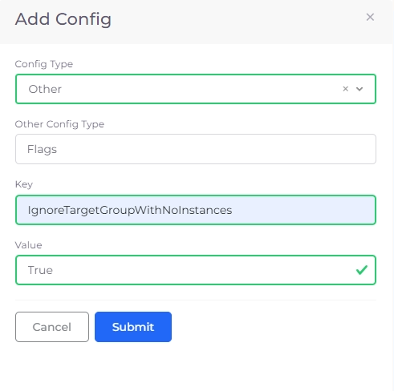
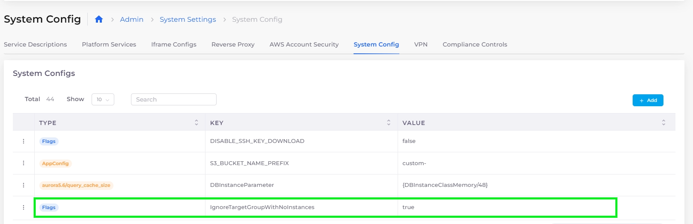

# System Settings Flags

## Disabling faults for Target Groups without instances

If there is a Target Group with no instances/targets, DuploCloud generates a fault. You can configure DuploCloud's Systems Settings to ignore Target Groups with no instances.

1. From the DuploCloud portal, navigate to **Administrator** -> **Systems Settings**.
2. Select the **System Config** tab.
3. Click **Add**. The **Add Config** pane displays.
4. For **ConfigType**, select **Other**.
5. In the **Other Config Type** field, type **Flags**.
6. In the **Key** field, enter **IgnoreTargetGroupWithNoInstances**.
7. In the **Value** field, enter **True**.

<figure><figcaption>
The <strong>Add Config</strong> pane with <strong>IgnoreTargetGroupWithNoInstances</strong> Flag.
</figcaption></figure>

8. Click **Submit**. The Flag is set and DuploCloud will not generate faults for Target Groups without instances.

<figure><figcaption>
The <strong>System Config</strong> page with <strong>IgnoreTargetGroupWithNoInstances</strong> set.
</figcaption></figure>

## Exclude faults  in Sentry/PagerDuty based on Modules

You can suppress fault notifications for specific modules to prevent noise in Sentry and PagerDuty. This is configured at the system level from the DuploCloud portal.

**Steps**

1. Navigate to **Administrator** -> **System Settings**.
2. Select the **System Config** tab.
3. Click **Add**. The **Add Config** pane displays.
4. In the **Config Type** field, select **AppConfig**.
5. In the **Key** field, enter **FaultNotificationExcludedModules**.
6. In the **Value** field, enter the module name to exclude (e.g., **MinionsDisconnectedStatusCheck**).
7. Click **Submit**.

**To exclude multiple modules**, enter each module name separated by a semicolon in the **Value** field.

**Example: MinionsDisconnectedStatusCheck; kubernetes**

<figure><figcaption></figcaption></figure>

## Exclude faults  in Sentry/PagerDuty based on Messages

You can suppress fault notifications for specific fault messages to prevent noise in Sentry and PagerDuty. This is configured at the system level from the DuploCloud portal.

**Steps**

1. Navigate to **Administrator** -> **System Settings**.
2. Select the **System Config** tab.
3. Click **Add**. The **Add Config** pane displays.
4. In the **Config Type** field, select **AppConfig**.
5. In the **Key** field, enter **FaultNotificationExcludedMessages**.
6. In the **Value** field, enter the fault message text to exclude (e.g., **no sufficient memory available**).
7. Click **Submit**.

**To exclude multiple messages**, enter each message separated by a semicolon in the **Value** field.

**Example: no sufficient memory available;Minion disconnected**

<figure><figcaption></figcaption></figure>

