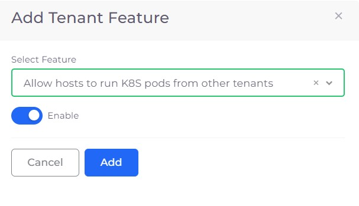
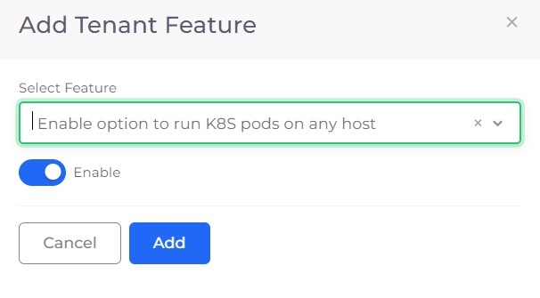
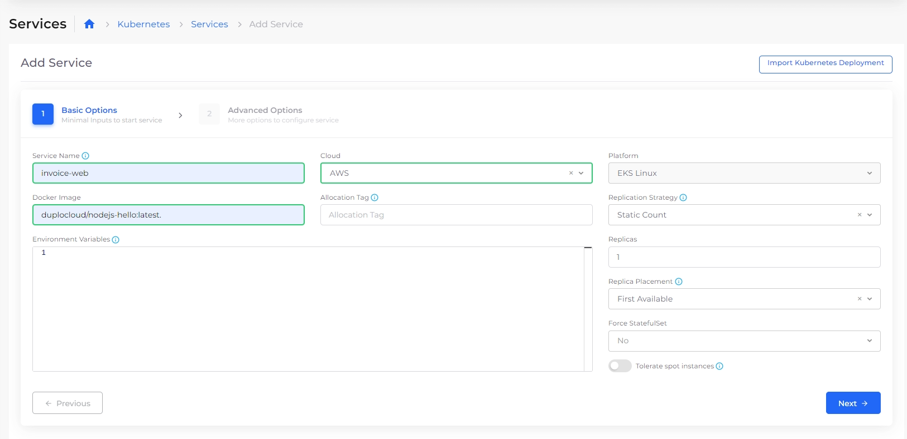

# Adding Shared Hosts

Shared Hosts allow workloads to run on the same set of virtual machines (VMs), making better use of resources across multiple Tenants. DuploCloud now supports Services, Jobs, and CronJobs on shared Hosts, providing more flexibility for running long-running services, batch jobs, and scheduled tasks.

DuploCloud supports shared Hosts for:

* **Services**
* **Jobs**
* **CronJobs**

## Configuring Tenants to allow Host sharing

To enable Host sharing, configure one Tenant to share its Hosts, and another Tenant to run K8s Pods on any Host.&#x20;

### Enabling a Tenant to share its Hosts

1. In the DuploCloud Portal, navigate to **Administrator** -> **Tenant**.
2. From the **Tenant** list box, select the Tenant that will share its Host.&#x20;
3. Click the **Settings** tab.
4.  Click **Add**. The **Add Tenant Feature** pane displays. 

    
<figure><figcaption>
The <strong>Add Tenant Feature</strong> pane
</figcaption></figure>

5. From the **Select Feature** item list, select **Allow hosts to run K8S pods from other tenants**.
6. Select **Enable.**
7. Click **Add**. This Tenant's Hosts can now run Pods from other Tenants.

### **Enabling a Tenant to run Pods on shared Hosts**

1. In the DuploCloud Portal, navigate to **Administrator** -> **Tenant**.
2. From the **Tenant** list, select the Tenant that will run Pods on the shared Host.
3. Select the **Settings** tab.
4.  Click **Add**. The **Add Tenant Feature** pane displays. 

    
<figure><figcaption>
<strong>Add Tenant Feature</strong> pane
</figcaption></figure>

5. From the **Select Feature** item list, select **Enable option to run K8S pods on any host**.
6. Select **Enable.**
7. Click **Add**. This Tenant can now run Pods on other Tenant's Hosts.

## Creating Services, Jobs, and CronJobs on Shared Hosts

After configuring Tenant settings to allow Host sharing, create the resources you want to run on the shared Hosts.&#x20;

### **Creating a Service to run on a shared Host**

1. From the **Tenant** list box, select the Tenant that will run Pods on the shared Host.
2. In the DuploCloud Portal, navigate to **Kubernetes** -> **Services**.
3.  In the **Services** tab, click **Add**. The **Add Service** page displays. 

    <figure><figcaption>
The filled <strong>Add Service</strong> page, Basic Options.
</figcaption></figure>
4. Fill in the **Service Name**, **Cloud**, **Platform**, and **Docker Image** fields. Click **Next**.
5.  Enable **Run on Any Host**.  

    
<figure><figcaption>
The filled <strong>Add Service</strong> page, Advanced Options.
</figcaption></figure>

6. Click **Create**. A Service running on the shared Host is created.&#x20;

### **Creating a Job or CronJob to run on a Shared Host**

DuploCloud supports running Jobs and CronJobs on shared Hosts for AWS.

1. Follow the steps in the DuploCloud documentation to create a [Kubernetes Job](../../../../kubernetes/jobs.md#creating-a-kubernetes-job-in-the-duplocloud-portal) or [Kubernetes CronJob](../../../../kubernetes/cronjobs.md#creating-a-kubernetes-cronjob-in-the-duplocloud-portal).&#x20;
2. On the **Add Kubernetes Job** or **Add Kubernetes CronJob** page, enable **Run on Any Host**.
3. Click **Create** to deploy the Job or CronJob on the shared Host.

<figure><figcaption>
The <strong>Add Kubernetes Job</strong> page with the <strong>Run on Any Host</strong> option enabled
</figcaption></figure>
