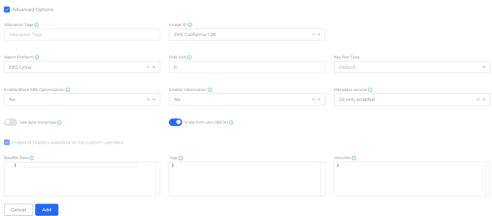
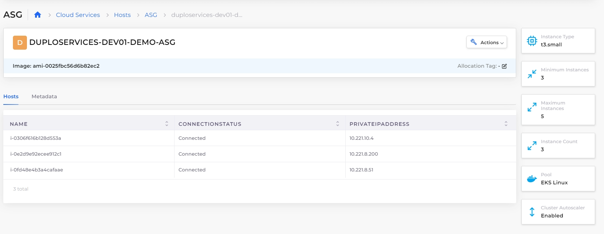

# Autoscaling Groups (ASG)

Configure Autoscaling Groups (ASG) to ensure the application load is scaled based on the number of EC2 instances configured. Autoscaling detects unhealthy instances and launches new EC2 instances. ASG is also cost-effective as EC2 Instances are dynamically created per the application requirement within minimum and maximum count limits.&#x20;


For cluster autoscaling, [enable the Cluster Autoscaler option](../../../creating-an-infrastructure-and-plan-for-aws/kubernetes-cluster/enable-cluster-autoscaler.md) in your Infrastructure before creating an ASG.


## Creating Autoscaling Groups (ASG)

1. In the DuploCloud Portal, navigate to **Cloud Services** -> **Hosts**.
2.  In the **ASG** tab, click **Add**. The **Add ASG** page is displayed.\

    <figure><figcaption>
<strong>Add ASG page</strong> with <strong>Use for Cluster Autoscaling</strong> enabled
</figcaption></figure>
3. In the **Friendly Name** field, enter the name of the ASG.
4. Select **Availability Zone** and **Instance Type**.
5. In the **Instance Count** field, enter the desired capacity for the Autoscaling group.
6. In the **Minimum Instances** field, enter the minimum number of instances. The Autoscaling group ensures that the total number of instances is always greater than or equal to the minimum number of instances.
7. In the **Maximum Instances** field, enter the maximum number of instances. The Autoscaling group ensures that the total number of instances is always less than or equal to the maximum number of instances.
8. Optionally, select **Use for Cluster Autoscaling**.
9.  Select **Advanced Options**. The **Advanced Options** section displays.\

    <figure><figcaption>
The <strong>Add ASG Advanced Options</strong> 
</figcaption></figure>
10. &#x20;Fill in additional fields as needed for your ASG.&#x20;
11. Click **Add**. Your ASG is added and displayed in the **ASG** tab.

<figure><figcaption>
The <strong>Add ASG</strong> page 
</figcaption></figure>

3. In the **Friendly Name** field, enter the name of the ASG.
4. Select **Availability Zone** and **Instance Type**.
5. In the **Instance Count** field, enter the desired capacity for the Autoscaling group.
6. In the **Minimum Instances** field, enter the minimum number of instances. The Autoscaling group ensures that the total number of instances is always greater than or equal to the minimum number of instances.
7. In the **Maximum Instances** field, enter the maximum number of instances. The Autoscaling group ensures that the total number of instances is always less than or equal to the maximum number of instances.
8. Optionally, select **Use for Cluster Autoscaling**.
9.  Optionally select **Advanced Options,** and complete additional fields as needed. \

    <figure><figcaption>
ASG <strong>Advanced Options</strong> 
</figcaption></figure>
10. Click **Add**. Your ASG is added and displayed in the **ASG** tab.

## Viewing Hosts in Autoscaling Groups

To view the hosts in an Autoscaling group, follow these steps:

1. In the DuploCloud Portal, navigate to **Cloud Services** -> **Hosts**.
2. Select the **ASG** tab.
3. In the **NAME** column, select the ASG for which you want to view Hosts.
4. Select the **Hosts** tab. A list of individual Hosts displays.&#x20;

<figure><figcaption>
The <strong>Hosts</strong> tab on the <strong>ASG Details</strong> page
</figcaption></figure>

## **Creating an Amazon EC2 Autoscaling Policy**

Refer to AWS [Documentation](https://docs.aws.amazon.com/autoscaling/ec2/userguide/as-scale-based-on-demand.html#as-how-scaling-policies-work) for detailed steps on creating Scaling policies for the Autoscaling Group.
