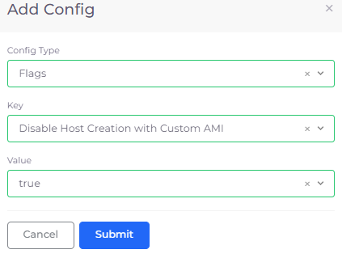
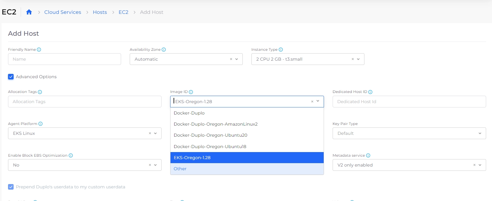

# Create Amazon Machine Image (AMI)

[Amazon Machine Images (AMIs)](https://docs.aws.amazon.com/AWSEC2/latest/UserGuide/AMIs.html) are virtual machine templates used to launch EC2 instances in AWS. An AMI includes the operating system, application software, and configuration data required to start an instance. While EC2 Hosts in DuploCloud represent dedicated physical servers, AMIs serve as reusable blueprints for creating virtual server instances. You can create and manage AMIs directly in the DuploCloud Portal to support consistent and scalable deployments.

## Adding an AMI

1. In the DuploCloud Portal, navigate to **Cloud Services** → **Hosts**. The **Hosts** page displays.
2. In the **NAME** column, select the host you want to use as the basis for your AMI.
3.  Click the **Actions** menu and select **Host Settings** → **Create AMI**. The **Create AMI** pane displays.  

    
<figure><figcaption>
<strong>Create AMI</strong> pane
</figcaption></figure>

4.  Complete the following fields:

    <table data-header-hidden><thead><tr><th width="214.22222900390625"></th><th></th></tr></thead><tbody><tr><td><strong>AMI Name</strong></td><td>Enter a name for the new AMI.</td></tr><tr><td><strong>Share With All Tenants</strong></td><td>Enable this option to make the AMI available to all tenants in the environment.</td></tr><tr><td><strong>Shared With Tenants</strong></td><td>If not sharing with all tenants, select one or more specific tenants to share the AMI with.</td></tr></tbody></table>
5. Click **Create** to generate the AMI. You can monitor its status on the **AMI** tab of the **Hosts** page.

## Viewing and Editing an AMI

1. In the DuploCloud Portal, navigate to **Cloud Services** → **Hosts**.&#x20;
2. Select the **AMI** tab.
3. Click the **Name** of an AMI to open its details page and view overview information such as creation date, source host, and sharing scope.
4. To update the AMI’s sharing settings, click **Actions** → **Edit** from the AMI details page. Here you can:
   * Enable or disable **Share With All Tenants**.
   * Select specific tenants to share the AMI with.
   * Keep the AMI tenant-scoped (private).


**Note:** The **Edit** option is available only for AMIs created after sharing functionality was implemented. Older AMIs may not support editing.


<figure><figcaption>
<strong>Overview</strong> and <strong>Details</strong> tabs for an AMI
</figcaption></figure>

## Launching a New Host from an AMI

You can create a new host based on an existing AMI to deploy a server with your custom configuration.&#x20;

When [creating a host in DuploCloud](adding-hosts.md#adding-a-host-vm), check the box to display **Advanced Options**, and select your desired AMI from the **Image ID** dropdown.

<figure><figcaption></figcaption></figure>

## Disabling Host creation for custom AMIs

You can disable host creation by non-administrators (Users) for custom AMIs by configuring the option in DuploCloud. &#x20;

### Configuring the Disable Host Creation with Custom AMI option&#x20;

1. In the DuploCloud Portal, navigate to **Administrator** -> **System Settings**.
2. Click the **System Config** tab.
3. Click **Add**. The **Add Config** pane displays.
4. In the **Config Type** list box, select **Flags**.
5. In the **Key** list box, select **Disable Host Creation with Custom AMI**.
6. In the **Value** list box, select **true**.
7. Click **Submit**.

<figure><figcaption>
<strong>Add Config</strong> pane with <strong>Disable Host Creation with Custom AMI</strong> selected
</figcaption></figure>

When this setting is configured, the **Other** option in the **Image ID** list box in the **Add Host** page, will be disabled, preventing hosts with custom AMIs from being created.

<figure><figcaption>
<strong>Add Host</strong> page with <strong>Other</strong> option in the <strong>Image ID</strong> list box disabled.
</figcaption></figure>
