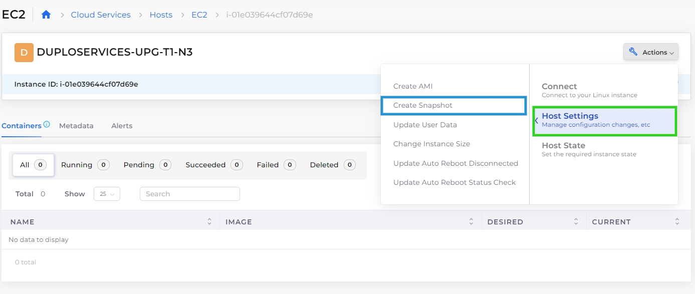

# EC2 Snapshots

EC2 snapshots provide point-in-time backups of virtual machine volumes for AWS-based hosts, allowing you to protect data and recover from issues such as misconfigurations or disk failures. You can create and manage snapshots for EC2-based hosts directly from the DuploCloud Portal.

## Creating an EC2 Snapshot

1. In the DuploCloud Portal, navigate to **Cloud Services** → **Hosts**.
2. Select the **EC2** tab.
3. From the **NAME** column, select the Host you want to backup.
4.  Click **Actions** → **Host Settings** → **Create Snapshot**.\

    
<figure><figcaption>
<strong>Create Snapshot</strong> option on the <strong>EC2 Hosts</strong> page
</figcaption></figure>

5. Click **Confirm** to confirm that you want to create the snapshot.

## Managing EC2 Snapshots

View and manage your EC2 snapshots in DuploCloud.

1. From the DuploCloud Portal, navigate to **Cloud Services** → **Hosts**.
2. Select the **EC2** tab.
3. Click on name of the EC2 host you want to inspect in the **NAME** column.
4. Select the **Snapshots** tab. A list of all snapshots for that host displays, showing details such as Snapshot ID, creation date, and description.
5. Click the menu icon () next to a snapshot, and select from the following options:
   * **View JSON**: to view details of the snapshot.
   * **Delete**: to delete the snapshot if no longer needed.

<figure><figcaption>
<strong>Snapshots</strong> tab on the EC2 instance details page
</figcaption></figure>
