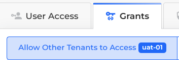

# Cross-Tenant Resource Sharing

Cross-tenant access enables you to share access to resources and services between two DuploCloud [Tenants](../../application-focused-interface-duplocloud-architecture/tenant.md). You can configure the DuploCloud Portal to support various types of Cross-tenant access.&#x20;

Configure Cross-tenant access to:

* [Grant a Tenant full access to another Tenant in the DuploCloud Portal](cross-tenant-access.md#granting-full-cross-tenant-access-between-tenants).
* [Share specific services between Tenants in the DuploCloud Portal](cross-tenant-access.md#granting-cross-tenant-access-to-specific-iam-restricted-services) that IAM policies restrict.


These features are currently only available for AWS.


## Prerequisites

Before you can use Cross-tenant access, you must do the following:

* In the **Security Group** associated with each tenant, add a [Security Group rule](../../../overview/use-cases/creating-an-infrastructure-and-plan-for-aws/security-group-rules.md) to allow the required port access between the tenants that need cross-tenant access.
* When accessing a resource in a tenant, include the full application namespace in the URL using this format:&#x20;

```
https://NAMESPACE.duploservices-TENANT_NAME:PORT
```

## Granting General (Non-IAM Restricted) Access Between Tenants

When you grant general (non-IAM restricted) access between tenants, you allow one DuploCloud tenant full access to another tenant’s workspace or namespace. Security Groups in your underlying cloud platform define any restrictions.

To grant Cross-tenant access only to specific services restricted by IAM policies, see [the next section](cross-tenant-access.md#granting-cross-tenant-access-to-specific-iam-restricted-services).

1. In the DuploCloud Portal, navigate to **Administrator** -> **Tenants**.
2. Select the Tenant whose resources you want to share from the **NAME** column.
3. Click the **Security** tab.
4.  Click **Add**. The **Add Tenant Security** pane displays.<br>

    <div align="left"><figure><figcaption><p><strong>Add Tenant Security</strong> pane</p></figcaption></figure></div>
5. From the **Source Type** list box, select **Tenant**.
6. From the **Tenants** list box, select the Tenant that will share resources.
7. From the **Protocol** list box, select the protocol to use for sharing.
8. In the **Port Range** field, specify the range of ports to which you want to grant access.
9. Add a user-friendly **Description** of this sharing rule.
10. Click **Add**.

## Granting Cross-Tenant Access to Specific IAM-Restricted Services

To allow access or create a share between Tenants for specific IAM-restricted services, perform this procedure using the Tenant **Grants** tab. Tenants sharing resources must reside within the same region in the AWS Portal.

To establish general non-IAM restricted Cross-tenant access, see [the previous section](cross-tenant-access.md#granting-general-non-iam-restricted-access-between-tenants).&#x20;

You can share access to the following Services between Tenants:

* [S3 Buckets](../../../overview/aws-services/s3-bucket.md)
* [DynamoDB Tables](../../../aws-user-guide/aws-services/database/dynamodb.md)
* KMS Keys

To configure cross-tenant access:

1. In the DuploCloud portal, navigate to **Administrator** -> **Tenants**.
2. From the **NAME** column, select the tenant that currently has access to the restricted resource you want to share.
3.  Click the **Grants** tab. Select **Allow Other Tenants to access&#x20;**_**TENANT\_NAME**_, where _**TENANT\_NAME**_ is the Tenant you selected.<br>

    <div align="left"><figure><figcaption><p><strong>Grants</strong> tab with <strong>Allow Other Tenants to access </strong><em><strong>TENANT_NAME</strong></em> option </p></figcaption></figure></div>


4.  Click **Add**. The **Grant Cross-Tenant Access** pane displays.<br>

    <div align="left"><figure><figcaption><p><strong>Grant Cross-Tenant Access</strong> pane</p></figcaption></figure></div>
5. From the **Requesting Tenant** list box, select the Tenant with which access will be shared.
6. From the **Access to Area** list box, select the restricted policy-based resource you want to share.
7. Click **Create**. Your cross-tenant access share is now created.

## Viewing Cross-Tenant Grants to Restricted Policy-Based Resources

1. In the DuploCloud portal, navigate to **Administrator** -> **Tenants**.&#x20;
2. From the **NAME** column, select the tenant whose cross-tenant grants you want to view.
3. Click the **Grants** tab. Select **Allow Other Tenants to access&#x20;**_**TENANT\_NAME**_, where _**TENANT\_NAME**_ is the Tenant you selected.
4. The resources that _**TENANT\_NAME**_ can access are displayed.

<div align="left"><figure><figcaption><p><strong>Grants</strong> tab on the <strong>Tenant</strong> page</p></figcaption></figure></div>
