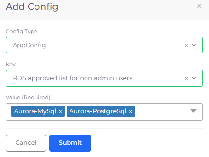

# Database Access for Users

Administrators have full access to all databases created in all DuploCloud Tenants. A non-administrator user can view and use database engine types created by an administrator if the administrator grants them view rights.&#x20;

## Granting Users View Access to Database Engines

1. In the DuploCloud Portal, navigate to **Administrator** -> **System Settings**.
2. Click **System Config**.
3.  Click **Add**. The **Add Config** pane displays. 

    
<figure><figcaption>
<strong>Add Config</strong> pane 
</figcaption></figure>

4. From the **Config Type** list box, select **AppConfig**.
5. From the **Key** list box, select **RDS approved list for non admin users**.
6. Select the **Value** list box, and select the types of databases you want non-administrator users to access. In this example, the user is granted access to any **Aurora-MySql** and **Aurora-PostgreSql** database engines the Administrator creates.
7. Click **Submit**. The **AppConfig** configuration setting is displayed on the **System Settings** page.

<figure><figcaption>
<strong>System Settings</strong> page with <strong>AppConfig</strong> configuration setting
</figcaption></figure>
