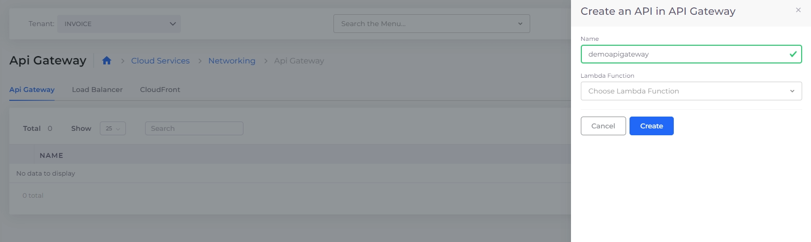

# API Gateway

## Creating an API Gateway

AWS ApiGateway RestApi is created from the DuploCloud Portal which will take care of creating the security policies to make the API Gateway accessible to other resources (like Lambda functions) within the Tenant. Creating the RestApi is the only configuration done from within the DuploCloud portal. All other configurations for the API (like defining methods, resources, and pointing to lambda functions) should be done in the AWS console. The API console can be reached by navigating to **Cloud Services** -> **Networking**, selecting the **API Gateway** tab, and then clicking on the **Console** button under the Actions menu.&#x20;

<figure><figcaption></figcaption></figure>

## Integrating a Lambda when setting up API Gateway

The steps below use DuploCloud's API Gateway/Lambda integration to create a web API with an HTTP endpoint for your Lambda function (in this case, it returns a simple "`Hello!`" response).


The example API deployed is not secure. Anyone on the internet can access the endpoint (in this example, "`Hello!`"). When creating your own Lambda, you will need to configure CORS, authentication, and other security details.


1. Create a `lambda_function.py` with this code:

```
def lambda_handler(event, context):
    return {
        "statusCode": 200,
        "headers": {
            "Content-Type": "application/json"
        },
        "isBase64Encoded": False,
        "multiValueHeaders": {
            "X-Custom-Header": ["My value", "My other value"],
        },
        "body": "Hello!"
    }
```

For more information about formatting your Lambda response, the [AWS documentation.](https://docs.aws.amazon.com/lambda/latest/dg/services-apigateway.html#apigateway-types-transforms)&#x20;

2. Run `zip my_deployment_package.zip lambda_function.py`
3. Upload `my_deployment_package.zip` to an [S3 bucket](../../overview/aws-services/s3-bucket.md#creating-an-s3-bucket).
4. [Create a Lambda Function](../../overview/aws-services/lambda/#id-3-toc-title) in DuploCloud and point it to that Zip with handler `lambda_function.lambda_handler`.
5. [Create an API Gateway](api-gateway.md#creating-an-api-gateway) and select the Lambda you just created.
6. Then you can "Deploy API" from the new gateway that's created in AWS Console and you can curl the endpoint that shows up under Stages -> Stage details -> Invoke URL (again in AWS Console).
