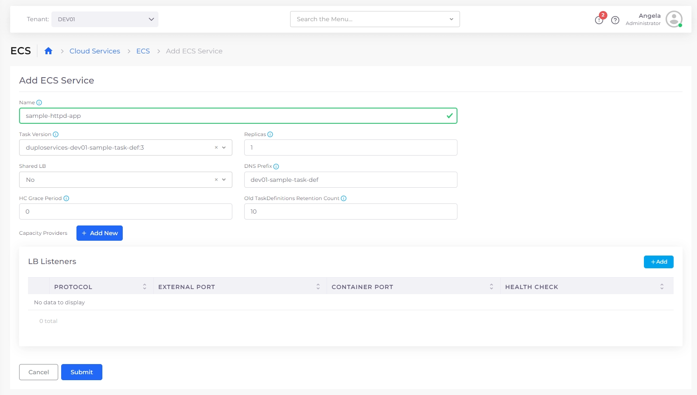
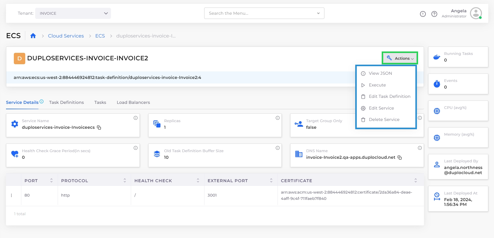

# ECS Containers, Task Definitions and Services

DuploCloud supports running containerized workloads using [Amazon Elastic Container Service (ECS)](https://docs.aws.amazon.com/AmazonECS/latest/developerguide/Welcome.html) on both **EC2** and **Fargate**. Using the DuploCloud Portal, you can define tasks, configure services, and manage container deployments without manually writing JSON task definitions or navigating the AWS Console. For a complete, step-by-step example of deploying an ECS Task Definition, Service, and Load Balancer, [see this tutorial](../../../overview/quick-start/quick-start-ecs-services/step-4-create-app-via-ecs.md).

## Creating a Task Definition

A Task Definition defines how your containers should run, including images, ports, CPU/memory settings, environment variables, volumes, and more.

1. Select the Tenant from the **Tenant** list box.&#x20;
2. Navigate to **Cloud Services** -> **ECS**.
3. Select the **Task Definition** tab, click **Add**. The **Add Task Definition**-**Basic Options** display.

<figure><figcaption>
The <strong>Add Task Definition-Basic Options</strong> page
</figcaption></figure>

4. In the **Name** field, give the task definition a name.&#x20;
5. Specify the **Operating System/Architecture.**
6. Specify the **vCPU** and **Memory**:
   * **vCPUs**: Specifies the number of CPU units used by the task. It can be expressed as an integer using CPU units, for example 1024, or as a string using vCPUs, for example `1 vCPU` or `1 vcpu`.
   * **Memory**: Specifies the amount of memory (in MiB) used by the task. It can be expressed as an integer using MiB, for example `1024`, or as a string using GB, for example `1GB` or `1 gb`.
7. Optionally, specify **Volumes** for the Task Definition.&#x20;
8.  Click **Next**. The **Add Task Definition**-**Advanced Options** display. \

    
<figure><figcaption>
The <strong>Add Task Definition-Advanced Options</strong>
</figcaption></figure>

9. &#x20;In the **Container-1** field, specify your primary **Container** details.
   * Add additional containers by clicking the add icon (  ) to create up to five (5) containers.
   * Be sure to select the **Essential Container** option when defining your containers, as the task will fail if the essential container stops or fails to run.&#x20;
10. Click **Submit**.

## **Running a Task (Optional)**

Execute a single instance of a container based on your Task Definition. This option is useful for jobs, scripts, and testing.

1. Select the Tenant from the **Tenant** list box.&#x20;
2. Navigate to **Cloud Services** -> **ECS**.
3. Select the **Task Definition** tab
4. From the **TASK DEFINITION FAMILY NAME** list, locate the Task Definition to run. Note that this is the Task Definition Name prepended by a unique identifier, which includes your Tenant name and part of your Infrastructure name.&#x20;
5.  Click on the **Actions** menu, and select **Execute**. The **Run ECS Tasks** pane displays.\

    
<figure><figcaption>
The <strong>Run ECS Tasks</strong> pane
</figcaption></figure>

6. Select the **Version** and Specify the **No of Tasks**.
7. Click **Create** to run the task.&#x20;

## Creating an ECS Service

Deploy a long-running ECS service that manages task replication, health checks, and optional load balancing.

1. Select the Tenant from the **Tenant** list box.&#x20;
2. Navigate to **Cloud Services** -> **ECS**.
3. Select the **Task Definitions** tab.
4. Select the Task Definition from the **TASK DEFINITION FAMILY NAME** list. Note that this is the Task Definition Name prepended by a unique identifier, which includes your Tenant name and part of your Infrastructure name.&#x20;
5. Select the **Service Details** tab, and click **Configure ECS Service**. The **Add ECS Service** page displays.

<figure><figcaption>
The <strong>Add ECS Service</strong> page
</figcaption></figure>

5. In the **Name** field, a name for the Service.
6. Optionally, click **Add** in the **LB Listeners** area to add Load Balancer.
   * Complete the required fields on the **Add Load Balancer Listener** pane, and click **Add**.&#x20;
7. Complete additional fields, as needed, on the **Add ECS Service** page.
8. Click **Submit**. The ECS Service is created.&#x20;

## Managing ECS Tasks and Task Definitions

The Task Definition details page in the DuploCloud Portal lets you manage Task Definitions, view individual versions, and inspect launched Tasks. To open the detail page, navigate to **Cloud Services** → **ECS**, select the **Task Definition** tab, then select the Task Definition from the **TASK DEFINITION FAMILY NAME** list. Note that this is the Task Definition Name prepended by a unique identifier, which includes your Tenant name and part of your Infrastructure name.

### Managing Task Definitions

From the Task Definition details page, click **Actions** to access the following options:

<table data-header-hidden><thead><tr><th width="175.77783203125"></th><th></th></tr></thead><tbody><tr><td><strong>View JSON</strong></td><td>Displays the full configuration of the Task Definition family in JSON format.</td></tr><tr><td><strong>Execute</strong></td><td>Runs a one-off ECS Task based on this Task Definition.</td></tr><tr><td><strong>Edit Task Definition</strong></td><td>Opens the Task Definition in edit mode for changes to containers, resources, etc.</td></tr></tbody></table>

### Managing Task Definition Versions

From the Task Definition details page, select the **Task Definitions** tab, then the **menu icon** (**⋮**) next to any Task Definition version to access the following options:

<table data-header-hidden><thead><tr><th width="198.88885498046875"></th><th></th></tr></thead><tbody><tr><td><strong>View JSON</strong></td><td>Shows the JSON configuration for that specific version.</td></tr><tr><td><strong>Edit Task Definition</strong></td><td>Opens the version for editing.</td></tr><tr><td><strong>Console</strong></td><td>Opens the version in the AWS ECS Console.</td></tr><tr><td><strong>Delete</strong></td><td>Deletes the version (if it is not in use).</td></tr></tbody></table>

### Additional Options for Tasks

From the Task Definition detail page, select the **Tasks** tab, then click the **menu icon** (**⋮**) next to any task to access the following options:

<table data-header-hidden><thead><tr><th width="135.77783203125"></th><th></th></tr></thead><tbody><tr><td><strong>View JSON</strong></td><td>Displays the runtime configuration of the Task in JSON format.</td></tr><tr><td><strong>Console</strong></td><td>Opens the ECS Task in the AWS Console.</td></tr><tr><td><strong>Logs</strong></td><td>Opens the CloudWatch Logs stream for the container.</td></tr><tr><td><strong>Shell Access</strong></td><td>Launches a shell session in the container.</td></tr></tbody></table>

## **Managing ECS Services**

1. Select the Tenant from the **Tenant** list box.
2. Navigate to **Cloud Services** → **ECS**.
3. Select the **Services** tab.
4. Select the **Service** from the **NAME** column.
5. Click **Actions** to access the following options:

<table data-header-hidden><thead><tr><th width="182.00006103515625"></th><th></th></tr></thead><tbody><tr><td><strong>View JSON</strong></td><td>View the JSON configuration for the Task Definition family.</td></tr><tr><td><strong>Console</strong></td><td>Open the Task Definition in the AWS Console.</td></tr><tr><td><strong>Logs</strong></td><td>View logs associated with the Task Definition.</td></tr><tr><td><strong>Execute</strong></td><td>Run a one-off ECS Task from this Task Definition.</td></tr><tr><td><strong>Edit Task Definition</strong></td><td>Open the Task Definition in edit mode.</td></tr><tr><td><strong>Edit Service</strong></td><td>Modify the configuration of the ECS Service.</td></tr><tr><td><strong>Delete Service</strong></td><td>Deletes the selected ECS Service.</td></tr></tbody></table>

<figure><figcaption>
Actions menu for ECS Service
</figcaption></figure>

## **Configuring** ECS with EC2 Capacity Provider

Set up a containerized environment where ECS uses EC2 instances to host containers. By leveraging an Auto Scaling Group (ASG), ECS can automatically launch and scale EC2 instances as needed to run your containers.

1. [Create an ASG ](../../../overview/use-cases/hosts-vms/auto-scaling/auto-scaling-groups/#creating-autoscaling-groups-asg)with the following specifications:

| **Agent Platform**  | `ECS`                  |
| ------------------- | ---------------------- |
| **Image**           | `Other`                |
| **Other Image ID**  | `ECS-Optimized AMI ID` |

2. [Create a Task Definition](ecs-containers-and-task-definitions.md#creating-a-task-definition) following the steps shown above.&#x20;
3. Add[ an ECS Service](ecs-containers-and-task-definitions.md#creating-an-ecs-service) to the Task Definition. During ECS Service creation, click **Capacity Provider** and select the ASG you created in step 1.

## Elastic Container Service (ECS) Fargate 

Fargate is a technology that you can use with ECS to run containers without having to manage servers or clusters of EC2 instances.

For information about Fargate, [contact the DuploCloud support team](https://duplocloud.com/company/contact-us/).
