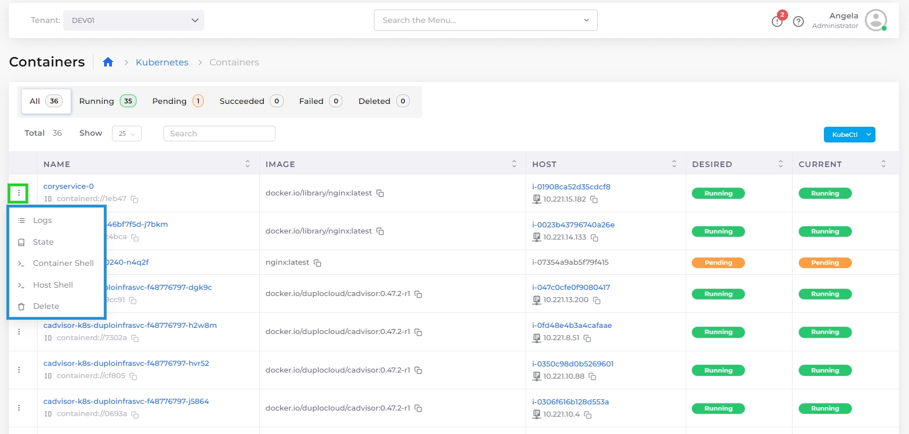

# ECS Containers, Task Definitions and Services


For an end-to-end example of creating an ECS Task Definition, Service, and Load Balancer, [see this tutorial](../../../overview/quick-start/quick-start-ecs-services/step-4-create-app-via-ecs.md).


## Creating a Task Definition

1. Select the Tenant from the **Tenant** list box.&#x20;
2. Navigate to **Cloud Services** -> **ECS**.
3. Select the **Task Definition** tab, click **Add**. The **Add Task Definition**-**Basic Options** display.

<figure><figcaption>
The <strong>Add Task Definition-Basic Options</strong> page
</figcaption></figure>

4. In the **Name** field, give the task definition a name.&#x20;
5. Optionally, specify the **Operating System/Architecture.**
6. Optionally, update the **vCPU** and **Memory**:
   * **vCPUs**: Specifies the number of CPU units used by the task. It can be expressed as an integer using CPU units, for example 1024, or as a string using vCPUs, for example `1 vCPU` or `1 vcpu`.
   * **Memory**: Specifies the amount of memory (in MiB) used by the task. It can be expressed as an integer using MiB, for example `1024`, or as a string using GB, for example `1GB` or `1 gb`.
7. Optionally, specify **Volumes** for the task definition.&#x20;
8.  Click **Next**. The **Add Task Definition**-**Advanced Options** display. \

    
<figure><figcaption>
The <strong>Add Task Definition-Advanced Options</strong>
</figcaption></figure>

9. &#x20;In the **Container-1** field, specify your primary **Container** details.
   * Add additional containers by clicking the add icon (  ) to create up to five (5) containers. Use the   and   icons to collapse and expand the **Container** areas as needed. Delete a container by clicking the Delete ( **X** ) icon in a container area.
   * Be sure to select the **Essential Container** option when defining your containers, as the task will fail if the essential container stops or fails to run.&#x20;
10. Click **Submit**.

## Creating an ECS Service

1. Select the Tenant from the **Tenant** list box.&#x20;
2. Navigate to **Cloud Services** -> **ECS**.
3. In the **Task Definitions** tab, select the correct Task Definition Family Name. This is the Task Definition Name prepended by a unique identifier, which includes your Tenant name and part of your Infrastructure name.&#x20;
4. Select the **Service Details** tab, and click **Configure ECS Service**. The **Add ECS Service** page displays.

<figure><figcaption>
The <strong>Add ECS Service</strong> page
</figcaption></figure>

5. In the **Name** field, a name for the Service.
6. Optionally, click **Add** in the **LB Listeners** area to add Load Balancer.
   * Complete the required fields on the **Add Load Balancer Listener** pane, and click **Add**.&#x20;
7. Complete additional fields, as needed, on the **Add ECS Service** page.
8. Click **Submit**. The ECS Service is created.&#x20;

## Managing ECS Services

1. Select the Tenant from the **Tenant** list box.
2. Navigate to **Cloud Services** -> **ECS**.
3. Select the **Services** tab.
4. Select the Service from the **NAME** column. Service details display.
5. Select the **Actions** menu for additional options, including **Edit** or **Delete**.&#x20;

<figure><figcaption>
Actions menu for ECS Service
</figcaption></figure>

## Kubernetes Containers

You can display and manage the Containers you have defined in the DuploCloud portal. Navigate to **Kubernetes** -> **Containers**.

Use the Options Menu (  ) in each Container row to display **Logs**, **State**, **Container Shell**, **Host Shell,** and **Delete** options.&#x20;

| Option              | Functionality                                                                                                                                                              |
| ------------------- | -------------------------------------------------------------------------------------------------------------------------------------------------------------------------- |
| **Logs**            | Displays container logs.                                                                                                                                                   |
| **State**           | Displays container state configuration, in YAML code, in a separate window.                                                                                                |
| **Container Shell** | Accesses the Container Shell. To access the **Container Shell** option, you must first set up [Shell access for Docker](../../../overview/prerequisites/kubectl-shell.md). |
| **Host Shell**      | Accesses the Host Shell.                                                                                                                                                   |
| **Delete**          | Deletes the container.                                                                                                                                                     |

<figure><figcaption>
<strong>Containers</strong> tab displaying defined containers with highlighted Options Menu
</figcaption></figure>

## Editing containers for ECS Services 

To edit the created Task Definition in order to add or delete multiple containers, select the Task Definition in the Task Definitions tab, and from the **Actions** menu, select **Edit Task Definition**.&#x20;

## **Configuring** ECS with EC2 Capacity Provider

Set up a containerized environment where ECS uses EC2 instances to host containers. By leveraging an Auto Scaling Group (ASG), ECS can automatically launch and scale EC2 instances as needed to run your containers.

1. [Create an ASG ](../../../overview/use-cases/hosts-vms/auto-scaling/auto-scaling-groups/#creating-autoscaling-groups-asg)with the following specifications:
   * In the **Agent Platform** field, select **ECS**.
   * In the **Image** field, select **Other**.
   * In the **Other Image ID** field, enter the **ECS-Optimized AMI ID**.
2. [Create a Task Definition](ecs-containers-and-task-definitions.md#creating-a-task-definition) following the steps shown above.&#x20;
3. Add[ an ECS Service](ecs-containers-and-task-definitions.md#creating-an-ecs-service) to the Task Definition you created in step 2 using the following specifications:
   * Click the **Capacity Provide**r button
   * In the **Capacity Provider** list box, select the Auto Scaling Group (ASG) you created in step 1.

## Elastic Container Service (ECS) Fargate 

Fargate is a technology that you can use with ECS to run containers without having to manage servers or clusters of EC2 instances.

For information about Fargate, [contact the DuploCloud support team](https://duplocloud.com/company/contact-us/).
