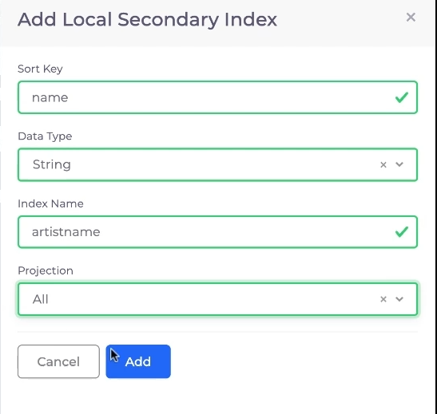

# AWS DynamoDB database

When using DynamoDB in DuploCloud AWS, the required permissions to access the DynamoDB from a virtual machine (VM), Lambda functions, and containers are provisioned automatically using Instance profiles. Therefore, no Access Key is required in the Application code.


When you write application code for DynamoDB in DuploCloud AWS, use the IAM role/Instance profile to connect to these services. If possible, use the AWS SDK constructor, which uses the region.


## Adding DynamoDB database tables

1. In the DuploCloud Portal, navigate to **Cloud Services** -> **Database.**
2. Click the **DynamoDB** tab.
3.  Click **Add**. The **Create DynamoDB** pane displays.\

    

    <figure><figcaption>
The <strong>Create DynamoDB</strong> page
</figcaption></figure>

    

4. Specify the DynamoDB **Table Name** and other required fields, including **Primary Key**, **Data Type**, **Sort Key**, and **Data Type**.
5.  Optionally, add Local Secondary Indexes (LSIs), which are indexes that use the same partition key as the base table, but allow you to use different sort keys. To add an LSI, click **Add Local Index**. The **Add Local Secondary Index** pane appears. Complete the fields: **Sort Key**, **Data Type** (**String** or **Number**), **Index Name**, and **Projection** (**All**, **Only Keys**, or **Include**). Click **Add**. Repeat to add additional secondary indexes. \

    

    <figure><figcaption>
The <strong>Add Local Secondary Index</strong> pane
</figcaption></figure>

    

6. Click **Submit**.&#x20;

For detailed guidance about configuring the `duplocloud_aws_dynamodb_table`, refer to the Terraform[ documentation](https://registry.terraform.io/providers/duplocloud/duplocloud/latest/docs/resources/aws\_dynamodb\_table). This resource allows for creating and managing AWS DynamoDB tables within DuploCloud.


Perform additional configuration, as needed, in the AWS Console by clicking the   **>\_** **Console** icon. In the AWS console, you can configure the application-specific details of DynamoDB database tables. However, no access or security-level permissions are provided.


After creating a DynamoDB table, you can retrieve the final name of the table using the `.fullname` attribute, which is available in the read-only section of the documentation. This feature is handy for applications that dynamically access table names post-creation. If you encounter any issues or need further assistance, please refer to the documentation or contact support.
